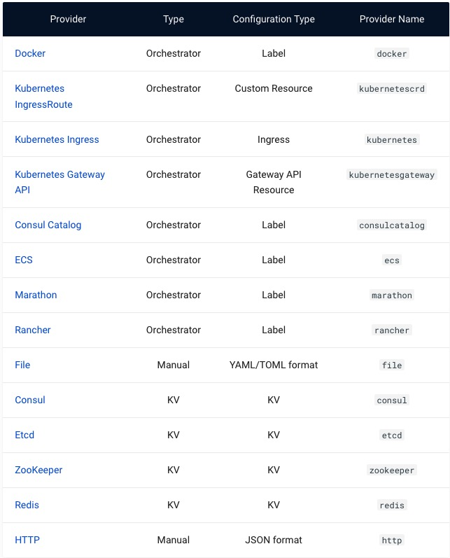
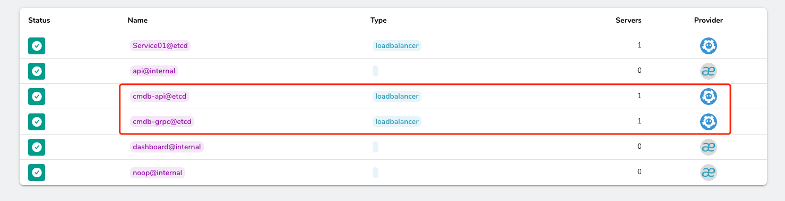

# 微服务网关

## 微服务架构

### 基于网关的架构

没有网关之前，服务直接是直接访问的, 如果外部需要访问某个服务, 需要知道每个服务的地址：


有了微服务后, 我们只需要知道网关的地址就可以了, 服务具体在哪儿，由网关负责寻找


传统的网关比如Nginx, 服务的发现都需要手动配置, 并不支持自动发现


因此我们需要选择一个微服务网关, 让我们的服务可以自动注册

常见的微服务网关有:
+ Kong(openresty), 基于Lua脚本进行扩展
+ APISix(openresty), 基于Lua脚本进行扩展
+ Traefik, Go 云原生网关

### 为什么选择Traefik

我们选择一个微服务网关大体的需求如下:

+ 服务启动时可以直接注册到注册中心(REST API/GRPC)
+ 网关可以通过注册中心发现内部服务
+ 网关可以选择配置哪些服务队伍提供访问
+ 内部服务通过注册中心直接访问，也可以走网关访问
+ 网关可以配置灰度发布‘
+ 网关可以配置链路追踪
+ 网关有流量监控


Treafik在综合比较下是一个不错的方案:

+ 完善的API接口与文档
+ 高性能,稳定性,高可用
+ 架构简单，易于维护
+ 完善的流量管理策略(Path匹配, 灰度，流量镜像)
+ 灵活的扩展定制能力(比如Nginx Lua)
+ 能对接注册中心实现服务发现
+ 与微服务生态比较亲近, 比如k8s
+ 支持GRPC代理

## Traefik 介绍

### 基本概念

网关对性能和可靠性要求比较高, 这里选用Traefik做完我们微服务的网关, 也方便我们二次开发

下面是Traefik的流程示意图:


traefik通过路由规则(Routes) 来配置 Endpint和service进行流量的分发


在路由里面我们通过配置路由规则进行流量转发, 比如Host规则就是匹配Host进行调度


最后把 流量路由到我们的 服务组内


下面是一个服务组的定义

```yaml
## Dynamic configuration
http:
  services:
    my-service:
      loadBalancer:
        servers:
        - url: "http://<private-ip-server-1>:<private-port-server-1>/"
        - url: "http://<private-ip-server-2>:<private-port-server-2>/"
```

### 配置介绍

Traefik里面的配置由2部分组成:
+ 静态配置: EntryPoints 和 Provider 需要在启动时配置好, [详细说明](https://doc.traefik.io/traefik/reference/static-configuration/overview/)
+ 动态配置: 路由规则和服务注册 可以动态发现, [详细说明](https://doc.traefik.io/traefik/reference/dynamic-configuration/file/)


Traefik和其他网关不同之处，在于其灵活的服务配置(服务发现)



其中最灵活的是Etcd, 我们将由程序自己实现服务的注册, 这样我们对外通过Traefik暴露我们的服务, 对内通过Etcd作为服务注册中心, 直接调用


#### 配置EntryPoint

下面是Yaml文件的配置:
```yaml
## Static configuration
entryPoints:
  web:
    address: ":80"

  websecure:
    address: ":443"

  grpc:
    address: ":18080"
```

下面是基于环境变量的配置:
```
TRAEFIK_ENTRYPOINTS_<NAME>:
Entry points definition. (Default: false)

TRAEFIK_ENTRYPOINTS_<NAME>_ADDRESS:
Entry point address.
```

#### 配置 Etcd Provider

下面是Etcd相关配置: [Traefik & Etcd](https://doc.traefik.io/traefik/providers/etcd/)

```yaml
providers:
  etcd:
    endpoints:
      - "127.0.0.1:2379"
    rootKey: "traefik"
    username: "foo"
    password: "bar"
    tls:
      ca: path/to/ca.crt
      caOptional: true
      cert: path/to/foo.cert
      key: path/to/foo.key
      insecureSkipVerify: true
```

如果要采用环境变量设置需要查阅: traefik支持的[配置变量](https://doc.traefik.io/traefik/reference/static-configuration/env/) 
该配置的参数都是 TRAEFIK_PROVIDERS_ETCD 打头的: 
```
TRAEFIK_PROVIDERS_ETCD:
Enable Etcd backend with default settings. (Default: false)

TRAEFIK_PROVIDERS_ETCD_ENDPOINTS:
KV store endpoints (Default: 127.0.0.1:2379)

TRAEFIK_PROVIDERS_ETCD_PASSWORD:
KV Password

TRAEFIK_PROVIDERS_ETCD_ROOTKEY:
Root key used for KV store (Default: traefik)

TRAEFIK_PROVIDERS_ETCD_USERNAME:
KV Username
```

#### API配置

```yaml
api:
  insecure: true
  dashboard: true
  debug: true
```

```
TRAEFIK_API:
Enable api/dashboard. (Default: false)

TRAEFIK_API_DASHBOARD:
Activate dashboard. (Default: true)

TRAEFIK_API_DEBUG:
Enable additional endpoints for debugging and profiling. (Default: false)

TRAEFIK_API_INSECURE:
Activate API directly on the entryPoint named traefik. (Default: false)
```

## 网关设计

那基于Traefik如何实现服务的自动发现喃?

traefik支持以etcd做完配置中心, 因此我们自己基于Traefik的格式 开发一套注册中心 可以对接Traefik了


## 安装Traefik

etcd的安装参考上节, 下面介绍Traefik的搭建

这里采用docker安装, 首先拉去官方镜像:
```go
docker pull traefik
```

准备好配置文件: traefik.yaml:
```yaml
api:
  insecure: true
  dashboard: true
  debug: true

entryPoints:
  web:
    address: ":80"

  websecure:
    address: ":443"

  grpc:
    address: ":18080"

providers:
  etcd:
    endpoints:
      - "<your host ip>:2379"
    rootKey: "traefik"
```

启动
```
# 其中 8080 是 traefik dashboard的地址
# 80 是web,  18080 是grpc, 443不测试 故不暴露
docker run -d -p 8080:8080 -p 80:80 -p 18080:18080 \
    -v $PWD/traefik.yml:/etc/traefik/traefik.yml traefik:latest


# window 注意挂载路径
docker run -d  -p 8080:8080 -p 80:80 -p 18080:18080  -v E:/Projects/Golang/go-course/day18/traefik.yml:/etc/traefik/traefik.yml traefik:latest
```

然后访问: http://localhost:8080/dashboard 就可以看到Traefik dashboard了


更详细的安装文档请求参考: [Install Traefik](https://doc.traefik.io/traefik/getting-started/install-traefik/)

## 服务注册与访问

我们的服务想要接入到Traefik, 需要2步:
+ 服务注册: 配置services
+ 路由匹配: 配置Router

我们先不忙 对接Etcd Provider, 我们先通过配置文件来看看, 如何配置

### 配置详解

以cmdb为例, cmdb提供2个服务:
+ HTTP RESTful API: 80
+ GRPC RPC:  18080

```yaml
## dynamic configuration ##

# web entrypoint 配置
# web entrypoint 监听的地址 在traefik启动的时候已经配置好了: 80
http:
  # services 配置, 具体配置请查看: https://doc.traefik.io/traefik/routing/services/
  services:
    # cmdb service 配置
    cmdb-api:
      loadBalancer:
        # cmdb 服务的实例
        servers:
        - url: http://127.0.0.1:8080
    # 注册 cmdb 的grpc服务, gprc采用http2协议, h2c兼容, 具体配置请参考 https://doc.traefik.io/traefik/user-guides/grpc/
    cmdb-grpc:
      loadBalancer:
        servers:
        - url: h2c://127.0.0.1:18080

  # routers 配置, 具体配置请参考: https://doc.traefik.io/traefik/routing/routers/
  routers:
    # cmdb 服务的路由
    cmdb:
      entryPoints:
        - "web"
      service: cmdb-api
      rule: PathPrefix(`/cmdb/api/v1`)
    # cmdb的所有服务都有统一的前缀, 通过gprc生成的文件可以看到
    cmdb:
      entryPoints:
        - "grpc"
      service: cmdb-grpc
      rule: PathPrefix(`infraboard.cmdb`)
```

### 基于KV的服务发现

现在Traefik使用etcd provider动态发现配置, 因此我们需要将上面的配置转化为符合etcd provider的格式写入etcd中

完整的文档请参考: [KV Configuration Reference](https://doc.traefik.io/traefik/reference/dynamic-configuration/kv/)


#### Service配置

服务注册 核心配置的是服务的地址, 也就是URL, 比如我有2个cmdb实例, 注册到etcd里面, key value结构大致如下: 
```
traefik/http/services/Service01/loadBalancer/servers/0/url	foobar
traefik/http/services/Service01/loadBalancer/servers/1/url  foobar
```

由此我们可以看出traefik的 key结构设计和yaml的结构设计是一样的, 只是etcd里面的使用/做完分层的方式:
```
<etcd_prefix>/<entry_point>/services/loadBalancer/servers/<index>/url   <url_value>
```

+ traefik etcd配置的前缀, provider配置时 有设置
+ web(变量): entrypoint 名称
+ services: 表示 web entrypoint的 services配置
+ cmdb(变量): 表示是cmdb服务的配置
+ loadBalancer: cmdb 服务loadBalancer配置
+ servers: loadBalancer 下的实例配置
+ 0(变量):  index
+ url: 实例的地址

可以测试下: 
```
docker exec -it -e "ETCDCTL_API=3" etcd  etcdctl put traefik/http/services/Service01/loadBalancer/servers/0/url foobar
```


#### Router配置

对于Router而言，核心需要配置的是:
+ entry point
+ rule
+ service

```
traefik/http/routers/Router1/entryPoints/0	foobar
traefik/http/routers/Router1/rule	foobar
traefik/http/routers/Router1/service	foobar
```

#### 完整配置

下面是cmdb和keyauth服务的服务发现配置

```
# cmdb 和 keyauth services 配置
traefik/http/services/cmdb/loadBalancer/servers/0/url	http://127.0.0.1:8060
traefik/http/services/cmdb/loadBalancer/servers/0/url	h2c://127.0.0.1:18060
traefik/http/services/keyauth/loadBalancer/servers/0/url	http://127.0.0.1:8050
traefik/http/services/keyauth/loadBalancer/servers/0/url	h2c://127.0.0.1:18050

# cmdb 和 keyauth router配置
traefik/http/routers/cmdb-api/entryPoints/0	web
traefik/http/routers/cmdb-api/rule	PathPrefix(`/cmdb/api/v1`)
traefik/http/routers/cmdb-api/service cmdb-api

traefik/http/routers/cmdb-grpc/entryPoints/0 grpc
traefik/http/routers/cmdb-grpc/rule PathPrefix(`infraboard.cmdb`)
traefik/http/routers/cmdb-grpc/service cmdb-grpc

traefik/http/routers/keyauth-api/entryPoints/0 web
traefik/http/routers/keyauth-api/rule	PathPrefix(`/keyauth/api/v1`)
traefik/http/routers/keyauth-api/service keyauth-api

traefik/http/routers/keyauth-grpc/entryPoints/0 grpc
traefik/http/routers/keyauth-grpc/rule PathPrefix(`infraboard.keyauth`)
traefik/http/routers/keyauth-grpc/service keyauth-grpc
```

#### 验证测试

我们手动操作etcd来把上面的配置写入: 
```
# cmdb http 配置, 注意填写本级的IP, 因为traefik是在容器里面访问的
docker exec -it -e "ETCDCTL_API=3" etcd  etcdctl put traefik/http/services/cmdb-api/loadBalancer/servers/0/url http://192.168.31.16:8060
docker exec -it -e "ETCDCTL_API=3" etcd  etcdctl put traefik/http/routers/cmdb-api/rule 'PathPrefix(`/cmdb/api/v1`)'
docker exec -it -e "ETCDCTL_API=3" etcd  etcdctl put traefik/http/routers/cmdb-api/service cmdb-api
docker exec -it -e "ETCDCTL_API=3" etcd  etcdctl put traefik/http/routers/cmdb-api/entryPoints/0	web

# cmdb grpc 配置
docker exec -it -e "ETCDCTL_API=3" etcd  etcdctl put traefik/http/services/cmdb-grpc/loadBalancer/servers/0/url h2c://192.168.31.16:18060
docker exec -it -e "ETCDCTL_API=3" etcd  etcdctl put traefik/http/routers/cmdb-grpc/rule 'PathPrefix(`/infraboard.cmdb`)'
docker exec -it -e "ETCDCTL_API=3" etcd  etcdctl put traefik/http/routers/cmdb-grpc/service cmdb-grpc
docker exec -it -e "ETCDCTL_API=3" etcd  etcdctl put traefik/http/routers/cmdb-grpc/entryPoints/0 grpc

通过etcd我们可以看到key已经写入
```sh
$ docker exec -it -e "ETCDCTL_API=3" etcd  etcdctl get --prefix  traefik 
traefik/http/routers/cmdb-api/entryPoints/0
web
traefik/http/routers/cmdb-api/rule
PathPrefix(`/cmdb/api/v1`)
traefik/http/routers/cmdb-api/service
cmdb-api
traefik/http/routers/cmdb-grpc/entryPoints/0
grpc
traefik/http/routers/cmdb-grpc/rule
PathPrefix(`/infraboard.cmdb`)
traefik/http/routers/cmdb-grpc/service
cmdb-grpc
traefik/http/services/Service01/loadBalancer/servers/0/url
foobar
traefik/http/services/cmdb-api/loadBalancer/servers/0/url
http://127.0.0.1:8060
traefik/http/services/cmdb-grpc/loadBalancer/servers/0/url
h2c://127.0.0.1:18060                                                         
```




启动cmdb服务, 确认好 http和grpc服务监听的端口:
```
$ cd cmdb
$ make run
```

验证 http 访问
```sh
$ curl localhost/cmdb/api/v1/hosts
{"code":400,"namespace":"global","reason":"请求不合法","message":"token required"}
```

验证 grpc 访问: 运行之前的测试用例测试
```go
func TestClient(t *testing.T) {
	should := assert.New(t)
	conf := client.NewConfig("localhost:18080")
	conf.WithClientCredentials("nHerVBlrKIDurviMGUXVOQHC", "l5FB38Mw2JmxHgGm8rUcich2ZrGRVrl7")

	c, err := client.NewClient(conf)
	if should.NoError(err) {
		rs, err := c.Resource().Search(context.Background(), resource.NewSearchRequest())
		should.NoError(err)
		fmt.Println(rs)
	}
}
```

## 其他功能

###  灰度发布

灰度发布需要我们控制不通版本的集群的流量, traefik的Weighted Round Robin (service)提供该功能的支持

```golang
// WeightedRoundRobin is a weighted round robin load-balancer of services.
type WeightedRoundRobin struct {
	Services []WRRService `json:"services,omitempty" toml:"services,omitempty" yaml:"services,omitempty" export:"true"`
	Sticky   *Sticky      `json:"sticky,omitempty" toml:"sticky,omitempty" yaml:"sticky,omitempty" export:"true"`
	// HealthCheck enables automatic self-healthcheck for this service, i.e.
	// whenever one of its children is reported as down, this service becomes aware of it,
	// and takes it into account (i.e. it ignores the down child) when running the
	// load-balancing algorithm. In addition, if the parent of this service also has
	// HealthCheck enabled, this service reports to its parent any status change.
	HealthCheck *HealthCheck `json:"healthCheck,omitempty" toml:"healthCheck,omitempty" yaml:"healthCheck,omitempty" label:"allowEmpty" file:"allowEmpty" export:"true"`
}
```

```yaml
## Dynamic configuration
http:
  services:
    cmdb-api-app:
      weighted:
        healthCheck: {}
        services:
        - name: appv1
          weight: 3
        - name: appv2
          weight: 1

    cmdb-api-v1:
      loadBalancer:
        servers:
        - url: "http://192.168.31.16:8060"

    cmdb-api-v2:
      loadBalancer:
        servers:
        - url: "http://192.168.31.16:8070"
```


服务注册
```
# appv1和appv2
docker exec -it -e "ETCDCTL_API=3" etcd  etcdctl put traefik/http/services/cmdb-api-v1/loadBalancer/servers/0/url http://172.22.111.202:8060
docker exec -it -e "ETCDCTL_API=3" etcd  etcdctl put traefik/http/services/cmdb-api-v2/loadBalancer/servers/0/url http://172.22.111.202:8070

# Weighted Round Robin (service)
docker exec -it -e "ETCDCTL_API=3" etcd  etcdctl put traefik/http/services/cmdb-api-app/weighted/services/0/name cmdb-api-v1
docker exec -it -e "ETCDCTL_API=3" etcd  etcdctl put traefik/http/services/cmdb-api-app/weighted/services/0/weight 3
docker exec -it -e "ETCDCTL_API=3" etcd  etcdctl put traefik/http/services/cmdb-api-app/weighted/services/1/name cmdb-api-v2
docker exec -it -e "ETCDCTL_API=3" etcd  etcdctl put traefik/http/services/cmdb-api-app/weighted/services/1/weight 1

# 开启健康检查
# KV 文档里面使用的是``
docker exec -it -e "ETCDCTL_API=3" etcd  etcdctl put traefik/http/services/cmdb-api-app/weighted/healthCheck {}
```


配置导出规则:
```
docker exec -it -e "ETCDCTL_API=3" etcd  etcdctl put traefik/http/routers/cmdb-api-app/rule 'PathPrefix(`/cmdb/api/v1`)'
docker exec -it -e "ETCDCTL_API=3" etcd  etcdctl put traefik/http/routers/cmdb-api-app/service cmdb-api-app
docker exec -it -e "ETCDCTL_API=3" etcd  etcdctl put traefik/http/routers/cmdb-api-app/entryPoints/0	web
```


最后验证服务的访问情况

### 健康检查

现在我们的服务实例注册上去了, 一个完整的网关一定要包含实例的检查检查, 这样到后端实例故障的时候，才能正常摘除

traefik为服务提供的监控检查的功能:


```yaml
  services:
    Service01:
      loadBalancer:
        sticky:
          cookie:
            name: foobar
            secure: true
            httpOnly: true
            sameSite: foobar
        servers:
        - url: foobar
        - url: foobar
        healthCheck:
          scheme: foobar
          path: foobar
          port: 42
          interval: foobar
          timeout: foobar
          hostname: foobar
          followRedirects: true
          headers:
            name0: foobar
            name1: foobar
        passHostHeader: true
        responseForwarding:
          flushInterval: foobar
        serversTransport: foobar
```

这是官方的配置样例
```
traefik/http/services/Service01/loadBalancer/healthCheck/followRedirects	true
traefik/http/services/Service01/loadBalancer/healthCheck/headers/name0	foobar
traefik/http/services/Service01/loadBalancer/healthCheck/headers/name1	foobar
traefik/http/services/Service01/loadBalancer/healthCheck/hostname	foobar
traefik/http/services/Service01/loadBalancer/healthCheck/interval	foobar
traefik/http/services/Service01/loadBalancer/healthCheck/path	foobar
traefik/http/services/Service01/loadBalancer/healthCheck/port	42
traefik/http/services/Service01/loadBalancer/healthCheck/scheme	foobar
traefik/http/services/Service01/loadBalancer/healthCheck/timeout
```

我们基于此来配置下app-v1/app-v2 的健康检查
```
# cmdb-api-v1
docker exec -it -e "ETCDCTL_API=3" etcd  etcdctl put traefik/http/services/cmdb-api-v1/loadBalancer/healthCheck/path	/
docker exec -it -e "ETCDCTL_API=3" etcd  etcdctl put traefik/http/services/cmdb-api-v1/loadBalancer/healthCheck/interval	5
docker exec -it -e "ETCDCTL_API=3" etcd  etcdctl put traefik/http/services/cmdb-api-v1/loadBalancer/healthCheck/timeout	1

# cmdb-api-v2
docker exec -it -e "ETCDCTL_API=3" etcd  etcdctl put traefik/http/services/cmdb-api-v2/loadBalancer/healthCheck/path	/
docker exec -it -e "ETCDCTL_API=3" etcd  etcdctl put traefik/http/services/cmdb-api-v2/loadBalancer/healthCheck/interval	5
docker exec -it -e "ETCDCTL_API=3" etcd  etcdctl put traefik/http/services/cmdb-api-v2/loadBalancer/healthCheck/timeout	1
```


## 插件开发

官方主要支持2种插件机制:
+ RemotePlugins: 远程插件, 通过http请求，请求Treafik官方插件市场(pilot), 把插件下载到本地
+ LocalPlugins: 本地插件, 直接将插件方针于本地目录


### 插件工作机制

Traefik的插件就是一个Go的pkg, 因此插件的开发语言就是Go, Go不是编译型的语言吗?, 我写的Go源码 也直接加载工作?

Traefik内嵌了一个 Go的解释器, 用于解释执行Go代码, 因此效率上是比不上机械码的, 这个解释器是社区的，完全支持Go的语法解析[Yaeji](https://github.com/traefik/yaegi)

比如: 
```sh
$ yaegi
> 1 + 2
3
> import "fmt"
> fmt.Println("Hello World")
Hello World
>
```

### 如何开发一个插件

插件就是一个Go的包, 只是必须满足如下条件:
+ A type type Config struct { ... }. The struct fields are arbitrary.
+ A function func CreateConfig() *Config.
+ A function func New(ctx context.Context, next http.Handler, config *Config, name string) (http.Handler, error).

```go
// Package example a example plugin.
package example

import (
	"context"
	"net/http"
)

// Config the plugin configuration.
type Config struct {
	// ...
}

// CreateConfig creates the default plugin configuration.
func CreateConfig() *Config {
	return &Config{
		// ...
	}
}

// Example a plugin.
type Example struct {
	next     http.Handler
	name     string
	// ...
}

// New created a new plugin.
func New(ctx context.Context, next http.Handler, config *Config, name string) (http.Handler, error) {
	// ...
	return &Example{
		// ...
	}, nil
}

func (e *Example) ServeHTTP(rw http.ResponseWriter, req *http.Request) {
	// ...
	e.next.ServeHTTP(rw, req)
}
```

我们需要处理的 就是在ServeHTTP  添加我们的自定义逻辑, 也就常见的web 中间件的开发模式

### 安装插件

将我们开发好的插件放到./plugins-local/ 下, traefik启动时会加载这些插件

```
./plugins-local/
    └── src
        └── github.com
            └── traefik
                └── plugindemo
                    ├── demo.go
                    ├── demo_test.go
                    ├── go.mod
                    ├── LICENSE
                    ├── Makefile
                    └── readme.md
```

然后traefik配置好需要加载的插件的名称
```
# Static configuration

experimental:
  localPlugins:
    example:
      moduleName: github.com/traefik/plugindemo

# 根据moduleName, 加载的插件:  ./plugins-local/src/github.com/traefik/plugindemo
```

最后我们在动态配置时使用 我们定义的插件:
```yaml
# Dynamic configuration

http:
  routers:
    my-router:
      rule: host(`demo.localhost`)
      service: service-foo
      entryPoints:
        - web
      middlewares:
        - my-plugin

  services:
   service-foo:
      loadBalancer:
        servers:
          - url: http://127.0.0.1:5000
  
  middlewares:
    my-plugin:
      plugin:
        example:
          headers:
            Foo: Bar
```

### 演示

创建一个我们的插件仓库: [Demo插件](https://gitee.com/infraboard/traefik-plugin-demo.git)

补充配置
```yaml
experimental:
  localPlugins:
    demo:
      moduleName: gitee.com/infraboard/traefik-plugin-demo
```

添加配置
```
# 使用demo中间件创建一个middleware
docker exec -it -e "ETCDCTL_API=3" etcd  etcdctl put traefik/http/middlewares/demo-plugin/plugin/demo/headers/Foo	Bar

# 使用该middleware
docker exec -it -e "ETCDCTL_API=3" etcd  etcdctl put traefik/http/routers/cmdb-api/middlewares/0	demo-plugin
```

启动服务进行测试
```
# 其中 8080 是 traefik dashboard的地址
# 80 是web,  18080 是grpc, 443不测试 故不暴露
# /plugins-local/
docker run -d -p 8080:8080 -p 80:80 -p 18080:18080 \
    -v $PWD/traefik.yml:/etc/traefik/traefik.yml traefik:latest
```

## 注册中心


