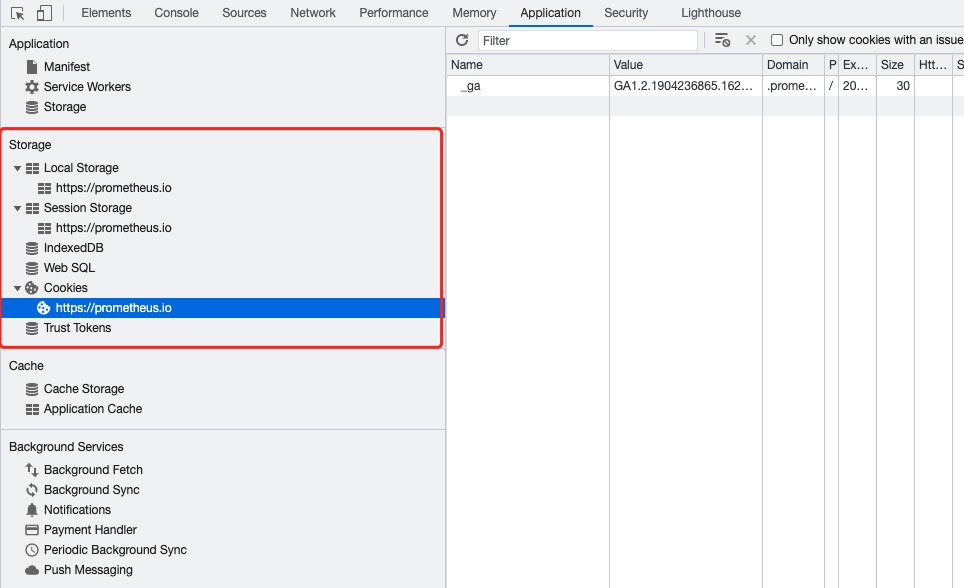
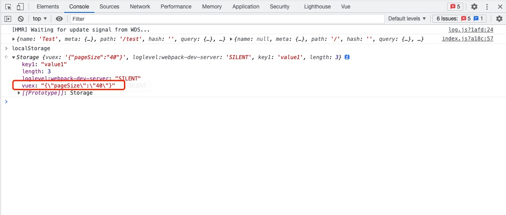

# Vue状态管理

举个简单的例子, 我们每个页面在访问后端数据的时候 都需要token, 那么所有组件都依赖token这个数据, 我们就需要找个地方存起来，让其他组件都能访问到它

通俗的讲，就是存储一些公用的东西，提供给各个组件使用，和服务器端的session功能也很类似

那我们如何来实现这个共享存储喃?

## 共享内存

第一种方式最直接: 共享内存, 直接开辟一个变量，全局都能访问到就可以了, 你和定义一个全局map一样简单

比如我在root 实例上 添加一个data, 其他子实例 通过$root.$data来访问数据

```js
// Root Vue实例
new Vue({
  render: h => h(App),
  data: {a: 1},
}).$mount('#app')
```

我们在父节点添加一个b属性

```html
<script>
import HelloWorld from './components/HelloWorld.vue'

export default {
  name: 'App',
  created() {
    this.$root.$data.b = 2
  },
}
</script>
```

然后在子节点上读取

```html
<script>
export default {
  name: 'HelloWorld',
  mounted() {
    console.log(this.$root.$data.b)
  },
}
</script>
```

这种其实就是一个简单粗暴的 通过共享内存进行通信的方式, 好在其简单易懂，也许你会喜欢

因为这种方式使用的是内存, 所以页面关闭或者刷新就都没有, 想要就状态持久化 还需要存储

## 本地存储

这种方式就需要使用到浏览器的存储功能了, 它可供我们存储客户端临时信息 简称 Web Storage



+ cookie
+ sessionStorage
+ localStorage

### cookie

cookie是有可以设置过期时间的, 同一个域下的页面都可以访问

cookie在没有设置过期时间时，系统默认浏览器关闭时失效，只有设置了没到期的保存日期时，浏览器才会把cookie作为文件保存在本地上。当expire到期时，cookie不会自动删除，仅在下次启动浏览器或者刷新浏览器时，浏览器会检测cookie过期时间，如已过期浏览器则会删除过期cookie

注意:
  + 数据存放大小: 4k, 因为每次http请求都会携带cookie
  + 浏览器关闭时， cookie会失效
  + 注意cookie可以支持httpOnly, 这个时候前端js是修改不了的(也看不到)

```js
// 读取cookie, 注意读取出来的cookie是个字符串
document.cookie
'language=zh; Sub-System=develop; sidebarStatus=1; Current-Namespace=c16mhsddrei91m4ri0jg; Refresh-Token=paBuyTIfsX3BeKrXrCmD8khUla6x8y1g'
// 需要自己处理
document.cookie.split('; ')

// 直接赋值就添加了一个key-value
document.cookie = 'cookieKey=cookieValue'
'language=zh; Sub-System=develop; sidebarStatus=1; Current-Namespace=c16mhsddrei91m4ri0jg; Refresh-Token=paBuyTIfsX3BeKrXrCmD8khUla6x8y1g; cookieKey=cookieValue'

// 当然cookie还有很多选项可以设置, 通过;隔开比如
document.cookie="username=John Doe; expires=Thu, 18 Dec 2043 12:00:00 GMT; path=/";

// 修改cookie和设置cookie一样, 保证key相同就可以
document.cookie = 'cookieKey=cookieValue2'
document.cookie
'language=zh; Sub-System=develop; sidebarStatus=1; Current-Namespace=c16mhsddrei91m4ri0jg; Refresh-Token=paBuyTIfsX3BeKrXrCmD8khUla6x8y1g; cookieKey=cookieValue2'

// 删除cookie时，把expires 设置到过期的时间即可, 比如设置个2019年的时间
document.cookie = `cookieKey=;expires=Mon, 26 Aug 2019 12:00:00 UTC`
document.cookie
'language=zh; Sub-System=develop; sidebarStatus=1; Current-Namespace=c16mhsddrei91m4ri0jg; Refresh-Token=paBuyTIfsX3BeKrXrCmD8khUla6x8y1g'
```

### sessionStorage

存储的数据只有在同一个会话中的页面才能访问并且当会话结束后数据也随之销毁, 因此sessionStorage不是一种持久化的本地存储，仅仅是会话级别的存储

那么，到底什么是一个会话？多个标签页之间的数据是否会共享呢？

> 我们可以验证下: 开启2个窗口, 直接通过浏览器修改sessionStorage 进行验证

通过验证我们可以知道 一个标签页 就表示一个回话, 当标签页关闭, 回话就清除,  不通标签页之间不共享数据

```js
// 通过setItem设置key-value
sessionStorage.setItem('key1', 'value1')
sessionStorage['key2']= 'value2'
sessionStorage.key2= 'value2'

// 查询sessionStorage对象
sessionStorage
Storage {key2: 'value2', key1: 'value1', length: 2}

// 通过getItem获取key的值
sessionStorage.getItem('key1')
sessionStorage['key1']
sessionStorage.key1

// 修改
sessionStorage.key1 = 'value11'
sessionStorage['key1'] = 'value11'

// 删除key
sessionStorage.removeItem('key1')

// 清空storage
sessionStorage.clear()
```


### localStorage

localStorage生命周期是永久, 除非主动删除数据，否则数据是永远不会过期的

相同浏览器的不同页面间可以共享相同的 localStorage（页面属于相同域名和端口）

> 我们可以验证下: 开启2个窗口, 直接通过浏览器修改localStorage 进行验证

localStorage的操作方法和sessionStorage完全一样:

```js
// 通过setItem设置key-value
localStorage.setItem('key1', 'value1')
localStorage['key2']= 'value2'
localStorage.key2 = 'value2'

// 查询sessionStorage对象
localStorage
Storage {key2: 'value2', key1: 'value1', length: 2}

// 通过getItem获取key的值
localStorage.getItem('key1')
localStorage['key1']
localStorage.key1

// 修改
localStorage.key1 = 'value11'
localStorage['key1'] = 'value11'

// 删除key
localStorage.removeItem('key1')

// 清空storage
localStorage.clear()
```

### pinia

vuex是一种更高级的抽象, 所以使用上需要先理解他的理念，不像我们直接使用store那么简单

+ state，驱动应用的数据源；
+ actions，响应在 view 上的用户输入导致的状态变化
+ mutation, 用于直接修改数据的方法

读取数据: 组件通过store的getter方法 从中取数据
修改数据: 组件通过store提供的dispatch方法触发一个action, 有action提交mutation来修改数据


### 安装

当然你也可以选择手动安装:
```sh
npm install vuex --save
```

然后在项目中引入
```js
import Vue from 'vue'
import Vuex from 'vuex'

Vue.use(Vuex)
```

当然更加简单的方法是 使用 cli安装, 还能给我们生成实例
```sh
vue add vuex
```

### 起步

我们看看cli生成的样例, 是入口main.js
```js
import Vue from 'vue'
import App from './App.vue'
import store from './store'

Vue.config.productionTip = false

new Vue({
  store,
  render: h => h(App)
}).$mount('#app')
```

看到store模块提供了store实例, 直接看store如何实例化的: store/index.js
```js
import Vue from 'vue'
import Vuex from 'vuex'

Vue.use(Vuex)

export default new Vuex.Store({
  state: {
  },
  mutations: {
  },
  actions: {
  },
  modules: {
  }
})
```

我们举个简单的例子: 用户设置了分页大小, 我希望每个页面都能生效, 我们定义一个状态: pageSize
```js
export default new Vuex.Store({
  state: {
    /* 添加pageSize状态变量 */
    pageSize: 20
  },
  getters: {
    /* 设置获取方法 */
    pageSize: state => {
      return state.pageSize
    } 
  },
  mutations: {
    /* 定义修改pageSize的函数 */
    setPageSize(state, ps) {
      state.pageSize = ps
    }
  },
  actions: {
    /* 一个动作可以由可以提交多个mutation */
    /* { commit, state } 这个是一个解构赋值, 正在的参数是context, 我们从中解出我们需要的变量*/
    setPageSize({ commit }, ps) {
      /* 使用commit 提交修改操作 */
      commit('setPageSize', ps)
    }
  },
  modules: {
  }
})

```

现在我们的store定义完成了, 在一个足迹中使用, 然后尝试在另一个组件中读取

子组建中修改状态, 我们采用store提供的dispatch方法来进行修改: Test.vue
```js
<input v-model="pageSize" type="text">

computed: {
  pageSize: {
    get() {
      return this.$store.getters.pageSize
    },
    set(value) {
      this.$store.dispatch('setPageSize', value)
    }
  }
},
```

> 测试下 看看devtools中 vuex是否正常, 看看刷新后如何

### vuex-persist

上面的测试应该已经知道 vuex的状态存储并不能持久化，存储在 Vuex 中的 store 里的数据，只要一刷新页面，数据就丢失了

那我们能不能叫vuex的存储修改为localstorage喃? 答案是可以的, 有个插件就完成了这个事儿: vuex-persist,具体使用说明请参考: [vuex-persist Github](https://github.com/championswimmer/vuex-persist)

```js
// vuex-persist@3.1.3
npm install --save vuex-persist
```

安装好了后我们配置vuex使用该插件： store/index.js
```js
// 1. 引入依赖
import VuexPersistence from 'vuex-persist'

// 2. 实例化一个插件对象, 我们使用localStorage作为存储
const vuexLocal = new VuexPersistence({
  storage: window.localStorage
})

// 3.配置store实例使用localStorage插件
export default new Vuex.Store({
  // ...
  plugins: [vuexLocal.plugin],
})
```

我们通过console确认下是否已经存入localstorage:



可以发现vuex-persist, 使用vuex做一个key, 把所有数据都存储在这个字段里面, 所有还是不要使用vuex存储太多数据，不然有性能问题

## 参考

+ [Vue Router文档](https://next.router.vuejs.org/zh/introduction.html)
+ [Vuex 文档](https://vuex.vuejs.org/zh/)
+ [cookies、sessionStorage和localStorage解释及区别](https://www.cnblogs.com/pengc/p/8714475.html)
+ [JavaScript Cookie](https://www.runoob.com/js/js-cookies.html)
+ [JavaScript创建、读取和删除cookie](https://www.jb51.net/article/169117.htm)