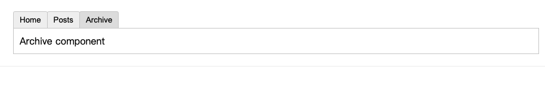

# 组件

组件允许我们将 UI 划分为独立的、可重用的部分来思考。组件在应用程序中常常被组织成层层嵌套的树状结构


这和我们嵌套 HTML 元素的方式类似，Vue 实现了自己的组件数据模型，使我们可以在每个组件内封装自定义内容与逻辑

## 组件基础

### 工作原理

我们一般会将 Vue 组件定义在一个单独的 .vue 文件中，这被叫做单文件组件 (简称 SFC), 它是一种特殊的文件格式，使我们能够将一个 Vue 组件的模板、逻辑与样式封装在单个文件中
```vue
<!-- 逻辑处理部分, 有JavaScript提供该能力 -->
<script setup>
</script>

<!-- 视图模版, 有HTML和自定义组件或者Web组件提供该能力 -->
<template>
  <p class="greeting">{{ greeting }}</p>
</template>

<!-- 元素样式, 由css提供该能力 -->
<style>
</style>
```

很显然 该文件并不是个合法的html文件, 并不能别浏览器直接加载, 它是一种特殊的文件格式, 定义该文件的语法被叫做: [SFC 语法](https://staging-cn.vuejs.org/api/sfc-spec.html)

该语法需要被转换成标准的HTML文件才能被浏览器加载, [@vue/compiler-sfc](https://github.com/vuejs/core/tree/main/packages/compiler-sfc) 就是用于干这个事儿的, 当然它不是独立工作的, vite提供了构建功能, vue以插件的形式提供sfc语法转换逻辑(compiler-sfc), 比如下面的vite配置:
```js
import { fileURLToPath, URL } from "url";

import { defineConfig } from "vite";
import vue from "@vitejs/plugin-vue";

// https://vitejs.dev/config/
export default defineConfig({
  plugins: [
    vue(),
  ],
  resolve: {
    alias: {
      "@": fileURLToPath(new URL("./src", import.meta.url)),
    },
  },
});
```

一个编译后的 SFC 是一个标准的 JavaScript(ES) 模块，这也意味着通过适当的构建配置，你可以像导入其他 ES 模块一样导入 SFC
```js
import MyComponent from './MyComponent.vue'

export default {
  components: {
    MyComponent
  }
}
```

当然，有些场景下使用 SFC 有些过犹不及。当不使用构建步骤时, 一个 Vue 组件以一个包含 Vue 特定选项的 JavaScript 对象来定义
```js
import { ref } from 'vue'

export default {
  setup() {
    const count = ref(0)
    return { count }
  },
  template: `
    <button @click="count++">
      You clicked me {{ count }} times.
    </button>`
  // 或者 `template: '#my-template-element'`
}
```

当然由于跳过的构建，没有编译器的支撑 很多编译器提供的功能,比如$ref,defineProps等 我们就不能使用了, 这会是语法比较繁琐, 一般不这样用

### 定义组件

我们分别定义:
+ script: js逻辑
+ template: 视图模板
+ style: 样式

```vue
<script setup>
import { ref } from "vue";

const count = ref(0);
</script>

<template>
  <button @click="count++">You clicked me {{ count }} times.</button>
</template>

<style scoped>
</style>
```

### 使用组件

通过Import导入后, 通过名称直接使用

```vue
<template>
  <div>
    <!-- 在单文件组件中, 推荐为子组件使用 PascalCase 的标签名 -->
    <ButtonCounter style="width: 220px" />
  
    <!-- 也可以使用原生 HTML 标签命名风格(单词-单词), 但是为了和标准HTML元素区分开, 并不推荐这样使用 -->
    <!-- <button-counter></button-counter> -->
  </div>
</template>
<script setup>
// 通过 <script setup>，导入的组件都在模板中直接可用
import ButtonCounter from "@/components/ButtonCounter.vue";
</script>
```

### 组件注册

向上面那样直接使用时局部导入

你也可以全局地注册一个组件，使得它在当前应用中的任何组件上都可以使用，而不需要额外再导入

```js
import MyComponent from './App.vue'

app.component('MyComponent', MyComponent)
```

### 动态组件

有的需求会想要在两个组件间来回切换:




vue 提供一个component元素, 它由一个属性: is, is的值可以为:
+ 被注册的组件名
+ 导入的组件对象

比如:
```js
<!-- currentTab 改变时组件也改变 -->
<component :is="currentComponentName"></component>
```

### 内置组建

vue 内置了一些组建, 可以理解为官方提供的一些标准库, 由于内置组建是全局组册的, 因此我们不需要Import, 可以在模版中直接使用

+ Transition: 组建过渡动画
+ TransitionGroup: 过渡组, 控制一组组建的过渡动画
+ KeepAlive: 组建缓存, 使我们可以在动态切换多个组件时视情况缓存组件实例

下面演示下组建缓存:


## 组件通信

组件是vue中用于复用的最小UI单元, 你可以把它理解为后端编程里面的一个函数, 只是这个函数不仅有逻辑还有界面:
```go
func Component() {
   // 定义UI 展示

   // 定义数据处理逻辑
}
```

现在我们的组建既没有参数，也获取不到组件的返回, 这使得我们的组件很难复用, 比如:
```go
func ComponentA() {
    // 显示 文章A的标签
}

func ComponentB() {
    // 显示 文章B的标签
}

// 使用参数进行统一抽象
func Component(title, callbackFunc) {
    // 根据传人的title参数 进行显示
    title

    // 如果用户修改了title 使用callbackFunc函数回调通知
    callbackFunc(titile)
}
```

vue 为我们提供组件通讯的机制有:
+ 传递 props: 父组件 --> 子组件
+ 监听事件:    父组件 <-- 子组件
+ v-model:    父组件 <--> 子组件
+ 依赖注入:    多个组件通过共享内存的方式直接通讯

### 传递 props

传递props, 主要用于 父组件向子组件通讯:
```
<父组件> ---> <子组件>
```

如果向组件传入参数, 首先组件需要定义参数: defineProps 宏就是用于干这个的
```vue
<script setup>
// 使用 defineProps 来进行组件属性(参数)的定义。
// defineProps() 是一个宏由编译器负责处理, 无需引入
const props = defineProps({
  title: String,
  likes: Number
})

console.log(props.foo)
</script>
```

最终我们可以通过组建的属性 来进行参数的传递:
```vue
<ComponentName title="文章A" likes=10 />
```

#### 属性命名规范

```js
defineProps({
  greetingMessage: String
})
```

一般情况下都会使用 PascalCase 作为组件标签名，因为这提高了模板的可读性，能很好地区分出 Vue 组件和原生 HTML 元素。
然而这对于传递 prop 来说收效并不高，因此我们选择对其进行转换

```vue
<ComponentName greeting-message="文章A" />
```

#### 动态属性

很多时候我们传递的属性都是和我们的响应式数据绑定的, 组件和元素HTML在属性绑定上并没有啥区别, 都是用v-bind执行来进行响应式数据绑定

```vue
<!-- 使用v-bind指令 绑定变量name -->
<ComponentName v-bind:greeting-message="name" />

<!-- v-bind可以缩写为: 缩写模式 -->
<ComponentName :greeting-message="name" />
```

#### 属性校验

定义属性时处理可以指定type以外，还可以有:
+ required: bool 是否是必须参数
+ default 属性: 集成类型默认值
+ default 函数: 对象或数组的默认值, 类似于个构造函数
+ validator函数: 属性的校验函数

```js
defineProps({
  // 基础类型检查
  // （给出 `null` 和 `undefined` 值则会跳过任何类型检查）
  propA: Number,
  // 多种可能的类型
  propB: [String, Number],
  // 必传，且为 String 类型
  propC: {
    type: String,
    required: true
  },
  // Number 类型的默认值
  propD: {
    type: Number,
    default: 100
  },
  // 对象类型的默认值
  propE: {
    type: Object,
    // 对象或数组的默认值
    // 必须从一个工厂函数返回。
    // 该函数接收组件所接收到的原始 prop 作为参数。
    default(rawProps) {
      return { message: 'hello' }
    }
  },
  // 自定义类型校验函数
  propF: {
    validator(value) {
      // The value must match one of these strings
      return ['success', 'warning', 'danger'].includes(value)
    }
  },
  // 函数类型的默认值
  propG: {
    type: Function,
    // 不像对象或数组的默认，这不是一个工厂函数。这会是一个用来作为默认值的函数
    default() {
      return 'Default function'
    }
  }
})
```

#### 注意事项(单数据流)

所有的 prop 都遵循着单向绑定原则，prop 因父组件的更新而变化，自然地将新的状态向下流往子组件，而不会逆向传递。这避免了子组件意外修改了父组件的状态，不然应用的数据流就会变得难以理解了

### 监听事件

监听事件, 主要用于 子组件向父组件通讯:
```
<父组件> <--- <子组件>
```

#### 定义并触发事件

组件要触发的事件可以显式地通过 defineEmits() 宏来声明

```vue
<script setup>
// 其中事件的名称可以使用数组来进行定义
const emit = defineEmits(['inFocus', 'submit'])
</script>
```

然后我们调用声明来进行事件的触发, 触发时 可以携带任何类型的数据
```js
// 把当前的值通知给父组件
const doClick = () => {
  count.value++;
  emit("submit", count.value);
};
```

#### 监听并处理事件

和其他正常的组件一样我们使用v-on(@)+事件名称 来监听具体的事件(当然是父组件来监听):
```vue
<template>
  <!-- 定义一个事件处理函数来处理 submit 事件 -->
  <button-counter
    @submit="submitEventHandler"
    style="width: 220px"
  ></button-counter>
</template>
<script setup>
  const submitEventHandler = (e) => {
  console.log(e);
};
</script>
```

### 双向绑定

```
父组件 --属性传递--> 子组件
父组件 <--触发事件-- 子组件
```
通过上面我们已经可以组件实现数据的双向绑定了:

#### 传递与监听实现
1. 首先子组件 定义属性, 当属性有变化是, 通过事件传递给父组件
```vue
<script setup>
// defineProps() 是一个宏由编译器负责处理, 无需引入
const props = defineProps({
  count: Number,
});

// 其中事件的名称可以使用数组来进行定义
const emit = defineEmits(["update_count"]);

const doClick = () => {
  // 把修改的值传递给父组件, 由父组件来更新count props
  emit("update_count", props.count + 1);
};
</script>

<template>
  <button @click="doClick">You clicked me {{ count }} times.</button>
</template>
```

2. 父组件监听事件, 并更新props:
```vue
<template>
  <div class="about">
      <button-counter
        @update_count="updateCountEventHandler"
        :count="count"
        style="width: 220px"
      ></button-counter>
    </div>
  </div>
</template>

<script setup>
import { ref } from "vue";
import ButtonCounter from "@/components/ButtonCounter.vue";

// 通过 v-bind 绑定动态属性
// 通过 v-on 监听来自于子组件的update_count事件
const count = ref(0);
const updateCountEventHandler = (e) => {
  count.value = e;
};
</script>
```

#### v-model实现

很显然上面的写法很累赘, 我们事件处理函数的处理逻辑也很单调, 仅仅是赋值, 像元素的HTML元素 都可以直接使用v-model来实现双向绑定, 比如:
```vue
<input v-model="searchText" />
```

那能不能把组件也通过这个语法直接变成双向绑定的喃?
```vue
<ButtonCounter v-model="count" />
```

为了使组件能像这样工作，组件必须：
+ 定义一个modelValue的属性
+ 定义update:modelValue的事件, 并且负责更新

```vue
<script setup>
// defineProps() 是一个宏由编译器负责处理, 无需引入
const props = defineProps({
  modelValue: Number,
});

// 其中事件的名称可以使用数组来进行定义
const emit = defineEmits(["update:modelValue"]);

const doClick = () => {
  // 把修改的值传递给父组件, 由父组件来更新count props
  emit("update:modelValue", props.modelValue + 1);
};
</script>

<template>
  <button @click="doClick">You clicked me {{ modelValue }} times.</button>
</template>
```

这样我们的父组件就能完成双向通行了
```vue
<ButtonCounter v-model="count" />
```

有上面可以看出 v-model作用与自定义组件时, 相当于固定了modelValue属性和update:modelValue方法

#### v-model:props实现

由于直接使用v-model 就等于直接绑定了modelValue属性和update:modelValue事件, 而且还只针对一个属性, 如果有多个自定义属性怎么办?

v-model提供了一个参数: v-model:propsName, 比如如果要绑定的属性名称为 count, 则:
```vue
<!-- 如果有多个属性需要绑定就写多个v-model:attr就可以了 -->
<ButtonCounter v-model:count="count" />
```

因此修改自组件的属性和事件命名:
```vue
<script setup>
// defineProps() 是一个宏由编译器负责处理, 无需引入
const props = defineProps({
  count: Number,
});

// 其中事件的名称可以使用数组来进行定义
const emit = defineEmits(["update:count"]);

const doClick = () => {
  // 把修改的值传递给父组件, 由父组件来更新count props
  emit("update:count", props.count + 1);
};
</script>

<template>
  <button @click="doClick">You clicked me {{ count }} times.</button>
</template>
```

### 依赖注入

上面讲到的都是父子组件的通讯, 如果组件并不是父子关系, 二是多层的关系，比如这样, 难道我们需要把props一层一层的往下传递?:


注入到父组件的变量, 所有的后面的子组件才能获取到, 就像golang里面的ctx

#### 注入依赖

要为组件后代供给数据，需要使用到 provide() 函数, 由于组件本身就是树状结构, 只要我们注入到根组件，那么后续所有组件都能访问到

修改App.vue
```vue
<script setup>
import { RouterLink, RouterView } from "vue-router";
import HelloWorld from "@/components/HelloWorld.vue";

import { ref, provide } from "vue";
// 如果的变量可以是响应式的
const count = ref(0);
provide(/* 注入名 */ "count", /* 值 */ count);
</script>
```

#### 获取依赖

通过inject获取父组件注入的变量:
```vue
<script setup>
import { inject } from "vue";

// 这里也可以获取默认值: inject(<变量名称>, <变量默认值>), 如果获取不到变量 就使用默认值
const count = inject("count");

const doClick = () => {
  count.value++;
};
</script>

<template>
  <button @click="doClick">You clicked me {{ count }} times.</button>
</template>
```

依然注入约等于共享内存，因此灵活度很高

### 组合式函数

上面的方式 必须像通过上下文 来传递变量, 变编程中 有一种更常用的 贡献内存通信的方式: 全局变量

我们可以定义一个全局变量, 在需要的地方直接导入，然后访问该变量的状态

在vue中, 我们很少直接定义这种全局变量, 它提供了一种 通过定义一个函数来 访问该全局变量的状态的方式: 组合式函数

“组合式函数”是一个利用 Vue 组合式 API 来封装和复用有状态逻辑的函数, 

#### 定义组合式函数

鼠标跟踪器示例: 获取当前鼠标的位置坐标:

我们通过编写一个js的模块, 导出一个函数给外部使用(工具函数), 该函数维护这2个响应式变量(x, y), 分别代码光标的 x,y位置
```js
// mouse.js
import { ref, onMounted, onUnmounted } from 'vue'

// 按照惯例，组合式函数名以“use”开头
export function useMouse() {
  // 被组合式函数封装和管理的状态
  const x = ref(0)
  const y = ref(0)

  // 组合式函数可以随时更改其状态。
  function update(event) {
    x.value = event.pageX
    y.value = event.pageY
  }

  // 一个组合式函数也可以挂靠在所属组件的生命周期上
  // 来启动和卸载副作用
  onMounted(() => window.addEventListener('mousemove', update))
  onUnmounted(() => window.removeEventListener('mousemove', update))

  // 通过返回值暴露所管理的状态
  return { x, y }
}
```

#### 使用组合式函数

组合式函数就是一个带有响应式数据的普通函数, 并没有特殊之处, 我们按照js模块引入规范，导入使用即可:

```vue
<script setup>
import { useMouse } from './mouse.js'

const { x, y } = useMouse()
</script>

<template>Mouse position is at: {{ x }}, {{ y }}</template>
```

#### 状态共享

定义一个保护响应式数据的公共模块
```js
// store/global.js
import { reactive } from "vue";

export const store = reactive({
  count: 0,
});
```

button组件引入并使用:
```vue
<script setup>
import { store } from "@/stores/global";

const doClick = () => {
  store.count++;
};
</script>

<template>
  <button @click="doClick">You clicked me {{ store.count }} times.</button>
</template>
```

其他组件也可以引入并使用:
```js
import { store } from "@/stores/global";
// 访问strore
store.count
```

但是显然我们基于stroe进行数据共享，但是我们store并没有持久化, 页面一刷新就没了, 有没有一种能持久化 并且是响应式的数据源工具喃? 这就不得不讲到 vue的 公共库: [vueuse](https://vueuse.org/)

#### VueUse库

首先我们安装上这个库:
```sh
npm i @vueuse/core
```

然后倒入我们需要的函数使用
```js
import { useMouse } from '@vueuse/core'

const { x, y, sourceType } = useMouse()
```

由于VueUse的出现, vue3终于可以比肩并(react Hooks)且有超越react的趋势

在VueUse的中有个这样的库: useStorage, 他可以把浏览器的Localstorage 包装成一个响应式对象

```js
import { useStorage } from "@vueuse/core";
// 第一个参数是key, 第二个参数是vulue
const count = useStorage("count", 0);
```

## 插件

插件通常用来为 Vue 添加全局功能。插件的功能范围没有严格的限制——一般有下面几种：

+ 添加全局方法或者 property。如：vue-custom-element
+ 添加全局资源：指令/过滤器/过渡等。如 vue-touch
+ 通过全局混入来添加一些组件选项。如 vue-router
+ 添加 Vue 实例方法，通过把它们添加到 Vue.prototype 上实现。
+ 一个库，提供自己的 API，同时提供上面提到的一个或多个功能。如 vue-router

我们可以看看element-ui的插件:

```js
import ElementUI from "element-ui"
import "element-ui/lib/theme-chalk/index.css"
Vue.use(ElementUI)
```

可以看到有很多组件
```js
import Vue, { PluginObject } from 'vue'
import { ElementUIComponent, ElementUIComponentSize, ElementUIHorizontalAlignment } from './component'

import { ElAlert } from './alert'
import { ElAside } from './aside'
import { ElAutocomplete } from './autocomplete'
import { ElBadge } from './badge'
import { ElBreadcrumb } from './breadcrumb'
import { ElBreadcrumbItem } from './breadcrumb-item'
import { ElButton } from './button'
```

可以看到这些element的组件都被注册到vue里面去了
```js
import Vue from 'vue'

/** ElementUI component common definition */
export declare class ElementUIComponent extends Vue {
  /** Install component into Vue */
  static install (vue: typeof Vue): void
}
```

## UI组件调研

+ [Element Plus](https://element-plus.org/zh-CN/guide/design.html): Element开源UI库
+ [Ant Design Vue](https://www.antdv.com/docs/vue/introduce-cn): 阿里开源UI库
+ [Vuetify](https://vuetifyjs.com/zh-Hans/): Material 样式的 Vue UI 组件库
+ [TDesign](https://tdesign.tencent.com/vue-next/overview): 腾讯开源UI库
+ [Arco Design](https://arco.design/): 字节跳动出品的企业级设计系统

### 安装Element Plus

通过插件的方式安装UI组件: plugins/elementPlus.ts
```ts
import ElementPlus from 'element-plus'

export default defineNuxtPlugin(nuxtApp => {
    nuxtApp.vueApp.use(ElementPlus)
})
```

修改Nuxt配置, 添加全局样式表

nuxt.config.ts
```ts
import { defineNuxtConfig } from 'nuxt'

// https://v3.nuxtjs.org/api/configuration/nuxt.config
export default defineNuxtConfig({
    // css
    css: ['~/assets/style/index.css'],
})
```

### 安装Arco Design

1. 安装UI库
```sh
# npm
npm install --save-dev @arco-design/web-vue
# yarn
yarn add --dev @arco-design/web-vue
```

2. vue加载UI库
修改: nuxt.config.ts, 依赖compute-scroll-into-view，需要使用Babel处理下
```ts
// https://v3.nuxtjs.org/api/configuration/nuxt.config
export default defineNuxtConfig({
    build: {
        transpile: ['compute-scroll-into-view'],
    },
})
```

通过插件的方式安装UI组件: plugins/arcoDesign.ts
```ts
// 引入组件库
import ArcoVue from "@arco-design/web-vue";
// Arco图标是一个独立的库，需要额外引入并注册使用
import ArcoVueIcon from '@arco-design/web-vue/es/icon';
// 加载样式
import "@arco-design/web-vue/dist/arco.css";

export default defineNuxtPlugin(nuxtApp => {
  // Doing something with nuxtApp
  nuxtApp.vueApp.use(ArcoVue)
  nuxtApp.vueApp.use(ArcoVueIcon)
})
```

3. 引入一个Menu组件进行测试, 修改pages/app.vue:
```vue
<template>
  <div class="menu-demo">
    <a-menu
      :style="{ width: '200px', height: '100%' }"
      :default-open-keys="['0']"
      :default-selected-keys="['0_2']"
      show-collapse-button
      breakpoint="xl"
      @collapse="onCollapse"
    >
      <a-sub-menu key="0">
        <template #icon><icon-apps></icon-apps></template>
        <template #title>Navigation 1</template>
        <a-menu-item key="0_0">Menu 1</a-menu-item>
        <a-menu-item key="0_1">Menu 2</a-menu-item>
        <a-menu-item key="0_2">Menu 3</a-menu-item>
        <a-menu-item key="0_3">Menu 4</a-menu-item>
      </a-sub-menu>
      <a-sub-menu key="1">
        <template #icon><icon-bug></icon-bug></template>
        <template #title>Navigation 2</template>
        <a-menu-item key="1_0">Menu 1</a-menu-item>
        <a-menu-item key="1_1">Menu 2</a-menu-item>
        <a-menu-item key="1_2">Menu 3</a-menu-item>
      </a-sub-menu>
      <a-sub-menu key="2">
        <template #icon><icon-bulb></icon-bulb></template>
        <template #title>Navigation 3</template>
        <a-menu-item key="2_0">Menu 1</a-menu-item>
        <a-menu-item key="2_1">Menu 2</a-menu-item>
        <a-sub-menu key="2_2" title="Navigation 4">
          <a-menu-item key="2_2_0">Menu 1</a-menu-item>
          <a-menu-item key="2_2_1">Menu 2</a-menu-item>
        </a-sub-menu>
      </a-sub-menu>
    </a-menu>
  </div>
</template>
<script lang="ts" setup>
import { Message } from '@arco-design/web-vue';

const onCollapse = (val: String, type: String) => {
  const content = type === 'responsive' ? '触发响应式收缩' : '点击触发收缩';
  Message.info({
    content,
    duration: 2000,
  });
}
</script>
<style scoped>
.menu-demo {
  box-sizing: border-box;
  width: 100%;
  height: 600px;
  padding: 40px;
  background-color: var(--color-neutral-2);
}
</style>
```

## 参考
+ [浅谈VueUse设计与实现](https://zhuanlan.zhihu.com/p/480313279)