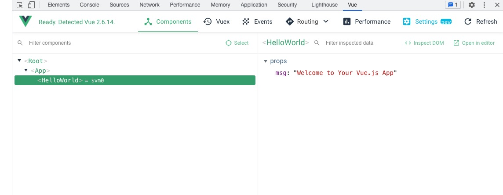

# Vue3入门基础

Vue 是一套用于构建用户界面的渐进式框架。与其它大型框架不同的是，Vue 被设计为可以自底向上逐层应用

Vue 的核心库只关注视图层，不仅易于上手，还便于与第三方库或既有项目整合, 比如实现拖拽: vue + sortable.js

vue借鉴了很有框架优秀的部分进行了整合:
+ 借鉴 angular 的模板和数据绑定技术
+ 借鉴 react 的组件化和虚拟 DOM 技术

所有框架的逻辑 都是通过js封装，上层概念比如MVVM, 方便快速开发，因此学习任何框架前都比较具体Web基础:
+ HTML
+ CSS
+ Javascript

在学习之前，快速浏览下官网: [vue3官网](https://staging-cn.vuejs.org/guide/introduction.html), 阅读完简介部分


## 快速上手

我们先快速初始化一个vue3的项目, 让我们对vue有一个感性的认识

### 安装

vue提供了一套脚手架用于快速初始化一个vue3的项目
```sh
$npm init vue@latest

Need to install the following packages:
  create-vue@3.2.2
Ok to proceed? (y) y

Vue.js - The Progressive JavaScript Framework

✔ Project name: … vue3_example
✔ Add TypeScript? … No / Yes
✔ Add JSX Support? … No / Yes
✔ Add Vue Router for Single Page Application development? … No / Yes
✔ Add Pinia for state management? … No / Yes
✔ Add Vitest for Unit Testing? … No / Yes
✔ Add Cypress for End-to-End testing? … No / Yes
✔ Add ESLint for code quality? … No / Yes
✔ Add Prettier for code formatting? … No / Yes

Scaffolding project in /Users/yumaojun/Workspace/Golang/go-course/extra/devcloud/vue3_example...

Done. Now run:

  cd vue3_example
  npm install
  npm run lint
  npm run dev
```

经过npm run dev后, 本地构建工具vite 会启动一个服务器, 将vue相关语法编译为html相关语法, 从而让浏览器可以正常显示:
```sh
> vue3_example@0.0.0 dev
> vite


  vite v2.9.12 dev server running at:

  > Local: http://localhost:3000/
  > Network: use `--host` to expose

  ready in 212ms.
```

这是我们看到的经过编译后，显示的界面


#### Vue Devtools

在使用 Vue 时，我们推荐在你的浏览器上安装 Vue Devtools。它允许你在一个更友好的界面中审查和调试 Vue 应用

##### chrome商店安装

vue-devtools可以从chrome商店直接下载安装，非常简单， 具体请参考: [Chrome Setting](https://devtools.vuejs.org/guide/installation.html#settings) 这里就不过多介绍了。不过要注意的一点就是，需要翻墙才能下载


##### 离线安装

请参考 [vue-devtools离线安装](https://www.jianshu.com/p/63f09651724c)

#### vscode 插件

+ ESLint: js eslint语法风格检查
+ Auto Rename Tag: tag rename
+ Vue Language Features (Volar): vue3语法支持
+ TypeScript Vue Plugin (Volar): Vue Plugin for TypeScript server
+ Vue VSCode Snippets: 代码片段

### 工程目录结构

通过vue脚手架搭建一个vue项目，会自动生成一系列文件，而这些文件具体是怎样的结构、文件对应起什么作用，可以看看下面的解释
```
├── dist/                      # 项目构建后的产物
├── node_module/               #项目中安装的依赖模块
├── public/                    # 纯静态资源, 入口文件也在里面
|── src/
│   ├── stores                  # vue状态管理模块
│   │   └── counter.js          # counter状态管理样例
│   ├── router                  # vue页面路由管理
│   │   └── index.js            # 入口路由配置
│   ├── views                   # vue页面
│   │   ├── AboutView.vue       # About页面
│   │   └── HomeView.vue        # Home页面
│   ├── components/             # 组件
│   │   └── ...
│   ├── assets/                 # 资源文件夹，一般放一些静态资源文件, 比如CSS/字体/图片
│   │   └── ...
│   ├── main.js                 # 程序入口文件
│   └── App.vue                 # 程序入口vue组件, 大写字母开头,后缀.vue
├── vite.config.js              # vite构建配置
├── .gitignore                  # 用来过滤一些版本控制的文件，比如node_modules文件夹 
├── package-lock.json           # 执行完npm install后, 记录的当前想起使用的依赖的具体版本
├── package.json                # 项目文件，记载着一些命令和依赖还有简要的项目描述信息 
├── index.html                  # html入口文件 
└── README.md                   #介绍自己这个项目的，可参照github上star多的项目。
```

我们可以通过dev-tools查看当前页面组建构成



### vue项目部署

如何部署:
```sh
$ npm run build ## 会在项目的dist目录下生成html文件, 使用这个静态文件部署即可

## 比如我们使用python快速搭建一个http静态站点, 如果是nginx copy到 对应的Doc Root位置
$ cd dist
$ python3 -m http.server
```

## MVVM如何诞生

现在主流的前端框架都是MVVM模型, MVVM分为三个部分：
+ M（Model，模型层 ）: 模型层，主要负责业务数据相关, 对应vue中的 data部分
+ V（View，视图层）: 视图层，顾名思义，负责视图相关，细分下来就是html+css层, 对应于vue中的模版部分
+ VM（ViewModel, 控制器）: V与M沟通的桥梁，负责监听M或者V的修改，是实现MVVM双向绑定的要点, 对应vue中双向绑定

Vue就是这种思想下的产物, 但是要讲清楚这个东西，我们不妨来看看web技术的进化史

### CGI时代

最早的HTML页面是完全静态的网页，它们是预先编写好的存放在Web服务器上的html文件, 浏览器请求某个URL时，Web服务器把对应的html文件扔给浏览器，就可以显示html文件的内容了

如果要针对不同的用户显示不同的页面，显然不可能给成千上万的用户准备好成千上万的不同的html文件，所以，服务器就需要针对不同的用户，动态生成不同的html文件。一个最直接的想法就是利用C、C++这些编程语言，直接向浏览器输出拼接后的字符串。这种技术被称为CGI：Common Gateway Interface

下面是一个python的cgi样例:


### 后端模版时代

很显然，像新浪首页这样的复杂的HTML是不可能通过拼字符串得到的, 于是，人们又发现，其实拼字符串的时候，大多数字符串都是HTML片段，是不变的，变化的只有少数和用户相关的数据, 所以我们做一个模版出来，把不变的部分写死, 变化的部分动态生成, 其实就是一套模版渲染系统, 其中最典型的就是:
+ ASP: 微软, C#体系
+ JSP: SUN, Java体系
+ PHP: 开源社区

下面是一段PHP样例:


但是，一旦浏览器显示了一个HTML页面，要更新页面内容，唯一的方法就是重新向服务器获取一份新的HTML内容。如果浏览器想要自己修改HTML页面的内容，怎么办？那就需要等到1995年年底，JavaScript被引入到浏览器

有了JavaScript后，浏览器就可以运行JavaScript，然后，对页面进行一些修改。JavaScript还可以通过修改HTML的DOM结构和CSS来实现一些动画效果，而这些功能没法通过服务器完成，必须在浏览器实现

### JavaScript原生时代

```html
<p id="userInfo">
姓名:<span id="name">Gloria</span>
性别:<span id="sex">男</span>
职业:<span id="job">前端工程师</span>
</p>
```

有以上html片段，想将其中个人信息替换为alice的，我们的做法
```js
// 通过ajax向后端请求, 然后利用js动态修改展示页面
document.getElementById('name').innerHTML = alice.name;
document.getElementById('sex').innerHTML = alice.sex;
document.getElementById('job').innerHTML = alice.job;
```

jQuery在这个时代脱颖而出

```html
<div id="name" style="color:#fff">前端你别闹</div> <div id="age">3</div>
<script>
$('#name').text('好帅').css('color', '#000000'); $('#age').text('666').css('color', '#fff');
/* 最终页面被修改为 <div id="name" style="color:#fff">好帅</div> <div id="age">666</div> */
</script>
```

在此情况下可以下 前后端算是分开了, 后端提供数据, 前端负责展示, 只是现在 前端里面的数据和展示并有分开，不易于维护


### 前端模版时代

在架构上前端终于走上后端的老路: 模版系统, 有引擎就是ViewModel动态完成渲染

```html
<script id="userInfoTemplate">
姓名:<span>{name}</span>
性别:<span>{sex}</span>
职业:<span>{job}</span>
</script>
```

```js
var userInfo = document.getElementById('userInfo');
var userInfoTemplate = document.getElementById('userInfoTemplate').innerHTML;
userInfo.innerHTML = templateEngine.render(userInfoTemplate, users.alice);
```

### 虚拟DOM技术

用我们传统的开发模式，原生JS或JQ操作DOM时，浏览器会从构建DOM树开始从头到尾执行一遍流程, 操作DOM的代价仍旧是昂贵的，频繁操作还是会出现页面卡顿，影响用户体验

如何才能对Dom树做局部更新，而不是全局更新喃? 答案就是由js动态来生产这个树, 修改时动态更新, 这就是虚拟Dom

这是一个真实dom


这是动态生成的Dom是不是和CGI很像


### 组件化时代

MVVM最早由微软提出来，它借鉴了桌面应用程序的MVC思想，在前端页面中，把Model用纯JavaScript对象表示，View负责显示，两者做到了最大限度的分离。


结合虚拟Dom技术, 我们就可以动态生成view, 在集合mvvm的思想, 前端终于迎来了组件化时代

+ 页面由多个组建构成
+ 每个组件都有自己的 MVVM


下面这个页面就是有多个vue组件构成的:


## Vue与MVVM

+ Model: vue中用于标识model的数据是 data对象, data 对象中的所有的 property 加入到 Vue 的响应式系统中, 有vue监听变化
+ View: vue使用模版来实现展示, 但是渲染时要结合 vdom技术
+ ViewModle: vue的核心, 负责视图的响应, 也就是数据双向绑定
  + 监听view中的数据,  如果数据有变化, 动态同步到 data中
  + 监听data中的数据,  如果数据有变化, 通过vdom动态渲视图


比如我们修改下About组件, 在model中添加一个name属性
```js
<script>
export default {
  name: 'HelloWorld',
  data() {
    return {
      name: '老喻'
    }
  },
  props: {
    msg: String
  }
}
</script>
```

然后在模版中添加个输入框来修改他, 给他h2展示name属性

默认情况下vue是单向绑定: 数据 --> 视图

如果要双向绑定, 需要使用v-model: 视图 --> 数据

```html
<h2>{{ name }}</h2>
<input v-model="name" type="text">
```

在安装了Vue Devtools的时候，我们可以在console里看到我们的虚拟dom


## 选项式 API和组合式 API

在上面的例子中 我们通过 export default {} 暴露出一个vue的实例(先不要纠结什么是vue实例, 我们马上就要讲到), 我们可以把 export 出去的这个对象认为是 vue实例的配置

vue提供了2种方式来配置vue实例, 被叫做两种 API 风格, 他们都能够覆盖大部分的应用场景。

它们只是同一个底层系统所提供的两套不同的接口。实际上，选项式 API 也是用组合式 API 实现的！关于 Vue 的基础概念和知识在它们之间都是通用的

### 选项式 API

我们上面使用的就是选项式API, 使用选项式 API，我们可以用包含多个选项的对象来描述组件的逻辑，例如 data、methods 和 mounted。选项所定义的属性都会暴露在函数内部的 this 上，它会指向当前的组件实例

比如我们在about页面，添加一个mounted选项(当界面模版渲染完成后调用), 打印下this(当前组件实例)
```vue
<script>
export default {
  name: "HelloWorld",
  // data() 返回的属性将会成为响应式的状态
  // 并且暴露在 `this` 上
  data() {
    return {
      name: "老喻",
    };
  },
  props: {
    msg: String,
  },
  // 生命周期钩子会在组件生命周期的各个不同阶段被调用
  // 例如这个函数就会在组件挂载完成后被调用
  mounted() {
    console.log(this);
  },
};
</script>
```

在右侧console就能看到该实例对象:


由此可以选项式 API 就是 vue 实例(或者叫组件的实例)给我们留的构子, 用于我们控制vue实例的行为。

### 组合式 API

组合式API 为我们提供了另外一种设置Vue实例的方式: 直接在函数作用域内定义响应式状态变量， 这个变量可以是数据, 比如 [], {},... 也可以是函数 比如 search() ...

通过组合式 API，我们可以使用导入的 API 函数来描述组件逻辑

```vue
<script setup>
// 以库的形式来使用vue实例提供的API
import { ref, onMounted, getCurrentInstance } from "vue";

// 响应式状态
// 相当于 data里面的 name属性
const name = ref("");

// 使用构造函数onMounted
// 想到于mounted选项
onMounted(() => {
  // 通过getCurrentInstance获取到当前组件的vue实例
  const _this = getCurrentInstance();
  console.log(_this);
});
</script>
```

当前实例对象上的proxy就是当前实例


### 如何选择

+ 选项式API更好理解(简单场景使用)

选项式 API 以“组件实例”的概念为中心 (即上述例子中的 this)，对于有面向对象语言背景的用户来说，这通常与基于类的心智模型更为一致,从而对初学者而言更为友好

+ 组合式API更灵活(复杂场景使用)

组合式 API 的核心思想是直接在函数作用域内定义响应式状态变量，并将从多个函数中得到的状态组合起来处理复杂问题,这种形式更加自由


## Vue实例

我们知道可以通过getCurrentInstance获取当前vue实例, 不要被内部的细节吓到, 我们只是大体上认知下vue实例上的一些关键属性, 好方便有个全局意识, 在后面的细节讲解中 会对他们有详细解释.

下面是关于该实例的描述:
```ts
/**
 * We expose a subset of properties on the internal instance as they are
 * useful for advanced external libraries and tools.
 */
export declare interface ComponentInternalInstance {
    uid: number;
    type: ConcreteComponent;
    parent: ComponentInternalInstance | null;
    root: ComponentInternalInstance;
    appContext: AppContext;
    /**
     * Vnode representing this component in its parent's vdom tree
     */
    vnode: VNode;
    /* Excluded from this release type: next */
    /**
     * Root vnode of this component's own vdom tree
     */
    subTree: VNode;
    ...
    proxy: ComponentPublicInstance | null;
    ...
}
```

内部实例一般是给库或者框架开发者预留的, 属于底层扩展,比如操作虚拟dom, 访问响应式数据, 而留给vue使用者的实例是ComponentPublicInstance, 比如定义实例的一些属性(props, slots)和一些钩子函数的定义(mounted,...): 
```ts
export declare type ComponentPublicInstance<P = {}, // props type extracted from props option
B = {}, // raw bindings returned from setup()
D = {}, // return from data()
C extends ComputedOptions = {}, M extends MethodOptions = {}, E extends EmitsOptions = {}, PublicProps = P, Defaults = {}, MakeDefaultsOptional extends boolean = false, Options = ComponentOptionsBase<any, any, any, any, any, any, any, any, any>> = {
    $: ComponentInternalInstance;
    $data: D;
    $props: MakeDefaultsOptional extends true ? Partial<Defaults> & Omit<P & PublicProps, keyof Defaults> : P & PublicProps;
    $attrs: Data;
    $refs: Data;
    $slots: Slots;
    $root: ComponentPublicInstance | null;
    $parent: ComponentPublicInstance | null;
    $emit: EmitFn<E>;
    $el: any;
    // 这是当前vue实例的配置参数, vue
    $options: Options & MergedComponentOptionsOverride;
    $forceUpdate: () => void;
    $nextTick: typeof nextTick;
    $watch(source: string | Function, cb: Function, options?: WatchOptions): WatchStopHandle;
} & P & ShallowUnwrapRef<B> & UnwrapNestedRefs<D> & ExtractComputedReturns<C> & M & ComponentCustomProperties;
```


```ts
declare type MergedComponentOptionsOverride = {
    beforeCreate?: MergedHook;
    created?: MergedHook;
    beforeMount?: MergedHook;
    mounted?: MergedHook;
    beforeUpdate?: MergedHook;
    updated?: MergedHook;
    activated?: MergedHook;
    deactivated?: MergedHook;
    /** @deprecated use `beforeUnmount` instead */
    beforeDestroy?: MergedHook;
    beforeUnmount?: MergedHook;
    /** @deprecated use `unmounted` instead */
    destroyed?: MergedHook;
    unmounted?: MergedHook;
    renderTracked?: MergedHook<DebuggerHook>;
    renderTriggered?: MergedHook<DebuggerHook>;
    errorCaptured?: MergedHook<ErrorCapturedHook>;
};
```


### 创建实例

我们如何创建一个vue实例喃? 我们看看入口: main.js

```js
import { createApp } from "vue";
import { createPinia } from "pinia";

import App from "./App.vue";
import router from "./router";

const app = createApp(App);

app.use(createPinia());
app.use(router);

app.mount("#app");
```

#### 根组件

每个应用都需要一个“根组件”，其他组件将作为其子组件

```sh
App (root component)
├─ TodoList
│  └─ TodoItem
│     ├─ TodoDeleteButton
│     └─ TodoEditButton
└─ TodoFooter
   ├─ TodoClearButton
   └─ TodoStatistics
```

这里传染的就是一个根组件: App.vue, 也就是vue Root实例, 也就是 MVVM里面的 ViewModel 概念的实体
```js
import { createApp } from "vue";
import App from "./App.vue";
const app = createApp(App);
```


#### 挂载应用

应用实例必须在调用了 .mount() 方法后才会渲染出来

```js
// 该方法接收一个“容器”参数，可以是一个实际的 DOM 元素或是一个 CSS 选择器字符串
// 这里的参数是一个 css id选择器, 他对于者一个HTML的元素
app.mount('#app')
```

允许npm run build后 会在 dist目录下看到构建后的 HTML产物: 
```html
<!DOCTYPE html>
<html lang="en">
  <head>
    <meta charset="UTF-8" />
    <link rel="icon" href="/favicon.ico" />
    <meta name="viewport" content="width=device-width, initial-scale=1.0" />
    <title>Vite App</title>
    <!-- 这就是编译后压缩 的纯JS脚步, 他的作用就是动态操作DOM(VDOM) -->
    <script type="module" crossorigin src="/assets/index.454cea7e.js"></script>
    <link rel="stylesheet" href="/assets/index.f6f45cab.css">
  </head>
  <body>
    <!-- js 框架(vue) 作用的根元素, 后期就是靠 vue框架生产虚拟DOM来动态选择出界面的 -->
    <div id="app"></div>

  </body>
</html>
```

#### 应用配置

应用配置就是全局配置, 当你有一些配置想要对全局生效, 你应该要能想起他

上面的use 就是用于加载全局插件使用的, 后面我们加载UI插件也会使用到use
```js
app.use(createPinia());
app.use(router);
```

### Vue实例生命周期

上面我们使用过一个onMounted的函数:
```js
// 以库的形式来使用vue实例提供的API
import { onMounted } from "vue";

// 使用构造函数onMounted
// 想到于mounted选项
onMounted(() => {
  // 通过getCurrentInstance获取到当前组件的vue实例
  const _this = getCurrentInstance();
  console.log(_this);
});
```

每个 Vue 组件实例在创建时都需要经历一系列的初始化步骤，比如挂载实例到 DOM(onMounted)。在此过程中，它也会运行称为生命周期钩子的函数，让开发者有机会在特定阶段添加自己的代码


下面我们使用组合式API来调试下这些生命周期钩子:
```vue
<script setup>
// 以库的形式来使用vue实例提供的API
import {
  ref,
  onBeforeMount,
  onMounted,
  onBeforeUpdate,
  onUpdated,
  onBeforeUnmount,
  onUnmounted,
} from "vue";

// 响应式状态
// 相当于 data里面的 name属性
const name = ref("老喻");

onBeforeMount(() => {
  console.log("before mount");
});
onMounted(() => {
  console.log("mounted");
});
onBeforeUpdate(() => {
  console.log("before update");
});
onUpdated(() => {
  console.log("on updated");
});
onBeforeUnmount(() => {
  console.log("before unmount");
});
onUnmounted(() => {
  console.log("unmounted");
});
</script>
```

下面是调试结果:
```sh
# 初始化实例
before mount
mounted
# 更新实例
before update
on updated
# 销毁实例
before unmount
unmounted
```

下面是选项式API:
```js
<script>
export default {
  name: 'HelloWorld',
  data() {
    return {
      name: '老喻'
    }
  },
  beforeCreate() {
    console.log('beforeCreate')
  },
  created() {
    console.log('created')
  },
  beforeMount() {
    console.log('beforeMount')
  },
  mounted() {
    console.log('mounted')
  },
  beforeUpdate() {
    console.log('beforeUpdate')
  },
  updated() {
    console.log('updated')
  },
  beforeDestroy() {
    console.log('beforeDestroy')
  },
  destroyed() {
    console.log('destroyed')
  },
  props: {
    msg: String
  }
}
</script>
```

下面是控制台的日志
```sh
# 当我们点到About页面时, vue实例初始化
beforeCreate
created
beforeMount
mounted

# 当我们离开该页面时, vue实例销毁
beforeDestroy
destroyed
```

## 响应式原理

vue 实现了 view 和 model的双向绑定, 如下:


而响应式指的就是 model(数据)有变化时，能反馈到view上, 当然这个反馈是由view实例来帮我们完成的， 那view怎么知道 model(数据)有变化喃?

### JavaScript Proxy

答案之一是[JavaScript Proxy](https://developer.mozilla.org/en-US/docs/Web/JavaScript/Reference/Global_Objects/Proxy), 其行为表现与一般对象相似。不同之处在于 Vue 能够跟踪对响应式对象 property 的访问与更改操作

```js
const monster1 = { eyeCount: 4 };

const handler1 = {
  set(obj, prop, value) {
    if ((prop === 'eyeCount') && ((value % 2) !== 0)) {
      console.log('Monsters must have an even number of eyes');
    } else {
      return Reflect.set(...arguments);
    }
  }
};

const proxy1 = new Proxy(monster1, handler1);

proxy1.eyeCount = 1;
// expected output: "Monsters must have an even number of eyes"

console.log(proxy1.eyeCount);
// expected output: 4

proxy1.eyeCount = 2;
console.log(proxy1.eyeCount);
// expected output: 2
```

当我修改数据时, vue实例就会感知到, 感知到后 使用js操作dom(vdom), 完成试图的更新。

那vue必须提供一个构造函数用于初始化 原声对象，这样vue才能跟踪数据变化, vue提供一个reactive函数 就是用来干这个的

```js
function reactive(obj) {
  return new Proxy(obj, {
    get(target, key) {
      track(target, key)
      return target[key]
    },
    set(target, key, value) {
      trigger(target, key)
      target[key] = value
    }
  })
}
```

下面我们修改About例子, 并做验证
```vue
<template>
  <div class="about">
    <h2>{{ person.name }}</h2>
    <input v-model="person.name" type="text" />
  </div>
</template>

<script>
// 以库的形式来使用vue实例提供的API
import { reactive } from "vue";

export default {
  // `setup` 是一个专门用于组合式 API 的特殊钩子
  setup() {
    // 使用reactive 构造Proxy对象, 这样vue才能跟踪对象变化
    const person = reactive({ name: "老喻" });

    // 暴露 person 到模板
    return {
      person
    }
  }
}
</script>
```

### getter/setters

Proxy仅对对象类型有效（对象、数组和 Map、Set 这样的集合类型），而对 string、number 和 boolean 这样的 原始类型 无效

为了解决 reactive() 带来的限制，Vue 也提供了一个 ref() 方法来允许我们创建可以使用任何值类型的响应式 ref

ref利用的是JavaScript的getter/setters 的方式劫持属性访问
```js
function ref(value) {
  const refObject = {
    get value() {
      track(refObject, 'value')
      return value
    },
    set value(newValue) {
      trigger(refObject, 'value')
      value = newValue
    }
  }
  return refObject
}
```

向上面我们如果不使用对象, 而是使用一个字符串，就需要使用ref来声明一个响应式变量

```vue
<template>
  <div class="about">
    <!-- 这里为啥没有使用 name.value来访问喃?
    当 ref 在模板中作为顶层 property 被访问时，它们会被自动“解包”，所以不需要使用 .value -->
    <h2>{{ name }}</h2>
    <input v-model="name" type="text" />
  </div>
</template>

<script>
// 以库的形式来使用vue实例提供的API
import { ref } from "vue";

export default {
  // `setup` 是一个专门用于组合式 API 的特殊钩子
  setup() {
    // 使用ref来为基础类型 构造响应式变量
    const name = ref("老喻");

    // 通过value来设置 基础类型的值(Setter方式)
    name.value = "张三";

    // 暴露 name 到模板
    return {
      name
    }
  }
}
</script>
```

### setup 语法

在 setup() 函数中手动暴露状态和方法可能非常繁琐
```vue
<script>
// 以库的形式来使用vue实例提供的API
import { reactive } from "vue";

export default {
  // `setup` 是一个专门用于组合式 API 的特殊钩子
  setup() {

    // 暴露 数据 到模板
    return {}
  }
}
</script>
```

幸运的是, 你可以通过使用构建工具来简化该操作。当使用单文件组件（SFC）时，我们可以使用 <script setup> 来简化大量样板代码

```vue
<script setup>
// 以库的形式来使用vue实例提供的API
import { ref } from "vue";

// 使用ref来为基础类型 构造响应式变量
const name = ref("老喻");

// 通过value来设置 基础类型的值(Setter方式)
name.value = "张三";
</script>
```

大多数 Vue 开发者在开发应用时都会基于: 单文件组件 + <script setup> 的语法的方式, 这也是我们后面常见的写法

### DOM异步更新

注意这是一个很重要的概念, 当你响应式数据发送变化时, DOM 也会自动更新, 但是这个更新并不是同步的，而是异步的: vue会将你的变更放到一个缓冲队列, 等待更新周期到达时, 一次性完成DOM(视图)的更新。

比如下面这个例子:
```vue
<script setup>
import { onMounted } from "vue";

// 使用ref来为基础类型 构造响应式变量
let name = $ref("老喻");

// 只有等模版挂载好后，我门才能获取到对应的HTML元素
onMounted(() => {
  // 通过value来设置 基础类型的值(Setter方式)
  name = "张三";
  console.log(document.getElementById("name").innerText);
});
</script>
```

由于修改name后, 并没有立即更新DOM, 所以获取到的name依然时初始值, 那如果想要获取到当前值怎么办?

vue在dom更新时 为我们提供了一个钩子: nextTick() 

该钩子就是当vue实例 到达更新周期后, 更新完Dom后，留给我们操作的口子, 因此我们改造下:
```vue
<script setup>
import { nextTick, onMounted } from "vue";

// 使用ref来为基础类型 构造响应式变量
let name = $ref("老喻");

// 只有等模版挂载好后，我门才能获取到对应的HTML元素
onMounted(() => {
  // 通过value来设置 基础类型的值(Setter方式)
  name = "张三";

  // 等待vue下次更新到来后, 执行下面的操作
  nextTick(() => {
    console.log(document.getElementById("name").innerText);
  });
});
</script>
```

一定要理解vue的异步更新机制, 因为你写的代码 并不是按照你的预期同步执行的, 这是引起很多魔幻bug的根源

### 深层响应性

通过上面我们知道 reactive 初始化的Proxy对象是响应式的, 那如果我这个对象里面再嵌套对象, 那嵌套的对象还是不是响应式的喃?

```vue
<template>
  <div class="about">
    <h2 id="name">{{ person }}</h2>
    <input v-model="person.name" type="text" />
    <input v-model="skill" @keyup.enter="addSkile(skill)" type="text" />
  </div>
</template>

<script setup>
import { reactive, ref } from "vue";

let skill = ref("");

// 使用ref来为基础类型 构造响应式变量
let person = reactive({
  name: "张三",
  profile: { city: "北京" },
  skills: ["Golang", "Vue"],
});

let addSkile = (s) => {
  person.skills.push(s);
  person.profile.skill_count = person.skills.length;
};
</script>
```

我们可以看到，当修改了嵌套的数组skills时, profile对象的 count和skills 都动态更新到试图上了, 因此可以看出在 Vue 中，状态都是默认深层响应式的, 这也是大多数场景下我们期望的

当你一个对象很大，嵌套很复杂的时候，这种深层的响应模式 可能会引发一些性能问题, 这个时候我们可以使用vue提供的shallowReactive 创建一个浅层响应式的数据

```js
// 使用shallowReactive 构造浅层响应式数据, 当数据有变化时，不会理解反馈到界面上
let person = shallowReactive({
  name: "张三",
  profile: { city: "北京" },
  skills: ["Golang", "Vue"],
});
```

### ref vs reactive

ref 不仅可以用于构造基础类型, 同时也支持用于构造复合类型, 比如对象和数组, 简而言之reactive能实现的 ref也能实现:
```vue
<script setup>
import { ref } from "vue";

let skill = ref("");

// 使用ref来为基础类型 构造响应式变量
let person = ref({
  name: "张三",
  profile: { city: "北京" },
  skills: ["Golang", "Vue"],
});

let addSkile = (s) => {
  person.value.skills.push(s);
  person.value.profile.skill_count = person.value.skills.length;
};
</script>
```

那ref对象是如何兼容reactive的喃? 答案很简单，ref函数会判断传递过来的的值是 复合类型还是简单类型, 如果是复合类型, 比如对象与数组 就会通过reactive将其转化为一个深层响应式的Proxy对象

由于ref可以控制到基础类型的力度, 而复合对象可以认为是基础对象的上层封装, 所以很大部分场景下 我们都可以直接使用ref 代替reactive

而且由于ref控制力度细的问题, 我们可以基于它来构造一个响应式对象，比如:
```vue
<template>
  <div class="about">
    <h2 id="name">{{ person }}</h2>
    <input v-model="person.name.value" type="text" />
    <input v-model="skill" @keyup.enter="addSkile(skill)" type="text" />
  </div>
</template>

<script setup>
import { ref } from "vue";

let skill = ref("");

// 使用ref来构造一个对象
let person = {
  name: ref("张三"),
  profile: ref({ city: "北京" }),
  skills: ref(["Golang", "Vue"]),
};

// 等价于一个reactive初始化出来的proxy对象
// let person = ref({
//   name: "张三",
//   profile: { city: "北京" },
//   skills: ["Golang", "Vue"],
// });

let addSkile = (s) => {
  person.skills.value.push(s);
  person.profile.skill_count = person.skills.value.length;
};
</script>
```

这样构造出来的对象还是另一个好处, 它在解构赋值时, 解构后的变量依然时响应式的, 可以思考下时为啥? 
```vue
<script setup>
import { ref } from "vue";

let skill = ref("");

// 使用ref来构造一个对象
let person = {
  name: ref("张三"),
  profile: ref({ city: "北京" }),
  skills: ref(["Golang", "Vue"]),
};

// 解构赋值
let { name, profile, skills } = person;

let addSkile = (s) => {
  skills.value.push(s);
  profile.skill_count = skills.value.length;
};
</script>
```

由于Proxy是一个对象,它的响应式是与该对象绑定, 如果对象一旦被解开了, 而对象的属性本身又不具备响应式，响应式就中断了, 而使用ref就不会

### ref 响应性语法糖

上面我们提到了定义setup函数的繁琐问题, 我们接下来说说.value的繁琐问题, 并且在没有类型系统的帮助时很容易漏掉

既然模板里面ref 编译器都能处理自动补充上 value, 那么在setup的js里面编译器能不能也帮忙补充下喃?
```vue
<template>
  <div class="about">
    <!-- 这里为啥没有使用 name.value来访问喃?
    当 ref 在模板中作为顶层 property 被访问时，它们会被自动“解包”，所以不需要使用 .value -->
    <h2>{{ name }}</h2>
    <input v-model="name" type="text" />
  </div>
</template>
```

Vue 的响应性语法糖为我们提供了编译时的转换过程, 在setup语法内, 我们使用$+名称来 引用编译时的宏命令, 

宏命令它不是一个真实的、在运行时会调用的方法。而是用作 Vue 编译器的标记，表明最终的 count 变量需要是一个响应式变量, 编译器自动帮我们补充上.value 的语法 

编译器支持的宏命令有:
+ ref -> $ref
+ computed -> $computed
+ shallowRef -> $shallowRef
+ customRef -> $customRef
+ toRef -> $toRef

响应性语法糖目前是一个实验性功能，默认是禁用的，需要显式选择使用, 并且要求vue版本大于3.2.25

我们通过vite配置文件开启该选项:
```js
// vite.config.js
export default {
  plugins: [
    vue({
      reactivityTransform: true
    })
  ]
}
```

有了响应式语法糖的帮助，我们终于可以不用写.value, 该功能应该很快就会加入到正式版本, 应用写.value的确很繁琐
```vue
<script setup>
// 使用ref来为基础类型 构造响应式变量
let name = $ref("老喻");

// 通过value来设置 基础类型的值(Setter方式)
name = "张三";
</script>
```

### 侦听器

一个简单的需求:
我们一个页面有多个参数, 用户可能把url copy给别人, 我们需要不同的url看到页面内容不同, 不然用户每次到这个页面都是第一个页面


这个就需要我们监听url参数的变化, 然后视图做调整, vue-router会有个全局属性: $route, 我们可以监听它的变化


由于没引入vue-router,那我们如何监听URL的变化 window提供一个事件回调:
```js
window.onhashchange = function () {
  console.log('URL发生变化了', window.location.hash);
  this.urlHash = window.location.hash
};
```

我们再也没挂在完成后, 把它记录成一个本地hash 来模拟这个过程, 这个有点多余，直接通过这个回调就可以完成页面变化处理, 这里是演示watch

vue 提供的属性watch语法如下:
```
  watch: {
    // 如果 `urlHash` 发生改变，这个函数就会运行
    urlHash: function (newData, oldData) {
      this.debouncedGetAnswer()
    }
  },
```

我们先监听变化， 挂载后修改vue对象, 然后watch做
```html
<script>
export default {
  name: 'HelloWorld',
  data() {
    return {
      urlHash: '',
    }
  },
  mounted() {
    /* 来个骚操作 */
    let that = this
    window.onhashchange = function () {
      that.urlHash = window.location.hash
    };
  },
  watch: {
    urlHash: function(newURL, oldURL) {
      console.log(newURL, oldURL)
    }
  }
}
</script>
```

更多watch用于请参考: [Vue Watch API](https://cn.vuejs.org/v2/api/#vm-watch)

## 模板语法

通过template标签定义的部分都是vue的模版, 模版会被vue-template-compiler编译后渲染
```html
<template>
  ...
</template>
```

### 访问变量

#### 文本值

在vue的模版中, 我们直接使用 {{ ref_name }} 的方式访问到js部分定义变量(包含响应式和非响应式)

```vue
<script setup>
import { ref } from "vue";

const count = ref(0);
</script>

<template>
  <button @click="count++">You clicked me {{ count }} times.</button>
</template>
```

#### 表达式

除了能在模版系统中直接访问到这些变量, 可以在模版系统中 直接使用js表达式, 这对象处理简单逻辑很有用

```html
<template>
  <div>{{ name.split('').reverse().join('') }}</div>
</template>

<script setup>
import { ref } from "vue";

const name = ref('');
</script>
```

#### 计算属性

如果model的数据并不是你要直接渲染的，需要处理再展示, 简单的方法是使用表达式，比如
```html
<h2>{{ name.split('').reverse().join('') }}</h2>
```

这种把数据处理逻辑嵌入的视图中，并不合适,  不易于维护, 我们可以把改成一个方法
```html
<h2>{{ reverseData(name.value) }}</h2>

<script setup>
import { ref } from "vue";

const name = ref('');
</script>
```

但是使用函数 每次访问该属性都需要调用该函数计算, 如果数据没有变化(vue是响应式的它知道数据有没有变化)，我们能不能把函数计算出的属性缓存起来,直接使用喃?

vue把这个概念定义为计算属性，使用computed钩子定义:
```js
// 一个计算属性 ref
const reverseName = computed({
  // getter
  get() {
    return name.vaule.split('').reverse().join('')
  },
  // setter
  set(newValue) {
    name.value = newValue.split(' ').reverse().join('')
  }
})
```

我们修改为计算属性:

```html
<h2>{{ reverseName }}</h2>

<script setup>
import { ref } from "vue";

const name = ref('');

// 一个计算属性 ref
const reverseName = computed({
  // getter
  get() {
    return name.vaule.split('').reverse().join('')
  },
  // setter
  set(newValue) {
    name.value = newValue.split(' ').reverse().join('')
  }
})
</script>
```

如果我们只有get 没有set方法 也可以简写为:
```js
// 一个计算属性 ref
const reverseName = computed(() => {name.vaule.split('').reverse().join('')})
```

#### 过滤器

Vue.js 允许你自定义过滤器，可被用于一些常见的文本格式化, 最常见就是 时间的格式化

过滤器语法:
```js
<!-- 在双花括号中 -->
{{ message | capitalize }}
```

你可以把他等价于一个函数: capitalize(message)

我们可以在当前组件的vue实例上定义一个过滤器:

```js
filters: {
  capitalize: function (value) {
    /*过滤逻辑*/
  }
}
```

我们先定义我们的parseTime过滤器:
```js
{{ ts | parseTime }}

<script>
export default {
  name: 'HelloWorld',
  data() {
    return {
      ts: Date.now()
    }
  },
  filters: {
    parseTime: function (value) {
      let date = new Date(value)
      return `${date.getFullYear()}-${date.getMonth() + 1}-${date.getDate()} ${date.getHours()}:${date.getMinutes()}`
    }
  }
}
</script>
```

如果每个地方都要用这个过滤器, 我们中不至于每个组件里面抄一遍吧!

vue提供全局过滤器, 再初始化vue实例的时候可以配置, 找到main.js添加

```js
// 添加全局过滤器
Vue.filter('parseTime', function (value) {
  let date = new Date(value)
  return `${date.getFullYear()}-${date.getMonth() + 1}-${date.getDate()} ${date.getHours()}:${date.getMinutes()}`
})

```

这样我们就可以删除我们在局部里面定义的过滤器了

### 响应式绑定

模版的变量只能作用于文本值部分, 并不能直接作用于HTML元素的属性, 比如下面属性:
+ id
+ class
+ style


变量不能作用在 HTML attribute 上, 比如下面的语法就是错误的
```html
<template>
  <!-- html属性id 无法直接访问到变量 -->
  <div id={{ name }}>
    <!-- 文本值变量 语法ok -->
    {{ name }}
  </div>
</template>
```

#### 元素属性

针对HTML元素的属性 vue专门提供一个 v-bind指令, 这个指令就是模版引擎里面的一个函数, 他专门帮你完成HTML属性变量替换, 语法如下:
```
v-bind:name="name"   ==>  name="name.value"
```

那我们修改下
```html
<template>
  <!-- html属性id 无法直接访问到变量 -->
  <div v-bind:id="name">
    <!-- 文本值变量 语法ok -->
    {{ name }}
  </div>
</template>
```

v-binding 有个缩写:  `:` 等价于 `v-bind:`

```html
<template>
  <!-- html属性id 无法直接访问到变量 -->
  <div :id="name">
    <!-- 文本值变量 语法ok -->
    {{ name }}
  </div>
</template>
```

因此我们可以直接使用:attr 来为HTML的属性绑定变量

#### 元素事件

如果我要要给buttom这个元素绑定一个事件应该如何写

参考: [HTML 事件属性](https://www.runoob.com/tags/ref-eventattributes.html)

原生的写法:
```html
<button onclick="copyText()">复制文本</button>
```

对于vue的模版系统来说, copyText这个函数如何渲染, 他不是一个文本，而是一个函数

vue针对事件专门定义了一个指令: v-on, 语法如下:
```
v-on:eventName="eventHandler"

eventName: 事件的名称
eventHandler: 处理这个事件的函数
```

比如 下面我们为button绑定一个点击事件:
```html
<template>
    <button :disabled="isButtomDisabled" v-on:click="clickButtom" >Button</button>
</template>
<script setup>
import { ref } from "vue";

const isButtomDisabled = ref(false);
const clickButtom() => {isButtomDisabled.value = !isButtomDisabled.value}
</script>
```

当然v-on这个指令也可以缩写成 `@`
```html
<template>
    <button :disabled="isButtomDisabled" @click="clickButtom" >Button</button>
</template>
```

#### Class 与 Style 绑定


#### 表单输入绑定


#### 骚包的指令

vue遇到不好解决的问题，就定义一个指令, 官方内置了一些指令:

+ v-model: 双向绑定的数据
+ v-bind: html元素属性绑定
+ v-on: html元素事件绑定
+ v-if: if 渲染
+ v-show: 控制是否显示
+ v-for: for 循环

上面的例子 只是指令的简单用法, 指令的完整语法如下:
```
v-directive:argument.modifier.modifier...

v-directive: 表示指令名称, 如v-on
argument： 表示指令的参数, 比如click
modifier:  修饰符,用于指出一个指令应该以特殊方式绑定
```

比如当用户按下回车时, 表示用户输入完成, 触发搜索

```
v-directive: 需要使用绑定事件的指令: v-on
argument:    监听键盘事件: keyup, 按键弹起时
modifier:    监听Enter建弹起时

因此完整写发:  v-on:keyup.enter
```

```html
<template>
    <input v-model="name" type="text" @keyup.enter="pressEnter">
</template>
<script>
export default {
  name: 'HelloWorld',
  data() {
    return {
      name: '老喻',
      isButtomDisabled: false,
    }
  },
  methods: {
    clickButtom() {
      alert("别点我")  
    },
    pressEnter() {
      alert("点击了回车键")
    }
  },
}
</script>
```

最后需要注意事件的指令的函数是可以接受参数的

```html
<template>
    <input v-model="name" type="text" @keyup.enter="pressEnter(name)">
    <button v-on:click="say('hi')">Say hi</button>
</template>
```

函数是直接读到model数据的, 因此别用{{ }}， 如果要传字符串 使用''


修饰符可以玩出花, 具体的请看官方文档
```html
<!-- 即使 Alt 或 Shift 被一同按下时也会触发 -->
<button v-on:click.ctrl="onClick">A</button>

<!-- 有且只有 Ctrl 被按下的时候才触发 -->
<button v-on:click.ctrl.exact="onCtrlClick">A</button>

<!-- 没有任何系统修饰符被按下的时候才触发 -->
<button v-on:click.exact="onClick">A</button>
```

#### 自定义指令

除了核心功能默认内置的指令 (v-model 和 v-show)，Vue 也允许注册自定义指令, 别问， 问就是你需要

比如用户进入页面让输入框自动聚焦, 方便快速输入, 比如登陆页面, 快速聚焦到 username输入框

如果是HTML元素聚焦, 我们找到元素, 调用focus就可以了, 如下:
```js
let inputE = document.getElementsByTagName('input')
inputE[0].focus()
```

添加到mounted中进行测试:
```js
mounted() {
  let inputE = document.getElementsByTagName('input')
  inputE[0].focus()
  }
```

如何将这个功能做成一个vue的指令喃? 比如 v-focus

我们先注册一个局部指令, 在本组件中使用
```js
export default {
  name: 'HelloWorld',
  directives: {
    focus: {
      // 指令的定义
      inserted: function (el) {
        el.focus()
      }
    }
  },
}
</script>
```

这里我们注册的指令名字叫focus, 所有的指令在模版要加一个v前缀, 因此我们的指令就是v-focus

注释掉之前的测试代码, 然后使用我们注册的指令来实现:
```html
<input v-focus v-model="name" type="text" @keyup.enter="pressEnter(name)">
```

怎么好用的功能，怎么可能局部使用，当然要全局注册, 找到main.js 配置自定义指令

```js
// 注册一个全局自定义指令 `v-focus`
Vue.directive('focus', {
  // 当被绑定的元素插入到 DOM 中时
  inserted: function (el) {
    // 聚焦元素
    el.focus()
  }
})
```

删除局部指令测试

### 条件渲染

有2个指令用于在模版中控制条件渲染:

+ v-if: 控制元素是否创建, 创建开销较大
+ v-show: 控制元素是否显示, 对象无效销毁，开销较小

v-if 完整语法:
```html
<t v-if="" /> 
<t v-else-if="" /> 
<t v-else="" /> 
```

v-show完整语法:
```html
<t v-show="" />
```

比如更加用户输入, 判断当前分数的等级

```html
<input v-model="name" type="text" @keyup.enter="pressEnter(name)">
<div v-if="name >= 90">
  A
</div>
<div v-else-if="name >= 80">
  B
</div>
<div v-else-if="name >= 60">
  C
</div>
<div v-else-if="name >= 0">
  D
</div>
<div v-else>
  请输入正确的分数
</div>
```

这些HTML元素都需要动态创建,  我们换成v-show看看

```html
<input v-model="name" type="text" @keyup.enter="pressEnter(name)">
<div v-show="name >= 90">
  A
</div>
<div v-show="name >= 80 && name < 90">
  B
</div>
<div v-show="name >= 60 && name < 80">
  C
</div>
<div v-show="name >= 0 && name < 60">
  D
</div>
```

我们可以看到只是简单地基于 CSS 进行切换


一般来说，v-if 有更高的切换开销，而 v-show 有更高的初始渲染开销。因此，如果需要非常频繁地切换，则使用 v-show 较好；如果在运行时条件很少改变，则使用 v-if 较好


### 列表渲染

v-for元素的列表渲染, 语法如下:

```html
<t v-for="(item, index) in items" :key="item.message">
  {{ item.message }}
</t>

<!-- items: [
  { message: 'Foo' },
  { message: 'Bar' }
] -->
```

 
 如果你不使用index, 也可以省略, 比如:

```html
<ul>
  <li v-for="item in items" :key="item.message">
    {{ item.message }}
  </li>
</ul>

<script>
export default {
  name: 'HelloWorld',
  data() {
    return {
      items: [
        { message: 'Foo' },
        { message: 'Bar' }
      ]
    }
  },
}
</script>
```

v-for 除了可以遍历列表，可以遍历对象, 比如我们套2层循环, 先遍历列表，再遍历对象
```html
<ul>
  <li v-for="(item, index) in items" :key="item.message">
    {{ item.message }} - {{ index}}
    <br>
    <span v-for="(value, key) in item" :key="key"> {{ value }} {{ key }} <br></span>
  </li>
</ul>
<script>
export default {
  name: 'HelloWorld',
  data() {
    return {
      items: [
        { message: 'Foo', level: 'info' },
        { message: 'Bar', level: 'error'}
      ]
    }
  }
}
</script>
```

我们也可以在console界面里进行数据修改测试
```js
$vm._data.items.push({message: "num4", level: "pannic"})
$vm._data.items.pop()
```

注意事项:
+ 不推荐在同一元素上使用 v-if 和 v-for, 请另外单独再起一个元素进行条件判断

比如
```html
<li v-for="todo in todos" v-if="!todo.isComplete">
  {{ todo }}
</li>

请改写成下面方式:

<ul v-if="todos.length">
  <li v-for="todo in todos">
    {{ todo }}
  </li>
</ul>
<p v-else>No todos left!</p>
```

## 参考

+ [Vue3 官方文档](https://staging-cn.vuejs.org/guide/introduction.html)
+ [Vue3 API](https://staging-cn.vuejs.org/api/application.html)
+ [那些前端MVVM框架是如何诞生的](https://zhuanlan.zhihu.com/p/36453279)
+ [MVVM设计模式](https://zhuanlan.zhihu.com/p/36141662)
+ [vue核心之虚拟DOM(vdom)](https://www.jianshu.com/p/af0b398602bc)