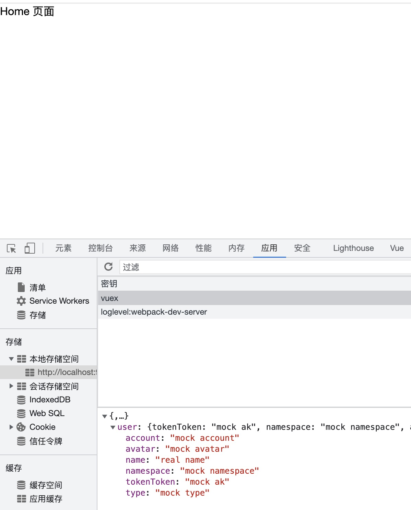

# 新登录页面


有好事之徒嫌之前登录页面丑, 而我也没能力设计出一个漂亮的登录页面, 因此去B站找了个过来改造: [原项目地址](https://github.com/ramostear/login-page-01), 如果打不开 可以点 [这个地址](https://hub.fastgit.org/ramostear/login-page-01)

## 搬迁素材

把该项目下的素材图片(img目录下)搬迁到我们的: src/assets/login 下面:
+ avatar.svg
+ bg.png
+ img-3.svg

## 搬迁HTML

原项目下的HTML文件为: login.html, 我们将他搬迁到我们 login组件的模板里面来: src/views/keyauth/login/new.vue

有几处需要调整:
+ img标签的src 替换为 @/assets/login/xxx.png
+ 之前的英文文案换成中文
+ input组件使用 v-model 绑定我们之前的数据
+ 替换掉之前的btn按钮, 使用之前的el-button, 但是样式使用它的样式

```html
<template>
<div class="login-container">
    
    <div class="container">
        <div class="img">
            
        </div>
        <div class="login-box">
            <form action="">
                
                <h2>极乐研发云</h2>
                <div class="input-group">
                    <div class="icon">
                        <i class="fa fa-user"></i>
                    </div>
                    <div>
                        <h5>账号</h5>
                        <input v-model="loginForm.username" type="text" class="input">
                    </div>
                </div>
                <div class="input-group">
                    <div class="icon">
                        <i class="fa fa-lock"></i>
                    </div>
                    <div>
                        <h5>密码</h5>
                        <input v-model="loginForm.password" type="password" class="input">
                    </div>
                </div>
                <a href="#">忘记密码</a>
                <!-- 提交表单 -->
                <!-- 这里替换成原来的el-button, 只是样式使用该项目的样式: class login-btn --> btn
                <el-button class="btn" :loading="loading" tabindex="3" size="medium" type="primary" @click="handleLogin">
                    登录
                </el-button>
            </form>
        </div>
    </div>
</div>
</template>
```

## 搬迁CSS

原来项目的css文件放置于: css/style.css, 我们将它搬迁到 组件目录下: src/views/keyauth/login/style.scss

它的样式我们不做调整直接使用: [style.css](https://hub.fastgit.org/ramostear/login-page-01/blob/master/css/style.css)

然后在我们组件内部引入

```html
<style lang="scss" scoped>
@import './style.scss';
</style>
```

调整我们的icon
```html
<span class="svg-container">
    <svg-icon icon-class="password" />
</span>
```

调整样式:
```css
.svg-container {
    padding-top: 11px;
    color: #d9d9d9;
    vertical-align: middle;
    display: inline-block;
}
```

## 搬迁Js

原项目的Js处理很简单, 核心就是添加focus和blur的事件处理:
```js
const inputs = document.querySelectorAll(".input");

function focusFunction(){
    let parentNode = this.parentNode.parentNode;
    parentNode.classList.add('focus');
}
function blurFunction(){
    let parentNode = this.parentNode.parentNode;
    if(this.value == ''){
        parentNode.classList.remove('focus');
    }
}

inputs.forEach(input=>{
    input.addEventListener('focus',focusFunction);
    input.addEventListener('blur',blurFunction);
});
```

我们将他搬迁到 new.vue里面的一个方法里面
```js
addEventHandler() {
    const inputs = document.querySelectorAll(".input");

    function focusFunction(){
        let parentNode = this.parentNode.parentNode;
        parentNode.classList.add('focus');
    }
    function blurFunction(){
        let parentNode = this.parentNode.parentNode;
        if(this.value == ''){
            parentNode.classList.remove('focus');
        }
    }

    inputs.forEach(input=>{
        input.addEventListener('focus',focusFunction);
        input.addEventListener('blur',blurFunction);
    });  
},
```

最后再页面加载完成后调用:
```js
mounted() {
    this.addEventHandler()
},
```

## 切换路由到新登录页面

修改我们路由: router/index.js, 让其指向新的登录视图
```js
{
path: "/login",
name: "Login",
component: () =>
    import("../views/keyauth/login/new.vue"),
},
```


到此我们基础的搬迁工作就完成了, 剩下适配我们的登录逻辑了

## 前端输入验证改造

之前的表单验证:
```js
this.$refs.loginForm.validate(async (valid) => {})
```

我们自己写一个check函数来完成验证, 如果没用输入用户名或者密码 我们就晃动下输入框

网上去找个晃动的样式 放到我们 login的css文件 style.scss中:
```css
.shake {
    animation: shake 800ms ease-in-out;
}
@keyframes shake {
    10%, 90% { transform: translate3d(-1px, 0, 0); }
    20%, 80% { transform: translate3d(+2px, 0, 0); }
    30%, 70% { transform: translate3d(-4px, 0, 0); }
    40%, 60% { transform: translate3d(+4px, 0, 0); }
    50% { transform: translate3d(-4px, 0, 0); }
}
```

然我们写一个动态添加晃动样式的函数和check的函数:
```js
shake(elemId) {
    let elem = document.getElementById(elemId)
    if (elem) {
        elem.classList.add('shake')
        setTimeout(()=>{ elem.classList.remove('shake') }, 800)
    }
},
check() {
    if (this.loginForm.username === '') {
        this.shake('username')
        return false
    }
    if (this.loginForm.password === '') {
        this.shake('password')
        return false
    }
    return true
},
```

我们为我们需要添加样式的元素添加上id:
```html
<!-- 账号输入框组 -->
<div id="username" class="input-group">
<!-- 密码输入框组 -->
<div id="password" class="input-group">
```

最后调整我们的验证函数: handleLogin
```js
async handleLogin() {
    if (this.check()) {
        // 省略...
    }
}
```

## 登陆逻辑

+ 表达校验
+ 通过后端验证登陆凭证, 如果正确 后端返回token, 前端保存
+ 验证成功后, 跳转到Home页面或者用户指定的URL页面

为了防止用户手抖，点击了多次登陆按钮, 为登陆按钮添加一个loadding状态
```js
  data() {
    return {
      loading: false,
      ...
    }
```

然后等了按钮绑定这个状态
```html
<!-- 登陆按钮 -->
<el-button class="login-btn" :loading="loading" size="medium" type="primary" tabindex="3" @click="handleLogin">
    登录
</el-button>
```

接下来就是具体登陆逻辑: 
```js
handleLogin() {
  this.$refs.loginForm.validate(async valid => {
    if (valid) {
      this.loading = true
      try {
        // 调用后端接口进行登录, 状态保存到vuex中
        await this.$store.dispatch('user/login', this.loginForm)

        // 调用后端接口获取用户profile, 状态保存到vuex中
        const user = await this.$store.dispatch('user/getInfo')
        console.log(user)
      } catch (err) {
        // 如果登陆异常, 中断登陆逻辑
        console.log(err)
        return
      } finally {
        this.loading = false
      }

      // 登陆成功, 重定向到Home或者用户指定的URL
      this.$router.push({ path: this.$route.query.redirect || '/', query: this.otherQuery })
    }
  })
}
```

## 登陆状态

登陆过程是全局的, 所有我们上面都是用的状态插件:vuex 来进行管理, 接下来我们就实现上面的3个状态管理

我们的状态在src/store里面管理, 在上次课[Vue Router与Vuex](../day16/vue-all.md)已经讲了vuex的基础用法, 有不清楚的可以回过头去再看看

### mock接口

因为还没开始写Keyauth后端服务, 这里直接mock后端数据: src/api/keyauth/token.js
```js
export function LOGIN(data) {
  return {
      code: 0,
      data: {
        access_token: 'mock ak',
        namespace: 'mock namespace'
      }
  }
}

export function GET_PROFILE() {
    return {
        code: 0,
        data: {
            account: 'mock account',
            type: 'mock type',
            profile: {real_name: 'real name', avatar: 'mock avatar'}
        }
    }
}
```

### user状态模块
我们先开发一个vuex的 user模块: src/store/modules/user.js
```js
import { LOGIN, GET_PROFILE } from '@/api/keyauth/token'

const state = {
    accessToken: '',
    namespace: '',
    account: '',
    type: '',
    name: '',
    avatar: '',
}

const mutations = {
    SET_TOKEN: (state, token) => {
        state.accessToken = token.access_token
        state.namespace = token.namespace
    },
    SET_PROFILE: (state, user) => {
        state.type = user.type
        state.account = user.account
        state.name = user.profile.real_name
        state.avatar = user.profile.avatar
    },
}

const actions = {
    // 用户登陆接口
    login({ commit }, loginForm) {
        return new Promise((resolve, reject) => {
            const resp = LOGIN(loginForm)
            commit('SET_TOKEN', resp.data)
            resolve(resp)
        })
    },

    // 获取用户Profile
    getInfo({ commit }) {
        return new Promise((resolve, reject) => {
            const resp = GET_PROFILE()
            commit('SET_PROFILE', resp.data)
            resolve(resp)
        })
    }
}

export default {
    // 这个是独立模块, 每个模块独立为一个namespace
    namespaced: true,
    state,
    mutations,
    actions
}
```

### 配置user模块

现在我们的user模块还没有加载给vuex, 接下来我们完成这个配置, 如何把user作为模块配置到vuex中喃?
```js
modules = {
  user: <我们刚才的模块>
}

const store = new Vuex.Store({
  modules
})
```

更多请参考: [vuex 模块](https://vuex.vuejs.org/zh/guide/modules.html)

修改 src/store/index.js
```js
import Vue from "vue";
import Vuex from "vuex";
import user from './modules/user'

Vue.use(Vuex);

export default new Vuex.Store({
  modules: {user: user},
});
```

我们再补充一个getter, 用于访问vuex所有模块属性: src/store/getters.js
```js
const getters = {
    accessToken: state => state.user.accessToken,
    namespace: state => state.user.namespace,
    account: state => state.user.account,
    username: state => state.user.name,
    userType: state => state.user.type,
    userAvatar: state => state.user.avatar,
  }
  export default getters
```

我们能让vuex真的持久化, 我们需要为vuex安装vuex-persist插件
```js
// vuex-persist@3.1.3
npm install --save vuex-persist
```

最终我们vuex index.js 就是这样:
```js
import Vue from "vue";
import Vuex from "vuex";
import VuexPersistence from 'vuex-persist'
import user from './modules/user'
import getters from './getters'

const vuexLocal = new VuexPersistence({
  storage: window.localStorage
})

Vue.use(Vuex);

export default new Vuex.Store({
  modules: {user: user},
  getters,
  plugins: [vuexLocal.plugin]
});
```

### 验证状态

登陆后，会调整到Home页面, 也能在localstorage查看到我们存储的信息:




## 登陆守卫

经过上面的逻辑我们可以登陆后 跳转到我们的Home页面, 但是现在我们登陆页面 依然形同虚设, 为啥?

用户如果直接访问Home也是可以的, 所以我们需要做个守卫, 判断当用户没有登陆的时候，跳转到等了页面

怎么做这个守卫, 答案就是vue router为我们提供的钩子, 在路由前我们做个判断: 我们在router下面创建一个permission.js模块, 用于定义钩子函数

```js
// 路由前钩子, 权限检查
export function beforeEach(to, from, next) {
    console.log(to, from)
    next()
}

// 路由后构造
export function afterEach() {
    console.log("after")
}
```

然后我们在router上配置上: router/index.js
```js
...
import {beforeEach, afterEach} from './permission'

...
router.beforeEach(beforeEach)
router.afterEach(afterEach)

export default router;
```

### 权限判断

```js
import store from '@/store'

// 不需认证的页面
const whiteList = ['/login']

// 路由前钩子, 权限检查
export function beforeEach(to, from, next) {
    // 取出token
    const hasToken = store.getters.accessToken

    // 判断用户是否登陆
    if (hasToken) {
        // 已经登陆得用户, 再次访问登陆页面, 直接跳转到Home页面
        if (to.path === '/login') {
            next({ path: '/' })
        } else {
            next()
        }
    } else {
        // 如果是不需要登录的页面直接放行
        if (whiteList.indexOf(to.path) !== -1) {
            // in the free login whitelist, go directly
            next()
        } else {
          // 需要登录的页面, 如果未验证, 重定向到登录页面登录
          next(`/login?redirect=${to.path}`)
        }
    }
}
```

清空localstorage里面vuex对应的值, 进行测试:
+ Homoe页面测试
+ 其他页面测试(空页面, 无路由页面)

### Progress Bar

```js
// nprogress@0.2.0
npm install --save nprogress
```

然后补充上相应配置, 需要注意的时，如果有跳转到其他访问的也代表这个页面加载结束, 需要NProgress.done()
```js
import NProgress from 'nprogress' // progress bar
import 'nprogress/nprogress.css' // progress bar style

NProgress.configure({ showSpinner: false }) // NProgress Configuration
...

// 路由前钩子, 权限检查
export function beforeEach(to, from, next) {
    // 路由开始
    NProgress.start()

    // 省略其他代码
    next({ path: '/' })
    NProgress.done()

    // 省略其他代码
    next(`/login?redirect=${to.path}`)
    NProgress.done()
}

// 路由后构造
export function afterEach() {
    // 路由完成
    NProgress.done()
}
```

为了和主题颜色一致, 全局修改progress bar颜色: styles/index.js
```css
#nprogress .bar {
    background:#13C2C2;
  }
```

现在如果我们访问都其他不存在的页面，是一个空白页面，显然这样很有友好, 接下来我们添加一个404页面
