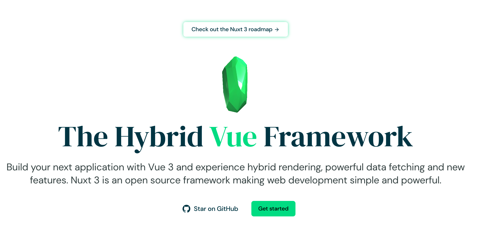
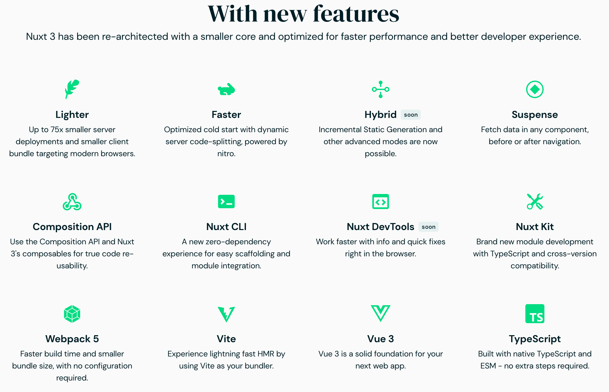
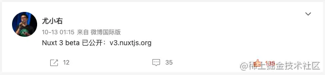
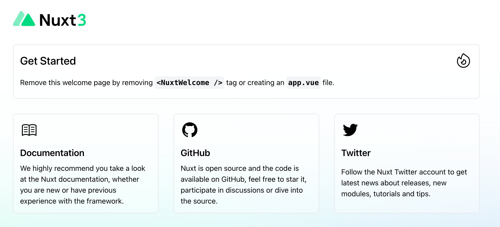
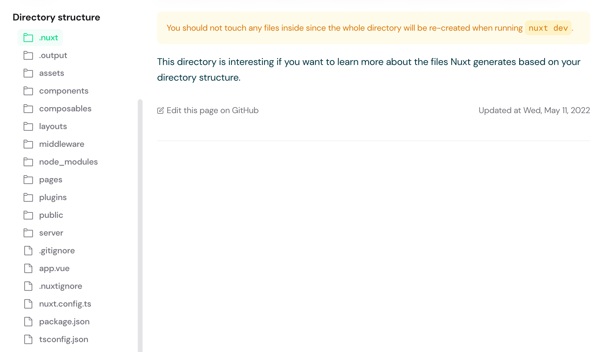
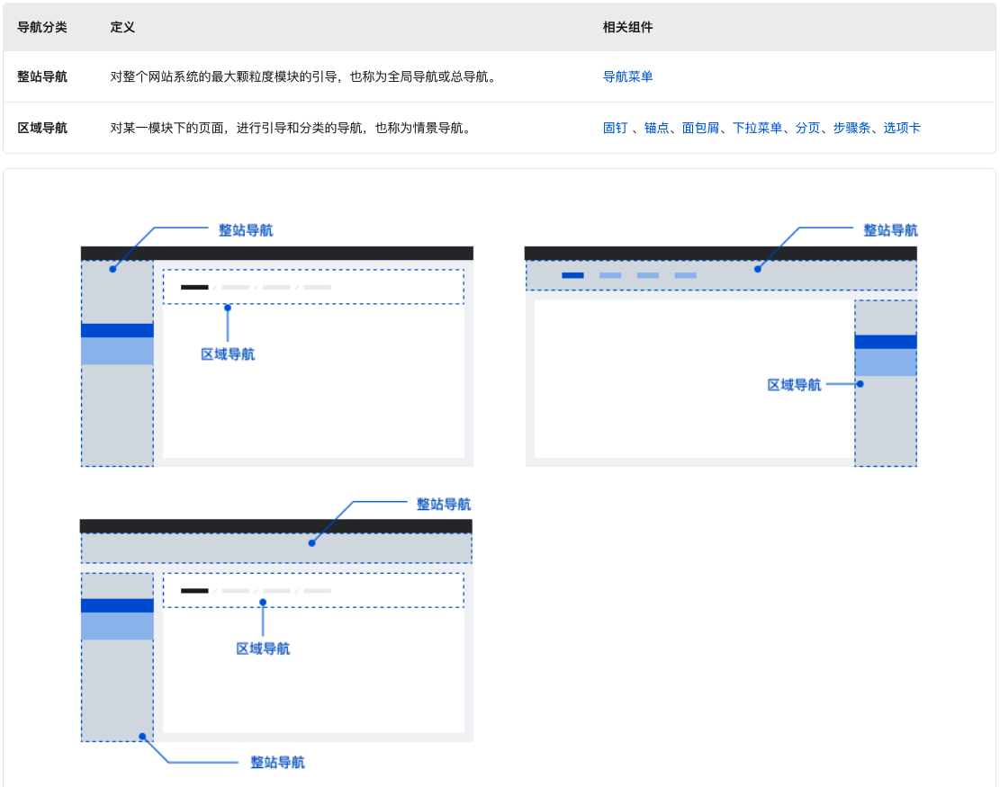
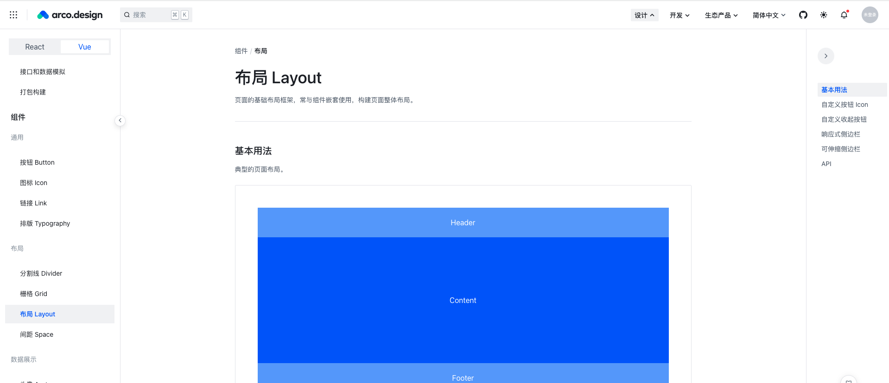

# NuxtJs工程




## 为什么选择Nuxt3

一般我们开发Vue3的应用都会使用到的组件有:
+ vue3
+ vite
+ typescript(推荐)

而Nuxt3整合了Vue3生态的工具, 为开发vue3应用提供开箱即用的体验:



而且vue的作者 尤雨溪在微博中(2021年)提及到了Nuxt3:




## 项目初始化


### 初始化工程
使用nuxi 初始化工程: devcloud
```sh
> npx nuxi init devcloud
Nuxt CLI v3.0.0-rc.3 
ℹ cloned nuxt/starter#v3 to /Users/yumaojun/Workspace/Nodejs/devcloud
 ✨ Your legendary Nuxt project is just created! Next steps:
 📁  cd devcloud
 💿  Install dependencies with npm install or yarn install or pnpm install --shamefully-hoist
 🚀  Start development server with npm run dev or yarn dev or pnpm run dev 
```

### 下载工程依赖
```sh
> yarn install
yarn install v1.22.18
info No lockfile found.
[1/4] 🔍  Resolving packages...
warning nuxt > nitropack > @vercel/nft > node-pre-gyp@0.13.0: Please upgrade to @mapbox/node-pre-gyp: the non-scoped node-pre-gyp package is deprecated and only the @mapbox scoped package will recieve updates in the future
[2/4] 🚚  Fetching packages...
warning vscode-languageclient@7.0.0: The engine "vscode" appears to be invalid.
[3/4] 🔗  Linking dependencies...
[4/4] 🔨  Building fresh packages...
success Saved lockfile.
✨  Done in 20.06s.
```

### 解决warning问题

1. 解决node-pre-gyp版本过低问题
```sh
> yarn upgrade @mapbox/node-pre-gyp
# 可以看到gyp的版本已经升级上去了
> yarn list | grep gyp
├─ @mapbox/node-pre-gyp@1.0.9
│  ├─ @mapbox/node-pre-gyp@^1.0.5
│  ├─ node-gyp-build@^4.2.2
│  ├─ node-pre-gyp@^0.13.0
├─ node-gyp-build@4.4.0
├─ node-pre-gyp@0.13.0
```

第二个问题等待nuxtjs官方升级, 展示对项目没影响

### 启动工程 

```sh
> yarn dev -o
```

启动完成后我们会看到这样一个页面:



接下来了解Nuxt这个脚手架，并编写Vue代码页面

## NuxtJs工程介绍

Nuxt的工程结构如下:



### 入口文件

首先我们需要找到工程的入口文件:
```
The app.vue file is the main component in your Nuxt 3 applications.
```

修改app.vue文件
```vue
<template>
  <div>
    <!-- <NuxtWelcome /> -->
    <h1>Hello Nuxt3!</h1>
  </div>
</template>
```

### 页面与路由

#### 页面路由
我们不可能把所有的页面逻辑都写在入口文件里面, 因此Nuxt为我们准备了一个pages目录, 放在该目录下的vue文件, nuxt会根据文件路径自动为我们创建路由映射, 比如:
```
pages/index.vue --->   /
pages/detail.vue --->  /detail
```

+ pages/index.vue
```vue
<template>
    <div>
        <h1>Index page</h1>
    </div>
</template>
```

+ pages/detail.vue
```vue
<template>
    <div>
        <h1>Detail Page</h1>
    </div>
</template>
```

+ app.vue
```vue
<template>
  <div>
    <h1>hello, nuxt3</h1>
    <!-- 添加页面路由出口 -->
     <NuxtPage />
  </div>
</template>
```

然后我们切换页面访问路径: / --> /detail 也试图就会改变

#### 动态路由

同一个页面 可能由于访问的用户不同展示出来的页面内容的数据也所有差异, 如果解决这个问题喃? 有如下2种思路:
+ 固定路径 + 路径参数, 比如 /detail?id=xxx
+ 动态路由参数, 比如 /detail/xxx, 

1. 固定路由

修改pages/detail.vue页面:
```
<template>
    <div>
        <h1>Detail Page</h1>
        <!-- $route保存了当前路由信息 -->
        <p>{{ $route }}</p>
    </div>
</template>
```

访问页面: /detail?id=xxx, 就能看到当前路由页面的路由信息
```json
{
    "fullPath":"/detail?id=xxx",
    "hash":"",
    "query":{"id":"xxx"},
    "name":"detail",
    "path":"/detail",
    "params":{},
    "matched":[ ... ],
    "meta":{},
    "href":"/detail?id=xxx"
}
```

那我们在编程就可以根据id向后端请求不同的数据:
```js
getDataById($route.query.id)
```

2. 动态路由

为了避免之前路径的影响，先删除之前的detail.vue页面，然后创建一个pages/detail/[id].vue的页面, 这里使用[id], 就是路径参数变量的表示
```vue
<template>
    <div>
        <h1>Detail Page</h1>
        <!-- $route保存了当前路由信息, 通过params获取路径参数的所有变量 -->
        <p>{{ $route.params }}</p>
    </div>
</template>
```

访问页面: /detail/xxx, 就能看到当前路由页面的路由信息

#### 自定义404页面

Nuxt3默认有404页面，如果想要自定义404页面, 只需要添加pages/404.vue页面,比如: 
```vue
<template>
    <div>
        <h1>custom 404</h1>
    </div>
</template>
```

再次访问就能访问到看看404页面是否生效

#### 路由嵌套

很多场景下 我们一个页面可能很复杂，有很多个组件构成, 我们可以选择以组件的方式构建页面，比如:
```vue
<template>
    <div>
        <h1>dashboard main page</h1>
        <component1 />
        <component2 />
        <component3 />
    </div>
</template>
```

我们也可以选择路由嵌套来实现, 比如下面就是一个dashboard嵌套页面的目录:
```sh
# 注意: dashboard.vue 如果是是嵌套, 则需要创建一个名称为:dashboard的目录, 里面存放具体嵌套的页面
-| pages/
---| dashboard/
------| index.vue
------| component1.vue
------| component2.vue
------| component3.vue
---| dashboard.vue
```

上面目录结构 映射为 下面这样的 嵌套路由:
```json
[
  {
    path: '/dashboard',
    component: '~/pages/dashboard.vue',
    name: 'dashboard',
    children: [
      {
        path: '/',
        component: '~/pages/dashboard/index.vue',
        name: 'dashboard-index'
      },
      {
        path: '/component1',
        component: '~/pages/dashboard/component1.vue',
        name: 'dashboard-component1'
      },
      {
        path: '/component2',
        component: '~/pages/dashboard/component2.vue',
        name: 'dashboard-component2'
      },
      {
        path: '/component3',
        component: '~/pages/dashboard/component3.vue',
        name: 'dashboard-component3'
      }
    ]
  }
]
```

这里需要注意的是, 页面嵌套时, 主页面需要添加 NuxtPage 才能路由的字页面, 比如pages/dashboard.vue
```vue
<template>
    <div>
        <h1>dashboard main page</h1>
        <!-- 子页面出口 -->
        <NuxtPage />
    </div>
</template>
```


思考: 你想把当前的页面(日程)通过url分享给另外一个人, 如何确保分享点开页面是显示的是日程这个标签页


#### 路由跳转

路由调整Nuxt提供2种方式:
+ 组件方式: NuxtLink组件
+ 编程方式: navigateTo函数

##### 组件方式

我们经常需要进行页面跳转, 典型的场景就是 列表页跳转到详情页:

pages/user/index.vue
```vue
<template>
    <div>
        <h1>User Index Page</h1>
        <NuxtLink to="/user/detail?id=1">User 1</NuxtLink> <br>
        <NuxtLink to="/user/detail?id=2">User 2</NuxtLink> <br>
        <NuxtLink to="/user/detail?id=3">User 3</NuxtLink> <br>
    </div>
</template>
```

pages/user/detail.vue
```vue
<template>
    <div>
        <h1>User {{ $route.query.id }} Detail Page</h1>
    </div>
</template>
```

##### 编程方式

修改pages/users/index.vue 调整为a标签, 然后自己控制路由跳转
```vue
<template>
    <div>
        <h1>User Index Page</h1>
        <a @click="jumpTo(1)">User 1</a> <br>
        <a @click="jumpTo(2)">User 2</a> <br>
        <a @click="jumpTo(3)">User 3</a> <br>
    </div>
</template>

<script setup>

function jumpTo(id){
  return navigateTo({
    path: '/user/detail',
    query: {
        id: id
    }
  })
}
</script>
```

下面是navigateTo函数参数的定义: 总体而言支持路径参数 和 命名参数 也就是上面的(path选项或者name选项)
```ts
export interface NavigateToOptions {
    replace?: boolean;
    redirectCode?: number;
}
export declare const navigateTo: (to: RouteLocationRaw, options?: NavigateToOptions) => Promise<void | NavigationFailure> | RouteLocationRaw;
```

#### 页面元数据

我们可以通过definePageMeta函数, 对当前页面设置Meta信息, 来完成对当前改页面进行装饰(比如添加缓存, ...), 可以把该功能理解为页面装饰器/页面增强

```js
definePageMeta({
  title: 'User Index Page'
})
```

##### 内置Meta

+ keepalive: 组件缓存, 具体效果请参考[Keep Alive组件使用](https://vuejs.org/guide/built-ins/keep-alive.html#basic-usage)
```ts
<script setup>
definePageMeta({
  keepalive: true
})
</script>

+ key: vue组件 有一个关键属性:key, 只要key的值有变化 就会触发vue组件刷新, 比如下面: 只要url发生变化就触发重新刷新
```ts
<script setup>
definePageMeta({
  key: route => route.fullPath
})
</script>
```

+ layout: 指定当前页面使用那种布局, 布局需要提前定义在layouts目录下
```vue
<template>
  <div>
    Some shared layout content:
    <slot />
  </div>
</template>
```

然后在我们需要你用到的页面指定:
```ts
<script>
// This will also work in `<script setup>`
definePageMeta({
  layout: "custom",
});
</script>
```

+ middleware: 页面中间件(页面加载之前的一些处理逻辑), 比如auth, 这个后面讲中间件时单独介绍
```ts
<script setup>
definePageMeta({
  middleware: ["auth"]
  // or middleware: 'auth'
})
</script>
```

+ layouttransition: 用于设置layout的过渡动画
+ pagetransition:  用于设置页面的过渡动画, 为页面添加动画过渡, 具体参考[Vue Transition](https://vuejs.org/guide/built-ins/transition.html#css-based-transitions)
```vue
<Transition name="bounce">
  <p v-if="show" style="text-align: center;">
    Hello here is some bouncy text!
  </p>
</Transition>
```
下面使用css 做的过渡动画
```css
.bounce-enter-active {
  animation: bounce-in 0.5s;
}
.bounce-leave-active {
  animation: bounce-in 0.5s reverse;
}
@keyframes bounce-in {
  0% {
    transform: scale(0);
  }
  50% {
    transform: scale(1.25);
  }
  100% {
    transform: scale(1);
  }
}
```

+ alias: page 别名, 通过该功能 可以让多个page 和 一个页面 对应, 具体可以参考[vue router alias](https://router.vuejs.org/guide/essentials/redirect-and-alias.html#alias)
```ts
definePageMeta({
  title: 'User Index Page',
  allow: ['admin'],
  // /user/list 会自动重定向到该页面, 常用于老页面的替换升级
  alias: ['/user/list'],
})
```

##### 自定义Meta

我们可以为当前页面添加一些元数据, 比如描述当前页面有哪些角色可以访问, 只是声明描述, 具体的业务路径可以配置中间件来实现

比如 pages/user/index.vue, 添加一个allow的meta信息
```vue
<template>
    <div>
        <h1>User Index Page</h1>
        <!-- 通过route可以访问到当前meta信息, 你也可以理解为路由装饰, 通过中间件可以实现非常灵活的业务, 而是分离了 声明(meta定义)+逻辑(中间件) -->
        <h1>{{ $route.meta }}</h1>
        <a @click="jumpTo(1)">User 1</a> <br>
        <a @click="jumpTo(2)">User 2</a> <br>
        <a @click="jumpTo(3)">User 3</a> <br>
    </div>
</template>

<script setup>
definePageMeta({
  title: 'User Index Page',
  allow: ['admin']
})

function jumpTo(id){
  return navigateTo({
    path: '/user/detail',
    query: {
        id: id
    }
  })
}
</script>
```

#### Nuxt与Vue Router


### 安装UI组件


#### Nuxt插件

Nuxt 将自动读取您plugins目录中的文件并加载它们。您可以在文件名中使用.server或.client后缀以仅在服务器或客户端加载插件

只有目录顶层的plugins/文件（或任何子目录中的索引文件）将被注册为插件
```sh
# 只有myPlugin.ts并且myOtherPlugin/index.ts会被注册
plugins
 | - myPlugin.ts
 | - myOtherPlugin
 | --- supportingFile.ts
 | --- componentToRegister.vue
 | --- index.ts
```

传递给插件的唯一参数是nuxtApp, vue的Root实例对象可以通过nuxtApp.vueApp访问到:
```js
export default defineNuxtPlugin(nuxtApp => {
  // Doing something with nuxtApp
  nuxtApp.vueApp.use(vuePlugin)
})
```

我们的选择的Vue UI组件就通过这种方式加载, 接下来为我们的项目挑选UI组件

#### UI组件调研

+ [Element Plus](https://element-plus.org/zh-CN/guide/design.html): Element开源UI库
+ [Ant Design Vue](https://www.antdv.com/docs/vue/introduce-cn): 阿里开源UI库
+ [Vuetify](https://vuetifyjs.com/zh-Hans/): Material 样式的 Vue UI 组件库
+ [TDesign](https://tdesign.tencent.com/vue-next/overview): 腾讯开源UI库
+ [Arco Design](https://arco.design/): 字节跳动出品的企业级设计系统

#### 安装Element Plus

通过插件的方式安装UI组件: plugins/elementPlus.ts
```ts
import ElementPlus from 'element-plus'

export default defineNuxtPlugin(nuxtApp => {
    nuxtApp.vueApp.use(ElementPlus)
})
```

修改Nuxt配置, 添加全局样式表

nuxt.config.ts
```ts
import { defineNuxtConfig } from 'nuxt'

// https://v3.nuxtjs.org/api/configuration/nuxt.config
export default defineNuxtConfig({
    // css
    css: ['~/assets/style/index.css'],
})
```

#### 安装Arco Design

1. 安装UI库
```sh
# npm
npm install --save-dev @arco-design/web-vue
# yarn
yarn add --dev @arco-design/web-vue
```

2. vue加载UI库
修改: nuxt.config.ts, 依赖compute-scroll-into-view，需要使用Babel处理下
```ts
// https://v3.nuxtjs.org/api/configuration/nuxt.config
export default defineNuxtConfig({
    build: {
        transpile: ['compute-scroll-into-view'],
    },
})
```

通过插件的方式安装UI组件: plugins/arcoDesign.ts
```ts
// 引入组件库
import ArcoVue from "@arco-design/web-vue";
// Arco图标是一个独立的库，需要额外引入并注册使用
import ArcoVueIcon from '@arco-design/web-vue/es/icon';
// 加载样式
import "@arco-design/web-vue/dist/arco.css";

export default defineNuxtPlugin(nuxtApp => {
  // Doing something with nuxtApp
  nuxtApp.vueApp.use(ArcoVue)
  nuxtApp.vueApp.use(ArcoVueIcon)
})
```

3. 引入一个Menu组件进行测试, 修改pages/app.vue:
```vue
<template>
  <div class="menu-demo">
    <a-menu
      :style="{ width: '200px', height: '100%' }"
      :default-open-keys="['0']"
      :default-selected-keys="['0_2']"
      show-collapse-button
      breakpoint="xl"
      @collapse="onCollapse"
    >
      <a-sub-menu key="0">
        <template #icon><icon-apps></icon-apps></template>
        <template #title>Navigation 1</template>
        <a-menu-item key="0_0">Menu 1</a-menu-item>
        <a-menu-item key="0_1">Menu 2</a-menu-item>
        <a-menu-item key="0_2">Menu 3</a-menu-item>
        <a-menu-item key="0_3">Menu 4</a-menu-item>
      </a-sub-menu>
      <a-sub-menu key="1">
        <template #icon><icon-bug></icon-bug></template>
        <template #title>Navigation 2</template>
        <a-menu-item key="1_0">Menu 1</a-menu-item>
        <a-menu-item key="1_1">Menu 2</a-menu-item>
        <a-menu-item key="1_2">Menu 3</a-menu-item>
      </a-sub-menu>
      <a-sub-menu key="2">
        <template #icon><icon-bulb></icon-bulb></template>
        <template #title>Navigation 3</template>
        <a-menu-item key="2_0">Menu 1</a-menu-item>
        <a-menu-item key="2_1">Menu 2</a-menu-item>
        <a-sub-menu key="2_2" title="Navigation 4">
          <a-menu-item key="2_2_0">Menu 1</a-menu-item>
          <a-menu-item key="2_2_1">Menu 2</a-menu-item>
        </a-sub-menu>
      </a-sub-menu>
    </a-menu>
  </div>
</template>
<script lang="ts" setup>
import { Message } from '@arco-design/web-vue';

const onCollapse = (val: String, type: String) => {
  const content = type === 'responsive' ? '触发响应式收缩' : '点击触发收缩';
  Message.info({
    content,
    duration: 2000,
  });
}
</script>
<style scoped>
.menu-demo {
  box-sizing: border-box;
  width: 100%;
  height: 600px;
  padding: 40px;
  background-color: var(--color-neutral-2);
}
</style>
```

### 页面布局

首先我们需要设计页面的布局风格: 下面是常见的3种中后台设计布局



更多可以参考: [腾讯TDesign中后台设计指南](https://tdesign.tencent.com/design/offices)

这里我们选择上下混合的布局风格, 就是第3种, 具体布局可以参考:



#### Layouts目录

Nuxt 提供了一个可定制的布局框架，您可以在整个应用程序中使用，非常适合将常见的 UI 或代码模式提取到可重用的布局组件中

布局放置在layouts/目录中，使用时将通过异步导入自动加载。layout通过将属性设置为页面元数据的一部分（如果您正在使用~/pages集成）或使用<NuxtLayout>组件来使用布局

如果您的应用程序中只有一个布局，我们建议您改用app.vue

##### 基于app.vue的布局

1. 定义默认Layout布局: layouts/default.vue

在您的布局文件中，您需要使用<slot />定义布局内容的加载位置。例如
```vue
<template>
  <div>
    <h1>Default Layout: </h1>
    <slot />
  </div>
</template>
```

2. 修改app.vue
```ts
<template>
  <NuxtLayout name="default">
    <NuxtPage />
  </NuxtLayout>
</template>
```

在Nuxt中default.vue指代默认布局, 因此可以省去name指定，比如:
```vue
<template>
  <NuxtLayout>
    <NuxtPage />
  </NuxtLayout>
</template>
```

如果使用了app.vue, 如果定义了多个布局文件 nuxt 会有bug，按照官方建议, 当我们使用app.vue来定义布局的, 只能适用于单一布局, 比如如果我有多个布局需要切换, 在app.vue中定义就无法实现

##### 基于页面的布局

``在使用页面布局之前，需要先删除app.vue文件,这步非常重要, 我们直接使用index.vue 作为根目录``


#### 使用UI布局

我们使用Arco Design的[布局组件](https://arco.design/vue/component/layout)来进行布局


##### 顶部导航布局


##### 侧边栏导航布局


##### 内容区布局 


## 参考

+ [vue3官方文档](https://vuejs.org/guide/introduction.html)
+ [nuxtjs官网](https://v3.nuxtjs.org/getting-started/quick-start)
+ [nuxt项目启动时跳过Are you interested in participation](http://www.flydream.cc/article/nuxt-bootstrap-skip-participation/)
+ [element-plus-nuxt-starter](https://github.com/element-plus/element-plus-nuxt-starter)
+ [Nuxt.js 2中文教程](https://www.w3cschool.cn/nuxtjs/nuxtjs-iwvf36gt.html)
+ [Arco Design Plans for Nuxt 3 support?](https://github.com/arco-design/arco-design-vue/issues/24)
