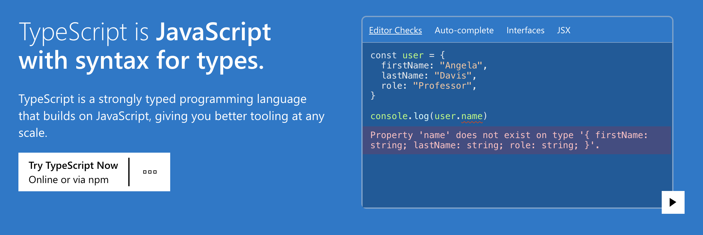
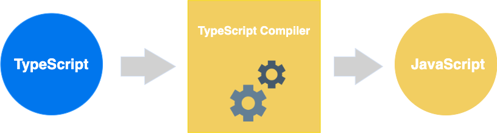

# TypeScript



## TS与JS

TypeScript 是 JavaScript 的一个超集，支持 ECMAScript 6 标准, 由微软开发, 它可以编译成纯 JavaScript，编译出来的 JavaScript 可以运行在任何浏览器上



## 安装TypeScript

项目中会使用到typescript, 因此我们提前安装好 typescript的编译器
```sh
# 把typescript 安装到全局
> npm install -g typescript

# 安装完成后 可以通过tsc -v查看当前typescript编译器版本
> tsc -v                                                                                                      1 ↵
Version 4.6.4
```

## 参考

+ [TypeScript官网](https://www.typescriptlang.org/)
+ [TypeScript HandBook](https://www.typescriptlang.org/docs/handbook/intro.html)
+ [TypeScript for JavaScript Programmers](https://www.typescriptlang.org/docs/handbook/typescript-in-5-minutes.html)
+ [TypeScript Basics](https://www.typescriptlang.org/docs/handbook/2/basic-types.html)