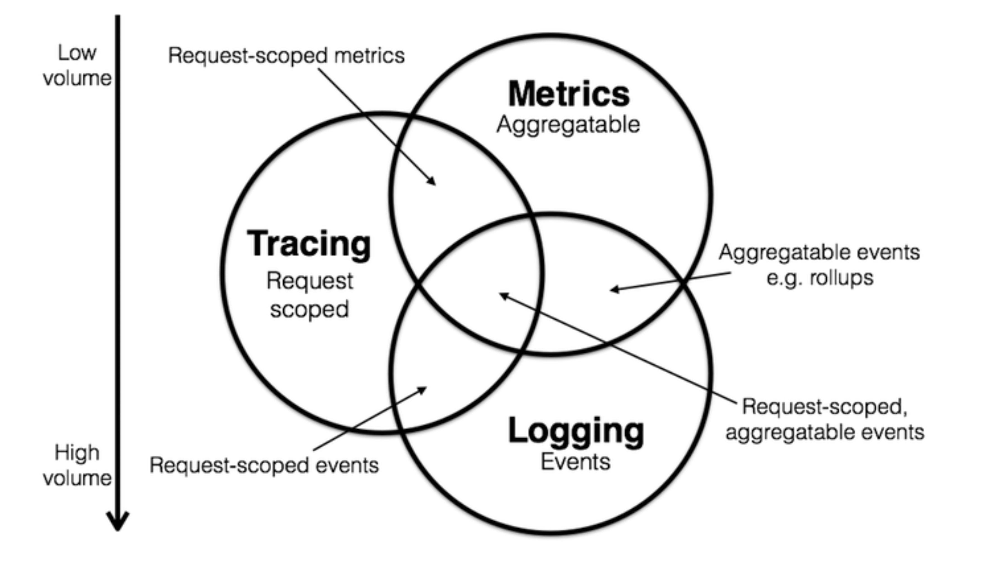
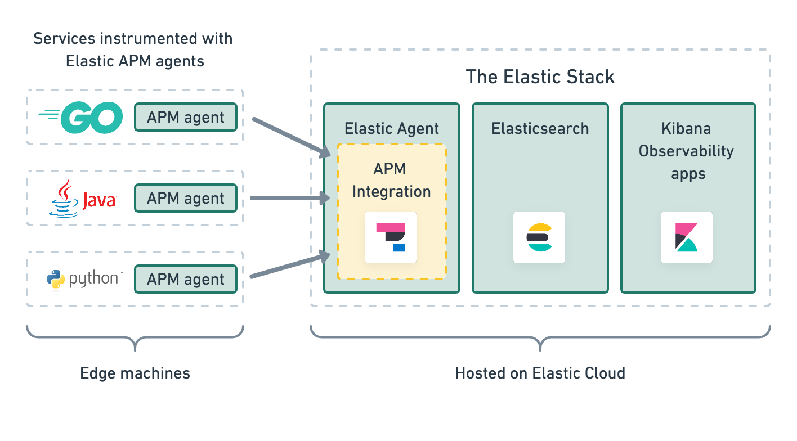
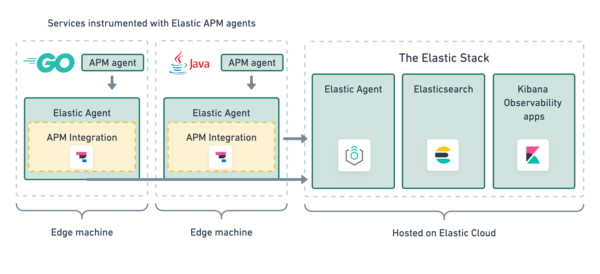

# Elastic APM

Kubernetes让微服务的部署变得容易, 但随着微服务规模的扩大，服务治理带来的挑战也会越来越大, 比如你的应用上线后, 某个客户反应有一个按钮点击后反应时快时慢, VIP客户哦？老板要你马上解决, 而此时线上有几百个微服务，至于服务间的调用关系，呵呵，你很有可能不清楚, 就问你慌不慌

这个问题该如何做手处理喃?
+ 首先，想到肯定是查看服务的日志(Logging), 如果有日志分析或者告警, 可以减少你的搜索范围
+ 如果有Trace系统, 可能快速定位到 找出服务调用链, 甚至直接找出问题, 如果没有，就只有基于日志大海捞针了
+ 为了观察当前应用的性能, 比如当前这个服务的接口响应速率, 你还需要查看监控(Metric)

向上面提到的看日志，看监控，以及Trace 有一个统一高大上的专业名词: 服务可观测性(observability)



在分布式系统里，系统的故障可能出现在任何节点，怎么能在出了故障的时候快速定位问题和解决问题，甚至是在故障出现之前就能感知到服务系统的异常，把故障扼杀在摇篮里。这就是可观测性的意义所在

有没工具能整合以上所有功能, 很好的实现服务的可观测性喃? 这就是我们今天主角: Elastic APM


## 选择Elastic APM


## 架构

1. APM Server 中心化部署模式



2. APM Server 分布式部署模式


Elastic APM 由四个组件组成：
+ APM agents：以应用程序库的形式提供，收集程序中的性能监控数据并上报给APM server。上报的数据包括: 
    + logs
    + metrics
    + traces
    + and other types of data to each host
+ Elastic APM integration(APM Server)：接收来自于APM agents的数据、进行校验和处理后写入 Elasticsearch 特定的 APM 索引中。虽然 agent 也可以实现为：将数据收集处理后直接上报到ES，不这么做官方给出的理由：使 agent 保持轻量，防止某些安全风险以及提升 Elastic 组件的兼容性。
+ Elasticsearch：用于存储性能指标数据并提供聚合功能。
+ Kibana：可视化性能数据并帮助找到性能瓶颈。


## 安装

我们采用Docker安装, 通过查看官方的镜像使用说明来获取最新的版本:
+ [elasticsearch](https://hub.docker.com/_/elasticsearch)
+ [kibana](https://hub.docker.com/_/kibana)
+ [apm-server](https://hub.docker.com/r/elastic/apm-server)

如何使用Docker部署相关参考:
+ [Run APM Server on Docker](https://www.elastic.co/guide/en/apm/guide/master/running-on-docker.html)


登陆elasticsearch添加超级管理员用户
```
bin/elasticsearch-users useradd admin -p 123456 -r superuser
```


## 数据模型

Elastic APM agent从其检测（instrument）的应用程序中收集不同类型的数据，这些被称为事件，类型包括 span，transaction，错误和指标四种。

+ Span 包含有关已执行的特定代码路径的信息。它们从活动的开始到结束进行度量，并且可以与其他span具有父/子关系。
+ 事务（Transaction） 是一种特殊的Span（没有父span，只能从中派生出子span，可以理解为“树”这种数据结构的根节点），具有与之关联的其他属性。可以将事务视为服务中最高级别的工作，比如服务中的请求等。
+ 错误(Error)：错误事件包含有关发生的原始异常或有关发生异常时创建的日志的信息。
+ 指标(Metric)：APM agent 自动获取基本的主机级别指标，包括系统和进程级别的 CPU 和内存指标。除此之外还可获取特定于代理的指标，例如 Java agent 中的JVM 指标和 Go agent 中的 Go Runtime 指标

更多详情 请参考[Data Model](https://www.elastic.co/guide/en/apm/guide/current/data-model.html)
+ [Spans](https://www.elastic.co/guide/en/apm/guide/current/data-model-spans.html)
+ [Transactions](https://www.elastic.co/guide/en/apm/guide/current/data-model-transactions.html)
+ [Errors](https://www.elastic.co/guide/en/apm/guide/current/data-model-errors.html)
+ [Metrics](https://www.elastic.co/guide/en/apm/guide/current/data-model-metrics.html)

### Spans


### Transactions


### Errors


### Metrics


### Metadata

[Metadata](https://www.elastic.co/guide/en/apm/guide/current/data-model-metadata.html)

#### Labels


#### Custom context 


#### User context 


## 实践


## 参考

+ [微服务应用性能如何](https://segmentfault.com/a/1190000037701422)
+ [Elastic APM 补齐服务监控](https://lxkaka.wang/golang-apm/)
+ [Kibana Guide](https://www.elastic.co/guide/en/kibana/current/index.html)
+ [Elasticsearch Guide](https://www.elastic.co/guide/en/elasticsearch/reference/current/index.html)
+ [APM User Guide](https://www.elastic.co/guide/en/apm/guide/current/index.html)
+ [How to instrument your Go app with the Elastic APM Go agent](https://www.elastic.co/blog/how-to-instrument-your-go-app-with-the-elastic-apm-go-agent?baymax=rec&rogue=rec-1&elektra=guide)