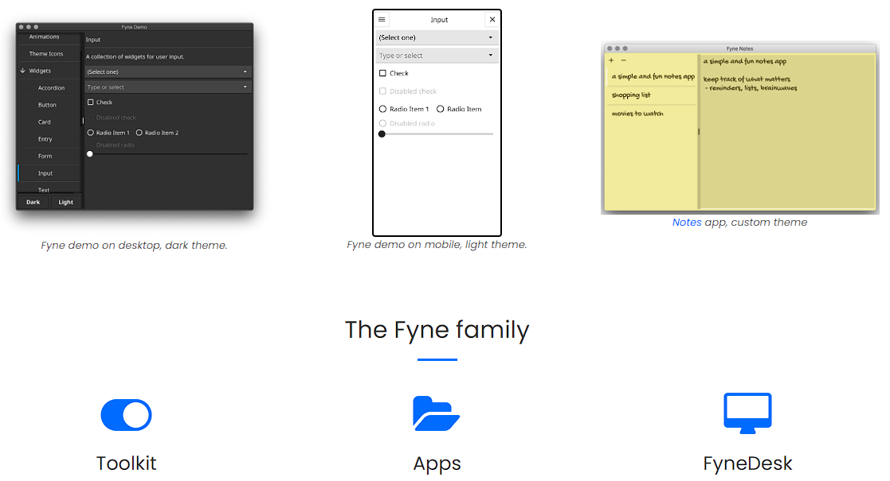
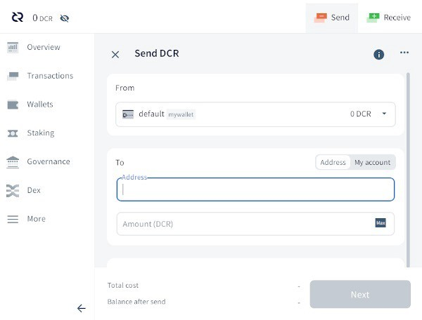
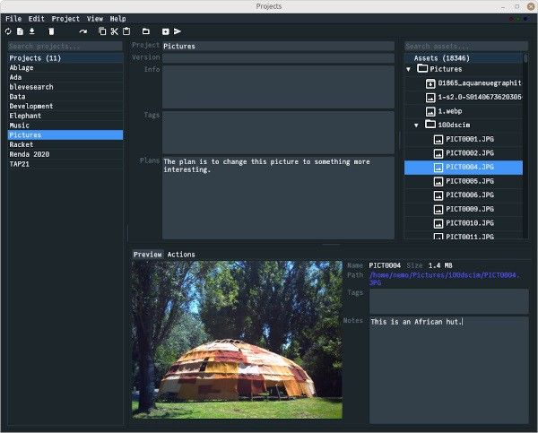
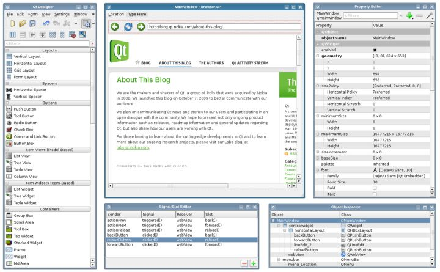
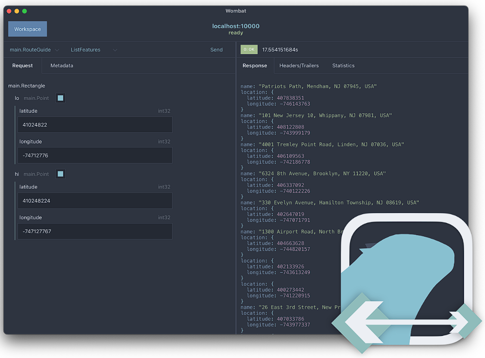

# Go跨平台桌面 GUI

很遗憾, Go官方 并没有GUI 框架, 社区也没有能一统江湖的GUI框架, 因此我们只有

+ [fyne](https://fyne.io/)

+ [gioui](https://gioui.org/)

+ [giu](https://github.com/AllenDang/giu)

+ [gotk3](https://github.com/gotk3/gotk3)

+ [Qt binding for Go](https://github.com/therecipe/qt)

+ [wails](https://github.com/wailsapp/wails)

## 参考

+ [不好的 Go GUI](https://zhuanlan.zhihu.com/p/526218523)