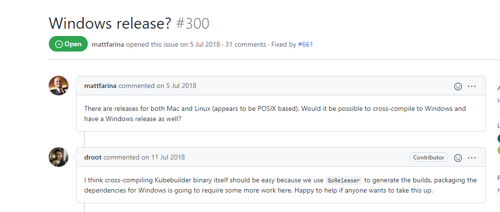
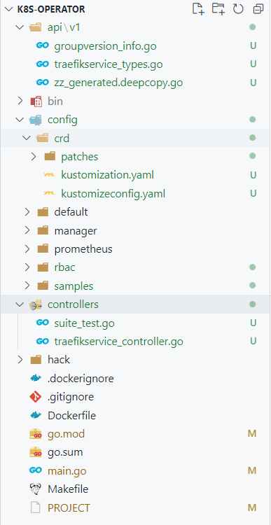
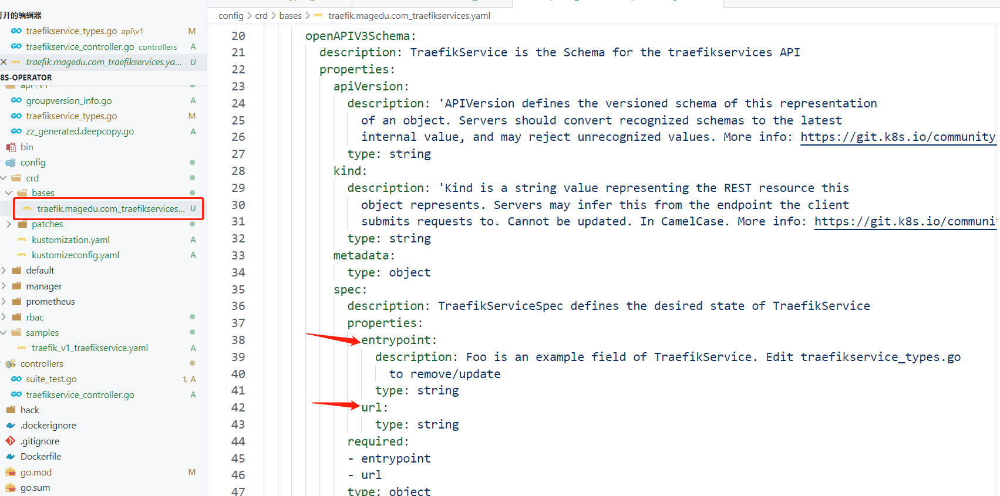
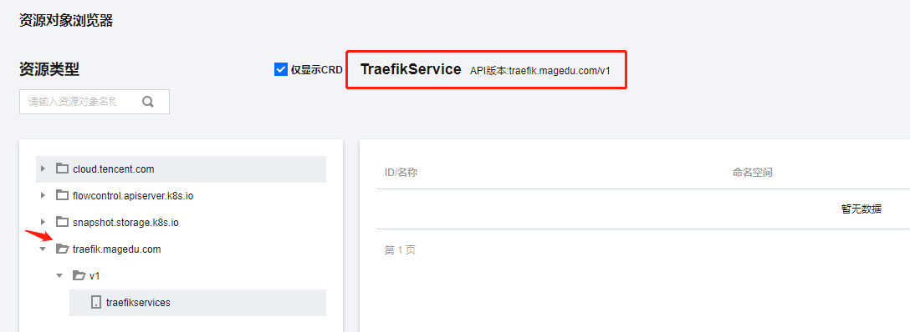
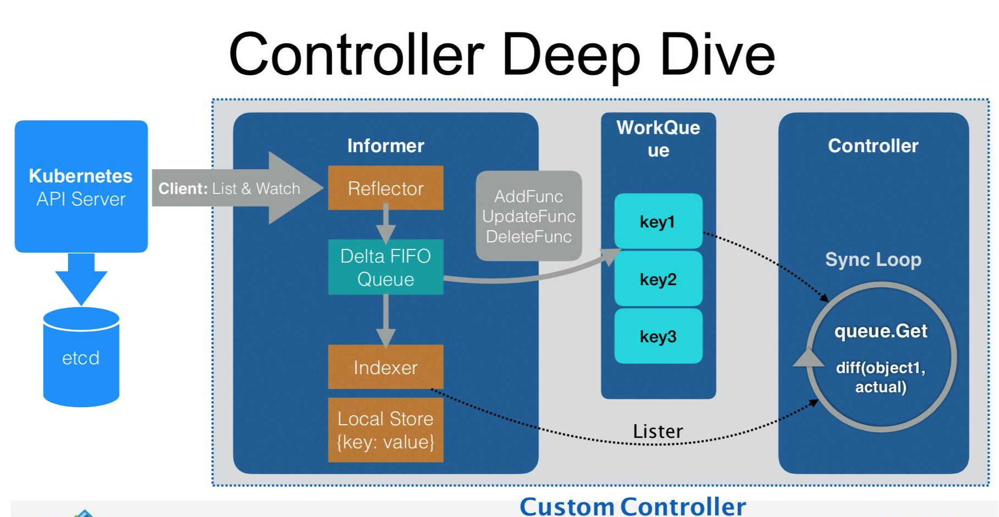

# k8s 定制开发(kubebuilder)

## 需求与设计

之前讲过使用Traefik + etcd的 内外网关打通的方案, 我们的服务在启动的时候可以通过框架直接注册到etcd中去, 那如果是其他框架或者语言, 比如 php, python, java 也想使用 Traefik+etcd这套方案这么办?

直接能想到的就是 每个框架和语言 都实现一个套 注册到etcd的功能,  实现起来也并不难, 但是这就面临 对别人服务的侵入性, 别人不一定愿意接受

现在的微服务开发，基本都基于容器部署, 而容器管理平台k8s也是当今 容器编排工具的标准, k8s本身是知道当前系统中有哪些service服务的, 那能否通过感知service的变化，来把service信息动态写入的etcd喃?

那我们的解决方案就很简单了:

k8s service <---watch---- service operater ------> etcd

## 环境准备

+ go version v1.15+ (kubebuilder v3.0 < v3.1).
+ go version v1.16+ (kubebuilder v3.1 < v3.3).
+ go version v1.17+ (kubebuilder v3.3+).
+ docker version 17.03+.
+ kubectl version v1.11.3+.
+ Access to a Kubernetes v1.11.3+ cluster.

### 准备k8s集群

直接在云商哪儿创建一个托管集群


### 安装kubectl

我们下载一个kubectl命令到本地:
```
curl -LO "https://dl.k8s.io/release/v1.23.0/bin/windows/amd64/kubectl.exe"
```

把kubectl copy到你的path路径下去就可以了

然后简单验证下:
```sh
$ kubectl.exe get ns
NAME              STATUS   AGE
default           Active   111d
kube-node-lease   Active   111d
kube-public       Active   111d
kube-system       Active   111d
mpaas             Active   30d
```


## 安装 kubebuilder

### Mac/Linux系统安装方法
```sh
curl -L -o kubebuilder https://go.kubebuilder.io/dl/latest/$(go env GOOS)/$(go env GOARCH)
chmod +x kubebuilder && mv kubebuilder /usr/local/bin/
```

### Windows系统安装方法

非常不幸, 该工具官方没有windows的包




所以我们需要通过源码安装
```sh
# 确保Proxy已经设置ok
export GOPROXY=https://goproxy.io,direct
# clone kubebuilder镜像仓库, 注意我直接使用的master
git clone git@github.com:kubernetes-sigs/kubebuilder.git
# 注意 提前搞定你的make命令安装
cd kubebuilder
make build
# 编译完成后, kubebuilder的可执行文件在 当前目录的bin下
```

最后将可执行文件 copy到 git bash安装目录下的 /usr/bin下面, windows由于权限问题, 需要你最近以管理员身份copy

copy完成后, 重新开启一个新的 git bash, 然后kubebuilder 这个命令就可以正常使用了

关于kubebuilder的使用说明一定要阅读:
```sh
$ kubebuilder -h
CLI tool for building Kubernetes extensions and tools.

Usage:
  kubebuilder [flags]
  kubebuilder [command]

Examples:
The first step is to initialize your project:
    kubebuilder init [--plugins=<PLUGIN KEYS> [--project-version=<PROJECT VERSION>]]

<PLUGIN KEYS> is a comma-separated list of plugin keys from the following table     
and <PROJECT VERSION> a supported project version for these plugins.

                        Plugin keys | Supported project versions
------------------------------------+----------------------------
          base.go.kubebuilder.io/v3 |                          3
   declarative.go.kubebuilder.io/v1 |                       2, 3
               go.kubebuilder.io/v2 |                       2, 3
               go.kubebuilder.io/v3 |                          3
 kustomize.common.kubebuilder.io/v1 |                          3

For more specific help for the init command of a certain plugins and project version
configuration please run:
    kubebuilder init --help --plugins=<PLUGIN KEYS> [--project-version=<PROJECT VERSION>]

Default plugin keys: "go.kubebuilder.io/v3"
Default project version: "3"


Available Commands:
  alpha       Alpha-stage subcommands
  completion  Load completions for the specified shell
  create      Scaffold a Kubernetes API or webhook
  edit        Update the project configuration
  help        Help about any command
  init        Initialize a new project
  version     Print the kubebuilder version

Flags:
  -h, --help                     help for kubebuilder
      --plugins strings          plugin keys to be used for this subcommand execution
      --project-version string   project version (default "3")

Use "kubebuilder [command] --help" for more information about a command.
```

## 创建项目

我们需要使用kubebuilder来为我们生成Operator开发的框架代码

kubebuilder 提供了一个 init命令用来初始化一个新的Operator工程目录，具体用法如下:
```sh
$ kubebuilder init -h
Initialize a new project including the following files:
  - a "go.mod" with project dependencies
  - a "PROJECT" file that stores project configuration
  - a "Makefile" with several useful make targets for the project
  - several YAML files for project deployment under the "config" directory
  - a "main.go" file that creates the manager that will run the project controllers

Usage:
  kubebuilder init [flags]

Examples:
  # Initialize a new project with your domain and name in copyright
  kubebuilder init --plugins go/v3 --domain example.org --owner "Your name"

  # Initialize a new project defining a specific project version
  kubebuilder init --plugins go/v3 --project-version 3


Flags:
      --component-config         create a versioned ComponentConfig file, may be 'true' or 'false'
      --domain string            domain for groups (default "my.domain")
      --fetch-deps               ensure dependencies are downloaded (default true)
  -h, --help                     help for init
      --license string           license to use to boilerplate, may be one of 'apache2', 'none' (default "apache2")
      --owner string             owner to add to the copyright
      --project-name string      name of this project
      --project-version string   project version (default "3")
      --repo string              name to use for go module (e.g., github.com/user/repo), defaults to the go package of the current working directory.
      --skip-go-version-check    if specified, skip checking the Go version

Global Flags:
      --plugins strings   plugin keys to be used for this subcommand execution
```

关键参数说明:
+ --plugins, 指定生成代码的插件, 默认使用 "go.kubebuilder.io/v3"
+ --project-version 支持的项目版本, 有2,3 默认3
+ --repo module path, 就是 go mod init 指定的go module的名称
+ --domain, 组织名称, 用于API Group等
+ --owner, operater所有者, 一般填写开发者邮箱

然后开始初始化项目:
```sh
$ kubebuilder init --domain magedu.com --repo gitee.com/go-course/k8s-operator

Writing kustomize manifests for you to edit...
Writing scaffold for you to edit...
Get controller runtime:
$ go get sigs.k8s.io/controller-runtime@v0.11.0
go: downloading k8s.io/client-go v0.23.0
go: downloading github.com/evanphx/json-patch v4.12.0+incompatible
go: downloading gomodules.xyz/jsonpatch/v2 v2.2.0
go: downloading github.com/prometheus/common v0.28.0
go: downloading k8s.io/component-base v0.23.0
go: downloading github.com/golang/groupcache v0.0.0-20210331224755-41bb18bfe9da
go: downloading golang.org/x/oauth2 v0.0.0-20210819190943-2bc19b11175f
go: downloading github.com/matttproud/golang_protobuf_extensions v1.0.2-0.20181231171920-c182affec369
Update dependencies:
$ go mod tidy
go: downloading github.com/go-logr/zapr v1.2.0
go: downloading github.com/onsi/gomega v1.17.0
go: downloading go.uber.org/zap v1.19.1
go: downloading github.com/Azure/go-autorest/autorest v0.11.18
go: downloading github.com/Azure/go-autorest/autorest/adal v0.9.13
go: downloading go.uber.org/goleak v1.1.12
go: downloading cloud.google.com/go v0.81.0
go: downloading gopkg.in/check.v1 v1.0.0-20200227125254-8fa46927fb4f
go: downloading github.com/Azure/go-autorest/logger v0.2.1
go: downloading github.com/form3tech-oss/jwt-go v3.2.3+incompatible
Next: define a resource with:
$ kubebuilder create api
```

## 创建API

通过脚手架为我们提供的create api来创建 CRD 相关的Resource 和控制器:
```
$ kubebuilder create api -h
Scaffold a Kubernetes API by writing a Resource definition and/or a Controller.

If information about whether the resource and controller should be scaffolded  
was not explicitly provided, it will prompt the user if they should be.        

After the scaffold is written, the dependencies will be updated and
make generate will be run.

Usage:
  kubebuilder create api [flags]

Examples:
  # Create a frigates API with Group: ship, Version: v1beta1 and Kind: Frigate
  kubebuilder create api --group ship --version v1beta1 --kind Frigate

  # Edit the API Scheme
  nano api/v1beta1/frigate_types.go

  # Edit the Controller
  nano controllers/frigate/frigate_controller.go

  # Edit the Controller Test
  nano controllers/frigate/frigate_controller_test.go

  # Generate the manifests
  make manifests

  # Install CRDs into the Kubernetes cluster using kubectl apply
  make install

  # Regenerate code and run against the Kubernetes cluster configured by ~/.kube/config
  make run


Flags:
      --controller           if set, generate the controller without prompting the user (default true)
      --force                attempt to create resource even if it already exists
      --group string         resource Group
  -h, --help                 help for api
      --kind string          resource Kind
      --make make generate   if true, run make generate after generating files (default true)
      --namespaced           resource is namespaced (default true)
      --plural string        resource irregular plural form
      --resource             if set, generate the resource without prompting the user (default true)
      --version string       resource Version

Global Flags:
      --plugins strings   plugin keys to be used for this subcommand execution
```

### 生成样例代码

```sh
kubebuilder create api --group traefik --version v1 --kind TraefikService

Create Resource [y/n]
y
Create Controller [y/n]
y
Writing kustomize manifests for you to edit...
Writing scaffold for you to edit...
api\v1\traefikservice_types.go
controllers\traefikservice_controller.go
Update dependencies:
$ go mod tidy
Running make:
$ make generate
/e/Projects/Golang/go-course-projects/k8s-operator/bin/controller-gen object:headerFile="hack\\boilerplate.go.txt" paths="./..."
Next: implement your new API and generate the manifests (e.g. CRDs,CRs) with:
$ make manifests
```

样例生成完了后，我们会看到我们项目新增了一些文件:



+ api/v1 目录下主要存放是我们API Object, 就是我们的Resource对象相关信息
+ config/crd 目录下是我们crd的描述文件, 我们需要把自定义资源(CRD)的描述信息注册给k8s时需要的
+ rbac 目录下 存放着 关于CRD资源的 role定义的样例文件(editor/viewer)
+ samples 目录下 存放着 CRD的一个样例文件, 后面部署完成后可以 直接编辑下 apply到k8s集群中去
+ controllers 目录下 存放着 我们所有的 Object 的Controller 代码

### CRD开发

按照之前的设计，我们其实是没有必要定义CRD的, 下面关于CRD的定义和安装 是出于教学演示目的, 如果你只想做项目，可以忽略这部分内容

#### CRD 设计

我们需要定义Traefik Service, 我们来看看Traefik Service一个service 实例定义:
```
<etcd_prefix>/<entry_point>/services/loadBalancer/servers/<index>/url   <url_value>

traefik etcd配置的前缀, provider配置时 有设置
services: 表示 web entrypoint的 services配置
loadBalancer: cmdb 服务loadBalancer配置
servers: loadBalancer 下的实例配置
0(变量): index
```

因此我们定义的Service需要有如下属性:
+ entrypoint name
+ service name
+ service url

作为k8s的CRD 必须是一个runtime.Object, 也就是为我们生成的TraefikService对象, 我们需要编辑的是TraefikServiceSpec对象

由于 Name已经在 ObjectMeta 有声明了, 因此我们只需要添加 entrypoint 和 url

修改资源定义: api/v1/traefikservice_types.go 
```go
// EDIT THIS FILE!  THIS IS SCAFFOLDING FOR YOU TO OWN!
// NOTE: json tags are required.  Any new fields you add must have json tags for the fields to be serialized.

// TraefikServiceSpec defines the desired state of TraefikService
type TraefikServiceSpec struct {
	// INSERT ADDITIONAL SPEC FIELDS - desired state of cluster
	// Important: Run "make" to regenerate code after modifying this file

	// Foo is an example field of TraefikService. Edit traefikservice_types.go to remove/update
	Entrypoint string `json:"entrypoint"`
	URL        string `json:"url"`
}

// TraefikServiceStatus defines the observed state of TraefikService
type TraefikServiceStatus struct {
	// INSERT ADDITIONAL STATUS FIELD - define observed state of cluster
	// Important: Run "make" to regenerate code after modifying this file

	// 是否被激活
	Active bool `json:"active,omitempty"`
	// 最新更新时间
	LastUpdateTime *metav1.Time `json:"lastUpdateTime,omitempty"`
	// 如果更新失败, 失败的原因
	Message string `json:"message,omitempty"`
}
```

#### CRD代码生成

我们通过make 提供 
 
+ manifests 重新生成修改后的 CRD定义描述
+ generate 重新生成代码

```
$ make manifests generate

/e/Projects/Golang/go-course-projects/k8s-operator/bin/controller-gen rbac:roleName=manager-role crd webhook paths="./..." output:crd:artifacts:config=config/crd/bases
/e/Projects/Golang/go-course-projects/k8s-operator/bin/controller-gen object:headerFile="hack\\boilerplate.go.txt" paths="./..."
```

我们看到CRD的描述文件已经有变化了:



到此我们的CRD的描述文件已经生成ok, 剩下的就是把该文件注册到k8s集群内, 也就是我们所的安装CRD

#### 安装CRD

脚手架使用 
+ install: 安装CRD
+ uninstall: 卸载CRD

```
Deployment
  install          Install CRDs into the K8s cluster specified in ~/.kube/config.
  uninstall        Uninstall CRDs from the K8s cluster specified in ~/.kube/config. Call with ignore-not-found=true to ignore resource not found errors during deletion.
```

+ 提前准备好你的集群访问凭证: ~/.kube/config
+ kubebuilder 是通过SDK来操作的, 执行这个命令 并不依赖你本地kubectl

执行如下命令安装:
```sh
$ make install
/e/Projects/Golang/go-course-projects/k8s-operator/bin/controller-gen rbac:roleName=manager-role crd webhook paths="./..." output:crd:artifacts:config=config/crd/bases
/e/Projects/Golang/go-course-projects/k8s-operator/bin/kustomize build config/crd | kubectl apply -f -
customresourcedefinition.apiextensions.k8s.io/traefikservices.traefik.magedu.com created
```

查看是否安装成功, 由于我的集群是腾讯托管的, 界面上可以直接看到,如下: 



当然你也可以使用SDK, List Resource 查看当前集群的所有支持的Resource
```
$ kubectl.exe get crd
NAME                                             CREATED AT
tkeserviceconfigs.cloud.tencent.com              2021-11-19T05:58:43Z
traefikservices.traefik.magedu.com               2022-03-10T13:51:06Z
volumesnapshotclasses.snapshot.storage.k8s.io    2021-11-19T05:59:24Z
volumesnapshotcontents.snapshot.storage.k8s.io   2021-11-19T05:59:24Z
volumesnapshots.snapshot.storage.k8s.io          2021-11-19T05:59:24Z
```

#### 验证CRD

接下来我们验证通过CRD来创建一个 TraefikService的资源

1. 准备CRD的YAML定义

我们参考samples下的样例, 补充spec相关参数
```yaml
apiVersion: traefik.magedu.com/v1
kind: TraefikService
metadata:
  name: traefikservice-sample
spec:
  # TODO(user): Add fields here
  entrypoint: web
  url: https://www.baidu.com
```

3. 创建我们的自定义资源:
```sh
# 创建资源
$ kubectl.exe apply -f config/samples/traefik_v1_traefikservice.yaml 
traefikservice.traefik.magedu.com/traefikservice-sample created

# 查看资源
$ kubectl.exe get TraefikService
NAME                    AGE
traefikservice-sample   13m

# 查看资源yaml
$ kubectl.exe get TraefikService -o yaml
apiVersion: v1
items:
- apiVersion: traefik.magedu.com/v1
  kind: TraefikService
  metadata:
    annotations:
      kubectl.kubernetes.io/last-applied-configuration: |
        {"apiVersion":"traefik.magedu.com/v1","kind":"TraefikService","metadata":{"annotations":{},"name":"traefikservice-sample","namespace":"default"},"spec":{"entrypoint":"web","url":"https://www.baidu.com"}}
    creationTimestamp: "2022-03-10T14:29:48Z"
    generation: 1
    name: traefikservice-sample
    namespace: default
    resourceVersion: "6043243202"
    selfLink: /apis/traefik.magedu.com/v1/namespaces/default/traefikservices/traefikservice-sample
    uid: aac22af5-6130-4d85-a5b0-dd4b4ff6d1de
  spec:
    entrypoint: web
    url: https://www.baidu.com
kind: List
metadata:
  resourceVersion: ""
  selfLink: ""
```

最后我们删除我们定义的资源
```sh
$ kubectl.exe delete -f config/samples/traefik_v1_traefikservice.yaml 
traefikservice.traefik.magedu.com "traefikservice-sample" deleted
```

到此为止我们仅仅完成了对象的基本操作, 比如创建和删除, 但是与这个对象关联的业务逻辑代码 我们还没编写,也就是
说我们仅仅完成了对象的声明, 那如何开发对象的业务逻辑喃，着就是涉及到Crontroller了

### Crontroller开发

什么是Crontroller? 他和 CRD之间又有啥纠葛, 且听我一一道来

#### Crontroller的原理

我们可以通过API Server声明一个资源对象(CRD)，实践上是声明了对象的期望状态, 是一个愿望, 比如期望副本数量为3个, Controller的核心逻辑就是让这个愿望实现, 并且实时Watch对象的变化, 一旦对象变化，我们就需要再次做出调整，让现实中的状态 变成期望的状态

因此Crontroller 是个面向期望的编程模型, 我们声明的这个期望对象，就是API Object(K8s Runtime Object)



#### Crontroller 业务逻辑编写

Reconcile 函数是 Operator 的核心逻辑, 位于 controllers/traefikservice_controller.go 文件中, 我们修改他，添加我们的业务逻辑

```go
// TraefikServiceReconciler reconciles a TraefikService object
type TraefikServiceReconciler struct {
	client.Client
	Scheme *runtime.Scheme
}

// 每当traefikv1.TraefikService{}对象有变化时，我们就会收到一个请求
func (r *TraefikServiceReconciler) Reconcile(ctx context.Context, req ctrl.Request) (ctrl.Result, error) {
	// 获取日志对象
	l := log.FromContext(ctx, "namespace", req.Namespace)

	// TODO(user): your logic here

	// 1.通过名称获取TraefikService对象, 并打印
	var obj traefikv1.TraefikService
	if err := r.Get(ctx, req.NamespacedName, &obj); err != nil {
		// 如果Not Found则表示该资源已经删除, 需要做删除处理
		if apierrors.IsNotFound(err) {
			l.Info("delete service ...")
			err = nil
		} else {
      l.Error(err, "unable to fetch TraefikService")
    }

		return ctrl.Result{}, err
	}

	l.Info("get TraefikService object",
		"name", obj.Name,
		"url", obj.Spec.URL,
		"entrypoint", obj.Spec.Entrypoint)

	// 2. 更加状态 排除已经同步完成的对象
	if obj.Status.Active {
		l.Info("traefik service is active, skip ...")
		return ctrl.Result{}, nil
	}

	// 3. 注册服务到Traefik service中, 比如写入到etcd provider中
	l.Info("set traefik service ...")

	// 4. 修改成功调整对象的状态
	obj.Status.Active = true
	obj.Status.LastUpdateTime = &metav1.Time{Time: time.Now()}
	if err := r.Status().Update(ctx, &obj); err != nil {
		l.Info("unable to update status", "reason", err.Error())
	}

	return ctrl.Result{}, nil
}

// SetupWithManager sets up the controller with the Manager.
func (r *TraefikServiceReconciler) SetupWithManager(mgr ctrl.Manager) error {
	return ctrl.NewControllerManagedBy(mgr).
		For(&traefikv1.TraefikService{}).
		Complete(r)
}
```

#### 部署 Controller

为了确保我们的CRD描述是最新的, 我们重新安装下
```sh
make manifests && make install
```

为了方便起见，我们将在本地运行 controller，当然您也可以将其部署到 Kubernetes 上运行
```sh
make run
```

#### 验证 Controller

我们继续使用之前的样例, 看看Controller能否感觉对象的变化, 正常工作
```sh
# 创建资源
$ kubectl.exe apply -f config/samples/traefik_v1_traefikservice.yaml 
traefikservice.traefik.magedu.com/traefikservice-sample created
```

我们通过controller的日志, 来确认Controller是否正常工作
```
...
1.6478685486381395e+09  INFO    controller.traefikservice       get TraefikService object       {"reconciler group": "traefik.magedu.com", "reconciler kind": "TraefikService", "name": "traefikservice-sample", "namespace": "default", "namespace": "default", "name": "traefikservice-sample", "url": "https://www.baidu.com", "entrypoint": "web"}
1.6478685486386724e+09  INFO    controller.traefikservice       set traefik service ... {"reconciler group": "traefik.magedu.com", "reconciler kind": "TraefikService", "name": "traefikservice-sample", "namespace": "default", "namespace": "default"}
1.6478685486955843e+09  INFO    controller.traefikservice       get TraefikService object       {"reconciler group": "traefik.magedu.com", "reconciler kind": "TraefikService", "name": "traefikservice-sample", "namespace": "default", "namespace": "default", "name": "traefikservice-sample", "url": "https://www.baidu.com", "entrypoint": "web"}
1.6478685486961432e+09  INFO    controller.traefikservice       traefik service is active, skip ...     {"reconciler group": "traefik.magedu.com", "reconciler kind": "TraefikService", "name": "traefikservice-sample", 
"namespace": "default", "namespace": "default"}
```

### Pod Controller

并不是什么时候我们都需要 CRD的, 比如我们只想Watch Pod的变化, 因此我们可以独立开发Controller即可


#### 设置需要Watch的资源对象

```go
// SetupWithManager sets up the controller with the Manager.
func (r *PodReconciler) SetupWithManager(mgr ctrl.Manager) error {
	return ctrl.NewControllerManagedBy(mgr).
		For(&v1.Pod{}).
		Complete(r)
}
```


#### 资源状态业务逻辑

```go
func (r *EndpointReconciler) Reconcile(ctx context.Context, req ctrl.Request) (ctrl.Result, error) {
	// 获取日志对象
	l := log.FromContext(ctx)

	// TODO(user): your logic here

	// 1.通过名称获取Pods对象, 并打印
	var obj v1.Pod
	if err := r.Get(ctx, req.NamespacedName, &obj); err != nil {
		// 如果Not Found则表示该资源已经删除, 需要做删除处理
		if apierrors.IsNotFound(err) {
			l.Info("delete Pods ...",
				"namespace", req.Namespace,
				"name", req.Name)
			err = nil
		} else {
			l.Error(err, "unable to fetch Pods")
		}
	}

	eps, _ := json.Marshal(obj)
	l.Info(string(eps))

	return ctrl.Result{}, nil
}
```

#### Manager加载Controller

controller开发完成后，需要注册给Manager, 才能给启动, 因此我们在main.go中完成该controller的加载

```go
func main() {
	var metricsAddr string
	var enableLeaderElection bool
	var probeAddr string
	flag.StringVar(&metricsAddr, "metrics-bind-address", ":8080", "The address the metric endpoint binds to.")
	flag.StringVar(&probeAddr, "health-probe-bind-address", ":8081", "The address the probe endpoint binds to.")
	flag.BoolVar(&enableLeaderElection, "leader-elect", false,
		"Enable leader election for controller manager. "+
			"Enabling this will ensure there is only one active controller manager.")
	opts := zap.Options{
		Development: true,
	}
	opts.BindFlags(flag.CommandLine)
	flag.Parse()

	ctrl.SetLogger(zap.New(zap.UseFlagOptions(&opts)))

	// 默认配置
	options := ctrl.Options{
		Scheme:                 scheme,
		MetricsBindAddress:     metricsAddr,
		Port:                   9443,
		HealthProbeBindAddress: probeAddr,
		LeaderElection:         enableLeaderElection,
		LeaderElectionID:       "d18673dd.magedu.com",
	}

	mgr, err := ctrl.NewManager(ctrl.GetConfigOrDie(), options)
	if err != nil {
		setupLog.Error(err, "unable to start manager")
		os.Exit(1)
	}

	if err = (&controllers.TraefikServiceReconciler{
		Client: mgr.GetClient(),
		Scheme: mgr.GetScheme(),
	}).SetupWithManager(mgr); err != nil {
		setupLog.Error(err, "unable to create controller", "controller", "TraefikService")
		os.Exit(1)
	}
	//+kubebuilder:scaffold:builder

	// Pods Controller
	if err = (&controllers.PodReconciler{
		Client: mgr.GetClient(),
		Scheme: mgr.GetScheme(),
	}).SetupWithManager(mgr); err != nil {
		setupLog.Error(err, "unable to create controller", "controller", "Pods")
		os.Exit(1)
	}

	if err := mgr.AddHealthzCheck("healthz", healthz.Ping); err != nil {
		setupLog.Error(err, "unable to set up health check")
		os.Exit(1)
	}
	if err := mgr.AddReadyzCheck("readyz", healthz.Ping); err != nil {
		setupLog.Error(err, "unable to set up ready check")
		os.Exit(1)
	}

	setupLog.Info("starting manager")
	if err := mgr.Start(ctrl.SetupSignalHandler()); err != nil {
		setupLog.Error(err, "problem running manager")
		os.Exit(1)
	}
}
```

#### 验证Pods Watch功能

下面是创建一个Nginx 的Deployment 观察到的Pod变化
```
1.6479577314173741e+09  INFO    controller.pod  nginx-86bd55b966-hwhtz  {"reconciler group": "", "reconciler kind": "Pod", "name": "nginx-86bd55b966-hwhtz", "namespace": "default", "namespace": "default", "labels": {"k8s-app":"nginx","pod-template-hash":"86bd55b966","qcloud-app":"nginx"}}
1.647957731418373e+09   INFO    controller.pod  172.16.0.69     {"reconciler group": "", "reconciler kind": "Pod", "name": "nginx-86bd55b966-hwhtz", "namespace": "default"}
1.647957731419115e+09   INFO    controller.pod  test    {"reconciler group": "", "reconciler kind": "Pod", "name": "nginx-86bd55b966-hwhtz", "namespace": "default", "pod_id": null}
```

基于次, 我们就可以把Pod容器里面的服务注册到注册中心去了


## 参考

+ [kubebuilder 官方文档](https://book.kubebuilder.io/introduction.html)
+ [operator-sdk 官方文档](https://sdk.operatorframework.io/docs/)