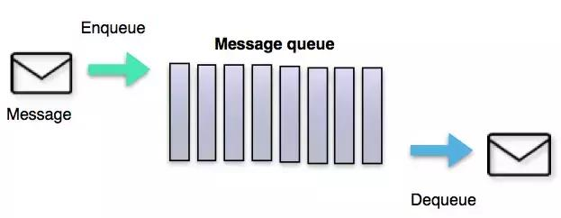
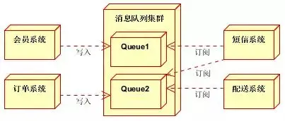
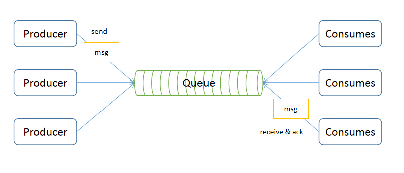
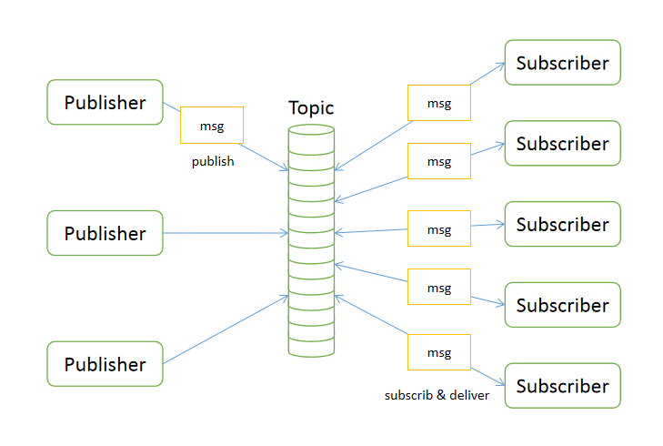
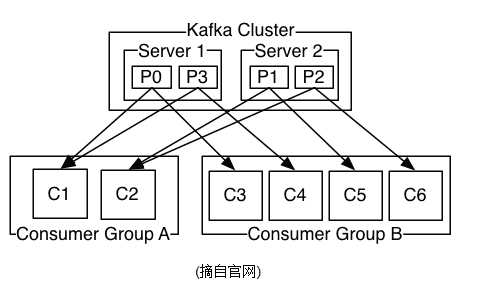

# 消息队列



## 什么是消息队列

消息队列（Message Queue）是一种进程间通信或同一进程的不同线程间的通信方式。

比如Go里面的channel就是一种典型的消息队列, 他用于不同的goroutine进行通信

```go
func main() {
    ch := make(chan, 5)

    // 生产消息(子Gorouine)
    go func() {
        for i:=0;i<10;i++ {
            ch <- i
        }
    }()

    // 消费消息(主Goroutine)
    for v := range ch {
        fmt.Println(v)
    }
}
```

这种语言内置的消息队列数据结构, 只能用于进程内通信, 一旦跨进程通信就无法使用

## 消息服务器

如果我们把消息队列这种数据结构 做成一个服务, 让他监听一个端口接收消息，然后把消息转发给其他进程 是不是就实现了 进程间的 基于消息队列的通信。

像上面说的这种 用于接收和转发消息的 服务，往往被叫做: 消息服务器, 或者消息中间件



## 使用场景

消息中间件主要用于组件之间的解耦，消息的发送者无需知道消息使用者的存在，反之亦然, 基于这个衍生出来很多使用场景:

+ 异步处理：例如短信通知、终端状态推送、App推送、用户注册等

有些业务不想也不需要立即处理消息。消息队列提供了异步处理机制，允许用户把一个消息放入队列，但并不立即处理它。想向队列中放入多少消息就放多少，然后在需要的时候再去处理它们。

+ 数据同步：业务数据推送同步

比如阿里云有个事件通知服务, 它把会消息放到你指定的队列中, 用于事件通知

+ 重试补偿：记账失败重试

创建的失败重试队列就是这种场景的应用

+ 流量消峰：秒杀场景下的下单处理

在访问量剧增的情况下，应用仍然需要继续发挥作用，但是这样的突发流量无法提取预知；如果以为了能处理这类瞬间峰值访问为标准来投入资源随时待命无疑是巨大的浪费。使用消息队列能够使关键组件顶住突发的访问压力，而不会因为突发的超负荷的请求而完全崩溃

+ 数据流处理：日志服务、监控上报

分布式系统产生的海量数据流，如：业务日志、监控数据、用户行为等，针对这些数据流进行实时或批量采集汇总，然后进行大数据分析是当前互联网的必备技术，通过消息队列完成此类数据收集是最好的选择

+ 系统解耦：通讯上下行、终端异常监控、分布式事件中心

降低工程间的强依赖程度，针对异构系统进行适配。在项目启动之初来预测将来项目会碰到什么需求，是极其困难的。通过消息系统在处理过程中间插入了一个隐含的、基于数据的接口层，两边的处理过程都要实现这一接口，当应用发生变化时，可以独立的扩展或修改两边的处理过程，只要确保它们遵守同样的接口约束

## 核心概念

+ Broker（消息服务器）
Broker的概念来自与Apache ActiveMQ，通俗的讲就是MQ的服务器。

+ Producer（生产者）
业务的发起方，负责生产消息传输给broker

+ Consumer（消费者）
业务的处理方，负责从broker获取消息并进行业务逻辑处理

+ Topic（主题）
发布订阅模式下的消息统一汇集地，不同生产者向topic发送消息，由MQ服务器分发到不同的订阅 者，实现消息的广播

+ Message（消息体）
根据不同通信协议定义的固定格式进行编码的数据包，来封装业务数据，实现消息的传输

## 消息模式

### 点对点模型

点到点模型就是基本的队列模型, 可以将他理解为Go里面的channel, 只是 发送者(Sender)往消息队列（Queue）发送消息, 接收者(Receiver)从Queue中接收消息



需要注意的是一旦被消费，消息就不再在消息队列中

### 发布订阅模型

当你的消息需要多个消费者都能收到时(也就是广播机制), 很显然点对点模式无法满足, 此时就会用到发布订阅模型, 这是最常用到的模型: 多个发布者将消息发送到Topic，系统将这些消息传递给多个订阅者



由于采用类似于广播的模式, 它有如下特点：
+ 每个消息可以有多个消费者：和点对点方式不同，发布消息可以被所有订阅者消费
+ 发布者和订阅者之间有时间上的依赖性。
+ 针对某个主题（Topic）的订阅者，它必须创建一个订阅者之后，才能消费发布者的消息。
+ 为了消费消息，订阅者必须保持运行的状态

## Kafka

Kafka 是 Apache 的子项目，是一个高性能跨语言的分布式发布/订阅消息队列系统（没有严格实现 JMS 规范的点对点模型，但可以实现其效果），在企业开发中有广泛的应用。高性能是其最大优势，劣势是消息的可靠性（丢失或重复），这个劣势是为了换取高性能，开发者可以以稍降低性能，来换取消息的可靠性


### Topic与Partition

一个Topic可以认为是一类消息，每个topic将被分成多个partition(区)，每个partition在存储层面是append log文件。任何发布到此partition的消息都会被直接追加到log文件的尾部，每条消息在文件中的位置称为offset（偏移量），offset为一个long型数字，它是唯一标记一条消息。它唯一的标记一条消息。kafka并没有提供其他额外的索引机制来存储offset，因为在kafka中几乎不允许对消息进行“随机读写”

kafka高性能的一个重要原因也在于此, 因为append log是顺序IO

### 数据冗余方案

一个Topic的多个partitions，被分布在kafka集群中的多个server上；每个server(kafka实例)负责partitions中消息的读写操作；此外kafka还可以配置partitions需要备份的个数(replicas)，每个partition将会被备份到多台机器上，以提高可用性。

基于replicated方案，那么就意味着需要对多个备份进行调度, 整个集群中只有1个leader节点负责人写, follower节点负责同步(leader和follower基于zk实现)


### 消费组



### 如何保证消息的顺序性

为了保证消息的有序性,kafka新增了一个概念: partition, partition中的数据一定是有序的。

生产者在写的时候 ，可以指定一个key，比如指定订单id作为key，这个订单相关数据一定会被分发到一个partition中去。消费者从partition中取出数据的时候也一定是有序的，把每个数据放入对应的一个内存队列，一个partition中有几条相关数据就用几个内存队列，消费者开启多个线程，每个线程处理一个内存队列


### 集群状态维护

比如一个consumer 在处理到1000条消息的时候突然挂了, 如果保证该consumer再次上线时, 能继续从之前下线的位置继续处理. 

因此我们需要保存consumer当前的一个消息处理状态, 但kafka集群几乎不需要维护任何consumer和producer状态信息，这些信息由zookeeper保存；

因此producer和consumer的客户端实现非常轻量级，它们可以随意离开，而不会对集群造成额外的影响

### 环境准备

这里环境采用Docker composej安装:

创建dock compose编排文件: docker-compose.yml
```yaml
version: '2'
services:
  zoo1:
    image: wurstmeister/zookeeper
    restart: unless-stopped
    hostname: zoo1
    ports:
      - "2181:2181"
    container_name: zookeeper

  kafka1:
    image: wurstmeister/kafka
    ports:
      - "9092:9092"
    environment:
      KAFKA_ADVERTISED_HOST_NAME: localhost
      KAFKA_ZOOKEEPER_CONNECT: "zoo1:2181"
      KAFKA_BROKER_ID: 1
      KAFKA_OFFSETS_TOPIC_REPLICATION_FACTOR: 1
      KAFKA_CREATE_TOPICS: "stream-in:1:1,stream-out:1:1"
    depends_on:
      - zoo1
    container_name: kafka
```

启动kafka服务
```
docker-compose up -d
```

### Go SDK

kafka是Java写的, 官方并没有Go SDK, 但是社区有3款还不错的SDK可供选择

+ [confluent-kafka-go](https://github.com/confluentinc/confluent-kafka-go): 基于c库[librdkafka](https://github.com/edenhill/librdkafka)的封装, 文档不错, 但是不支持Go Context
+ [sarama](https://github.com/Shopify/sarama): 迄今为止最流行的一个库, 纯Go实现, 但是暴露的API偏低层(Kafka protocol), 使用手感欠佳, 也不支持Go Context
+ [kafka-go](https://github.com/segmentio/kafka-go): 新贵,借鉴了sarama,并且兼容Sarama, 纯Go实现, 代码质量也比之前2个库好, API的封装非常友好, 非常符合Go的编程习惯, 比如Context, Reader, Writer等

这里选择kafka-go最为与Kafka交互的SDK

#### 创建Topic

为了让后面消费者做负载均衡测试时有效果, 提前创建一个有多个Partitions的topic
```go
func TestCreateTopic(t *testing.T) {
	conn, err := kafka.Dial("tcp", "localhost:9092")
	if err != nil {
		panic(err.Error())
	}
	defer conn.Close()

	controller, err := conn.Controller()
	if err != nil {
		panic(err.Error())
	}
	var controllerConn *kafka.Conn
	controllerConn, err = kafka.Dial("tcp", net.JoinHostPort(controller.Host, strconv.Itoa(controller.Port)))
	if err != nil {
		panic(err.Error())
	}
	defer controllerConn.Close()

	err = controllerConn.CreateTopics(kafka.TopicConfig{Topic: "topic-A", NumPartitions: 6, ReplicationFactor: 1})

	if err != nil {
		t.Fatal(err)
	}
}
```

#### 生产者(Producer)

kafka-go封装了Writer来发送消息，非常简单易用，也非常Go:
```go
// make a writer that produces to topic-A, using the least-bytes distribution
w := &kafka.Writer{
	Addr:     kafka.TCP("localhost:9092"),
  // NOTE: When Topic is not defined here, each Message must define it instead.
	Topic:   "topic-A",
	Balancer: &kafka.LeastBytes{},
  // The topic will be created if it is missing.
  AllowAutoTopicCreation: true,
  // 支持消息压缩
  // Compression: kafka.Snappy,
  // 支持TLS
  // Transport: &kafka.Transport{
  //     TLS: &tls.Config{},
  // }
}

err := w.WriteMessages(context.Background(),
	kafka.Message{
    // 支持 Writing to multiple topics
    //  NOTE: Each Message has Topic defined, otherwise an error is returned.
    // Topic: "topic-A",
		Key:   []byte("Key-A"),
		Value: []byte("Hello World!"),
	},
	kafka.Message{
		Key:   []byte("Key-B"),
		Value: []byte("One!"),
	},
	kafka.Message{
		Key:   []byte("Key-C"),
		Value: []byte("Two!"),
	},
)

if err != nil {
    log.Fatal("failed to write messages:", err)
}

if err := w.Close(); err != nil {
    log.Fatal("failed to close writer:", err)
}
```


#### 消费者(Consumer)

```go
// make a new reader that consumes from topic-A
r := kafka.NewReader(kafka.ReaderConfig{
    Brokers:   []string{"localhost:9092"},
    // Consumer Groups, 不指定就是普通的一个Consumer
    GroupID:   "consumer-group-id",
    // 可以指定Partition消费消息
    // Partition: 0,
    Topic:     "topic-A",
    MinBytes:  10e3, // 10KB
    MaxBytes:  10e6, // 10MB
})

for {
    m, err := r.ReadMessage(context.Background())
    if err != nil {
        break
    }
    fmt.Printf("message at topic/partition/offset %v/%v/%v: %s = %s\n", m.Topic, m.Partition, m.Offset, string(m.Key), string(m.Value))

    // 处理完消息后需要提交该消息已经消费完成, 消费者挂掉后保存消息消费的状态
    // if err := r.CommitMessages(ctx, m); err != nil {
    //     log.Fatal("failed to commit messages:", err)
    // }
}

if err := r.Close(); err != nil {
    log.Fatal("failed to close reader:", err)
}
```

#### 认证

企业中kafka一般都需要使用SAML进行认证

1. Producer
```go
mechanism, err := scram.Mechanism(scram.SHA512, "username", "password")
if err != nil {
    panic(err)
}

// Transports are responsible for managing connection pools and other resources,
// it's generally best to create a few of these and share them across your
// application.
sharedTransport := &kafka.Transport{
    SASL: mechanism,
}

w := kafka.Writer{
	Addr:      kafka.TCP("localhost:9092"),
	Topic:     "topic-A",
	Balancer:  &kafka.Hash{},
	Transport: sharedTransport,
}
```

2. Reader
```go
mechanism, err := scram.Mechanism(scram.SHA512, "username", "password")
if err != nil {
    panic(err)
}

dialer := &kafka.Dialer{
    Timeout:       10 * time.Second,
    DualStack:     true,
    SASLMechanism: mechanism,
}

r := kafka.NewReader(kafka.ReaderConfig{
    Brokers:        []string{"localhost:9093"},
    GroupID:        "consumer-group-id",
    Topic:          "topic-A",
    Dialer:         dialer,
})
```

## 参考

+ [消息队列原理及选型](https://www.zixi.org/archives/381.html)
+ [消息队列及消息中间件](http://www.uml.org.cn/zjjs/202005122.asp)