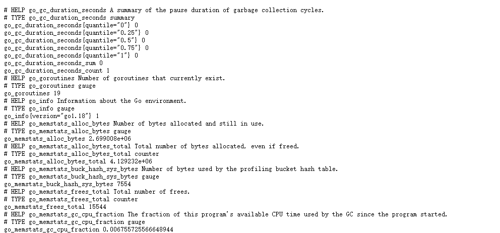
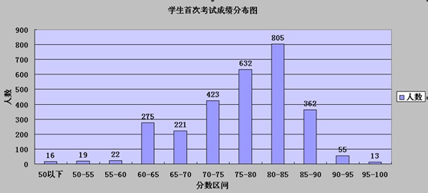
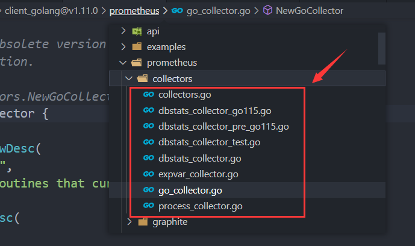

# Exporter 开发

我们将要开发的本机的: 8050:/metrics

我们提前配置到prometheus, 等下我们exporter启动后就能直接拉取数据


## 数据格式

prometheus是拉取数据的监控模型, 它对客户端暴露的数据格式要求如下:
```
# HELP go_goroutines Number of goroutines that currently exist.
# TYPE go_goroutines gauge
go_goroutines 19
```

## 简单粗暴

我们直接开发一个满足prometheus格式的API接口即可

```go
package main

import (
    "fmt"
    "net/http"
)

func HelloHandler(w http.ResponseWriter, r *http.Request) {
    fmt.Fprintf(w, "lexporter_request_count{user=\"admin\"} 1000" )
}

func main () {
    http.HandleFunc("/metrics", HelloHandler)
    http.ListenAndServe(":8050", nil)
}
```

## 使用SDK

大多数场景下，我们都没必要自己这样写, 可以利用Prometheus为我们提供的SDK快速完成Metric数据的暴露

### 默认指标

并不是所有的代码都需要我们自己去实现, Prometheus为我们准备了一个客户端, 我们可以基于客户端快速添加监控

```go
package main

import (
 "net/http"

 "github.com/prometheus/client_golang/prometheus/promhttp"
)

func main() {
    // Serve the default Prometheus metrics registry over HTTP on /metrics.
 http.Handle("/metrics", promhttp.Handler())
 http.ListenAndServe(":8050", nil)
}
```

然后我们可以在浏览器中访问 http://127.0.0.1:8050/metrics 来获得默认的监控指标数据: 



我们并没有在代码中添加什么业务逻辑，但是可以看到依然有一些指标数据输出，这是因为 Go 客户端库默认在我们暴露的全局默认指标注册表中注册了一些关于 promhttp 处理器和运行时间相关的默认指标，根据不同指标名称的前缀可以看出：

+ go_*：以 go_ 为前缀的指标是关于 Go 运行时相关的指标，比如垃圾回收时间、goroutine 数量等，这些都是 Go 客户端库特有的，其他语言的客户端库可能会暴露各自语言的其他运行时指标。
+ promhttp_*：来自 promhttp 工具包的相关指标，用于跟踪对指标请求的处理。

这些默认的指标是非常有用，但是更多的时候我们需要自己控制，来暴露一些自定义指标。这就需要我们去实现自定义的指标了。

### 自定义指标

Prometheus的Server端, 只认如下数据格式:
```
# HELP go_goroutines Number of goroutines that currently exist.
# TYPE go_goroutines gauge
go_goroutines 19
```

但是Prometheus客户端本身也提供一些简单数据二次加工的能力, 他把这种能力描述为4种指标类型: 
+ Gauges（仪表盘）：Gauge类型代表一种样本数据可以任意变化的指标，即可增可减。
+ Counters（计数器）：counter类型代表一种样本数据单调递增的指标，即只增不减，除非监控系统发生了重置。
+ Histograms（直方图）：创建直方图指标比 counter 和 gauge 都要复杂，因为需要配置把观测值归入的 bucket 的数量，以及每个 bucket 的上边界。Prometheus 中的直方图是累积的，所以每一个后续的 bucket 都包含前一个 bucket 的观察计数，所有 bucket 的下限都从 0 开始的，所以我们不需要明确配置每个 bucket 的下限，只需要配置上限即可。
+ Summaries（摘要）：与Histogram类似类型，用于表示一段时间内的数据采样结果（通常是请求持续时间或响应大小等），但它直接存储了分位数（通过客户端计算，然后展示出来），而不是通过区间计算

#### 指标采集

下面以SDK的方式演示4种指标的采集方式

##### Gauges

着是最常见的Metric类型, 也就是我们说的实时指标, 值是什么就返回什么, 并不会进行加工处理

SDK提供了该指标的构造函数: NewGauge
```go
queueLength := prometheus.NewGauge(prometheus.GaugeOpts{
    // Namespace, Subsystem, Name 会拼接成指标的名称: magedu_mcube_demo_queue_length
    // 其中Name是必填参数
    Namespace: "magedu",
    Subsystem: "mcube_demo",
    Name:      "queue_length",
    // 指标的描信息
    Help:      "The number of items in the queue.",
    // 指标的标签
    ConstLabels: map[string]string{
        "module": "http-server",
    },
})
```

Gauge对象提供了如下方法用来设置他的值:
```go
// 使用 Set() 设置指定的值
queueLength.Set(0)

// 增加或减少
queueLength.Inc()   // +1：gauge增加1.
queueLength.Dec()   // -1：gauge减少1.
queueLength.Add(23) // 增加23个增量.
queueLength.Sub(42) // 减少42个.
```

下面是编写的一个测试用例:
```go
package metric_test

import (
	"fmt"
	"os"
	"testing"

	"github.com/prometheus/client_golang/prometheus"
	"github.com/prometheus/common/expfmt"
)

func TestGauge(t *testing.T) {
	queueLength := prometheus.NewGauge(prometheus.GaugeOpts{
		// Namespace, Subsystem, Name 会拼接成指标的名称: magedu_mcube_demo_queue_length
		// 其中Name是必填参数
		Namespace: "magedu",
		Subsystem: "mcube_demo",
		Name:      "queue_length",
		// 指标的描信息
		Help: "The number of items in the queue.",
		// 指标的标签
		ConstLabels: map[string]string{
			"module": "http-server",
		},
	})

	queueLength.Set(100)

	// 创建一个自定义的注册表
	registry := prometheus.NewRegistry()
	registry.MustRegister(queueLength)

	// 获取注册所有数据
	data, err := registry.Gather()
	if err != nil {
		panic(err)
	}

	// 编码输出
	enc := expfmt.NewEncoder(os.Stdout, expfmt.FmtText)
	fmt.Println(enc.Encode(data[0]))
}
```
执行后他的输出
```
# HELP magedu_mcube_demo_queue_length The number of items in the queue.
# TYPE magedu_mcube_demo_queue_length gauge
magedu_mcube_demo_queue_length{module="http-server"} 100
```

##### Counters

Counters是计算器指标, 用于统计次数使用, 通过 prometheus.NewCounter() 函数来初始化指标对象
```go
totalRequests := prometheus.NewCounter(prometheus.CounterOpts{
 Name: "http_requests_total",
 Help: "The total number of handled HTTP requests.",
})
```

+ Inc: +1：计数器增加1.
+ Add: +n：计数器增加23.

```go
func TestCounter(t *testing.T) {
	totalRequests := prometheus.NewCounter(prometheus.CounterOpts{
		Name: "http_requests_total",
		Help: "The total number of handled HTTP requests.",
	})

	for i := 0; i < 10; i++ {
		totalRequests.Inc()
	}

	// 创建一个自定义的注册表
	registry := prometheus.NewRegistry()
	registry.MustRegister(totalRequests)

	// 获取注册所有数据
	data, err := registry.Gather()
	if err != nil {
		panic(err)
	}

	// 编码输出
	enc := expfmt.NewEncoder(os.Stdout, expfmt.FmtText)
	fmt.Println(enc.Encode(data[0]))
}
```

输出结果
```
# HELP http_requests_total The total number of handled HTTP requests.
# TYPE http_requests_total counter
http_requests_total 10
```

##### Histograms

Histograms 被叫主直方图或者柱状图, 主要用于统计指标值的一个分布情况, 也就是常见的概率统计问题

比如, 我们要统计一个班级的 成绩分布情况：



+ 横轴表示 分数的区间(0~50, 50~55, ...)
+ 纵轴表示 落在该区间的人数

prometheus的Histograms也是用于解决这类问题的, 在prometheus里面用于设置横轴区间的概念叫Bucket, 不同于传统的区间设置之处, 在于prometheus的Bucket只能设置上限, 下线就是最小值，也就是说 换用prometheus Histograms, 我们上面的区间会变成这样:
```
0 ~ 50
0 ~ 55
0 ~ 60
...
```

可以看出当我们设置好了Bucket后, prometheus的客户端需要统计落入每个Bucket中的值得数量(也就是一个Counter), 也就是Histograms这种指标类型的计算逻辑

在监控里面, Histograms 典型的应用场景 就是统计 请求耗时分布, 比如 
```
0 ~ 100ms 请求个数
0 ~ 500ms 请求个数
0 ~ 5000ms 请求个数
```

有同学可能会问题? 为啥不用平均值来进行统计? 提示: 平均值里面的噪点, 比如有一个值 远远大于其他所有值的和

我们使用NewHistogram初始化一个直方图类型的指标:
```go
requestDurations := prometheus.NewHistogram(prometheus.HistogramOpts{
  Name:    "http_request_duration_seconds",
  Help:    "A histogram of the HTTP request durations in seconds.",
  // Bucket 配置：第一个 bucket 包括所有在 0.05s 内完成的请求，最后一个包括所有在10s内完成的请求。
  Buckets: []float64{0.05, 0.1, 0.25, 0.5, 1, 2.5, 5, 10},
})
```

Histogram类型指标提供一个 Observe() 方法, 用于加入一个值到直方图中, 当然加入后 体现在直方图中的不是具体的值，而是值落入区间的统计，实际上每个bucket 就是一个 Counter指标

下面是一个完整测试用例
```go
func TestHistogram(t *testing.T) {
	requestDurations := prometheus.NewHistogram(prometheus.HistogramOpts{
		Name: "http_request_duration_seconds",
		Help: "A histogram of the HTTP request durations in seconds.",
		// Bucket 配置：第一个 bucket 包括所有在 0.05s 内完成的请求，最后一个包括所有在10s内完成的请求。
		Buckets: []float64{0.05, 0.1, 0.25, 0.5, 1, 2.5, 5, 10},
	})

	// 添加值
	for _, v := range []float64{0.01, 0.02, 0.3, 0.4, 0.6, 0.7, 5.5, 11} {
		requestDurations.Observe(v)
	}

	// 创建一个自定义的注册表
	registry := prometheus.NewRegistry()
	registry.MustRegister(requestDurations)

	// 获取注册所有数据
	data, err := registry.Gather()
	if err != nil {
		panic(err)
	}

	// 编码输出
	enc := expfmt.NewEncoder(os.Stdout, expfmt.FmtText)
	fmt.Println(enc.Encode(data[0]))
}
```

最后的结果
```
# HELP http_request_duration_seconds A histogram of the HTTP request durations in seconds.
# TYPE http_request_duration_seconds histogram
http_request_duration_seconds_bucket{le="0.05"} 2
http_request_duration_seconds_bucket{le="0.1"} 2
http_request_duration_seconds_bucket{le="0.25"} 2
http_request_duration_seconds_bucket{le="0.5"} 4
http_request_duration_seconds_bucket{le="1"} 6
http_request_duration_seconds_bucket{le="2.5"} 6
http_request_duration_seconds_bucket{le="5"} 6
http_request_duration_seconds_bucket{le="10"} 7
http_request_duration_seconds_bucket{le="+Inf"} 8
http_request_duration_seconds_sum 18.53
http_request_duration_seconds_count 8
```

注意点:
+ le="+Inf", 表示小于正无穷, 也就是统计所有的含义
+ 后缀 _sum,  参加统计的值的求和
+ 后缀 _count 参加统计的值得总数

很多时候直接依赖直方图还是很难定位问题, 因为很多时候，我们需要的是请求的一个概统分布, 比如百分之99的请求 落在了那个区间(比如99%请求都在500ms内完成的), 从而判断我们的访问 从整体上看 是良好的。

而像上面的概念分布问题有一个专门的名称叫: quantile, 翻译过来就分位数, 及百分之多少的请求 在那个范围下

那基于直方图提供的数据, 我们是可以计算出分位数的, 但是这个分位数的精度 会受到分区设置精度的影响(bucket设置)， 比如你如果只设置了2个bucket, 0.001, 5, 那么你统计出来的100%这个分位数 就是5s, 因为所有的请求都会落到这个bucket中

如果我们的bucket设置是合理的, 我又想使用直方图来统计分位数喃? prometheus的QL, 提供了专门的函数histogram_quantile, 可以用于 基于直方图的统计数据，计算分位数

如果服务端压力很大, bucket也不确定, 我能不能直接在客户端计算分位数(quantile)喃? 

答案是有的，就是第四种指标类型: Summaries

##### Summaries

这种类型的指标 就是用于计算分位数(quantile)的, 因此他需要配置一个核心参数: 你需要统计那个(百)分位

用NewSummary来构建该类指标
```go
requestDurations := prometheus.NewSummary(prometheus.SummaryOpts{
    Name:       "http_request_duration_seconds",
    Help:       "A summary of the HTTP request durations in seconds.",
    Objectives: map[float64]float64{
      0.5: 0.05,   // 第50个百分位数，最大绝对误差为0.05。
      0.9: 0.01,   // 第90个百分位数，最大绝对误差为0.01。
      0.99: 0.001, // 第90个百分位数，最大绝对误差为0.001。
    },
  },
)
```

和直方图一样, 他也近提供一个方法: Observe, 用于统计数据

下面是具体的测试用例:
```go
func TestSummary(t *testing.T) {
	requestDurations := prometheus.NewSummary(prometheus.SummaryOpts{
		Name: "http_request_duration_seconds",
		Help: "A summary of the HTTP request durations in seconds.",
		Objectives: map[float64]float64{
			0.5:  0.05,  // 第50个百分位数，最大绝对误差为0.05。
			0.9:  0.01,  // 第90个百分位数，最大绝对误差为0.01。
			0.99: 0.001, // 第90个百分位数，最大绝对误差为0.001。
		},
	})

	// 添加值
	for _, v := range []float64{0.01, 0.02, 0.3, 0.4, 0.6, 0.7, 5.5, 11} {
		requestDurations.Observe(v)
	}

	// 创建一个自定义的注册表
	registry := prometheus.NewRegistry()
	registry.MustRegister(requestDurations)

	// 获取注册所有数据
	data, err := registry.Gather()
	if err != nil {
		panic(err)
	}

	// 编码输出
	enc := expfmt.NewEncoder(os.Stdout, expfmt.FmtText)
	fmt.Println(enc.Encode(data[0]))
}
```

最后的结果:
```
# HELP http_request_duration_seconds A summary of the HTTP request durations in seconds.
# TYPE http_request_duration_seconds summary
http_request_duration_seconds{quantile="0.5"} 0.4
http_request_duration_seconds{quantile="0.9"} 11
http_request_duration_seconds{quantile="0.99"} 11
http_request_duration_seconds_sum 18.53
http_request_duration_seconds_count 8
```

可以看出来 直接使用客户端计算分位数, 准确度不依赖我们设置bucket, 是比较推荐的做法

#### 指标标签

Prometheus将指标的标签分为2类:
+ 静态标签: constLabels, 在指标创建时, 就提前声明好, 采集过程中永不变动
+ 动态标签: variableLabels, 用于在指标的收集过程中动态补充标签, 比如kafka集群的exporter 需要动态补充 instance_id

静态标签我们在NewGauge之类时已经指明, 下面讨论下如何添加动态标签

要让你的指标支持动态标签 有专门的构造函数, 对应关系如下:
+ NewGauge() 变成 NewGaugeVec()
+ NewCounter() 变成 NewCounterVec()
+ NewSummary() 变成 NewSummaryVec()
+ NewHistogram() 变成 NewHistogramVec()

下面以NewGaugeVec为例进行讲解

NewGaugeVec相比于NewGauge只多出了一个labelNames的参数:
```go
func NewGaugeVec(opts GaugeOpts, labelNames []string) *GaugeVec
```

一定声明了labelNames, 我们在为指标设置值得时候就必须带上对应个数的标签(一一对应, 二维数组)
```go
queueLength.WithLabelValues("rm_001", "kafka01").Set(100)
```

完整测试用例:
```go
func TestGaugeVec(t *testing.T) {
	queueLength := prometheus.NewGaugeVec(prometheus.GaugeOpts{
		// Namespace, Subsystem, Name 会拼接成指标的名称: magedu_mcube_demo_queue_length
		// 其中Name是必填参数
		Namespace: "magedu",
		Subsystem: "mcube_demo",
		Name:      "queue_length",
		// 指标的描信息
		Help: "The number of items in the queue.",
		// 指标的标签
		ConstLabels: map[string]string{
			"module": "http-server",
		},
	}, []string{"instance_id", "instance_name"})

	queueLength.WithLabelValues("rm_001", "kafka01").Set(100)

	// 创建一个自定义的注册表
	registry := prometheus.NewRegistry()
	registry.MustRegister(queueLength)

	// 获取注册所有数据
	data, err := registry.Gather()
	if err != nil {
		panic(err)
	}

	// 编码输出
	enc := expfmt.NewEncoder(os.Stdout, expfmt.FmtText)
	fmt.Println(enc.Encode(data[0]))
}
```

最终我们看到的结果如下:
```
# HELP magedu_mcube_demo_queue_length The number of items in the queue.
# TYPE magedu_mcube_demo_queue_length gauge
magedu_mcube_demo_queue_length{instance_id="rm_001",instance_name="kafka01",module="http-server"} 100
```

#### 指标注册

我们把指标采集完成后 需要注册给Prometheus的Http Handler这样才能暴露出去, 好在Prometheus的客户端给我们提供了对于的接口

Prometheus 定义了一个注册表的接口:
```go
// 指标注册接口
type Registerer interface {
	// 注册采集器, 有异常会报错
	Register(Collector) error
	// 注册采集器, 有异常会panic
	MustRegister(...Collector)
	// 注销该采集器
	Unregister(Collector) bool
}
```

##### 默认注册表

Prometheus 实现了一个默认的Registerer对象, 也就是默认注册表
```go
var (
	defaultRegistry              = NewRegistry()
	DefaultRegisterer Registerer = defaultRegistry
	DefaultGatherer   Gatherer   = defaultRegistry
)
```

我们通过prometheus提供的MustRegister可以将我们自定义指标注册进去
```go
// 在默认的注册表中注册该指标
prometheus.MustRegister(temp)
prometheus.Register()
prometheus.Unregister()
```

下面时一个完整的例子
```go
package main

import (
 "net/http"

 "github.com/prometheus/client_golang/prometheus"
 "github.com/prometheus/client_golang/prometheus/promhttp"
)

func main() {
    // 创建一个 gauge 类型的指标
    queueLength := prometheus.NewGauge(prometheus.GaugeOpts{
        // Namespace, Subsystem, Name 会拼接成指标的名称: magedu_mcube-demo_queue_length
        // 其中Name是必填参数
        Namespace: "magedu",
        Subsystem: "mcube_demo",
        Name:      "queue_length",
        // 指标的描信息
        Help:      "The number of items in the queue.",
        // 指标的标签
        ConstLabels: map[string]string{
            "module": "http-server",
        },
    })

 // 在默认的注册表中注册该指标
 prometheus.MustRegister(queueLength)

 // 设置 gauge 的值为 100
 queueLength.Set(100)

 // 暴露指标
 http.Handle("/metrics", promhttp.Handler())
 http.ListenAndServe(":8050", nil)
}
```

启动后重新访问指标接口 http://localhost:8050/metrics，仔细对比我们会发现多了一个名为magedu_mcube_demo_queue_length 的指标:
```
...
# HELP magedu_mcube_demo_queue_length The number of items in the queue.
# TYPE magedu_mcube_demo_queue_length gauge
magedu_mcube_demo_queue_length{module="http-server"} 100
...
```

##### 自定义注册表

Prometheus 默认的Registerer, 会添加一些默认指标的采集, 比如上面的看到的go运行时和当前process相关信息, 如果不想采集指标, 那么最好的方式是 使用自定义的注册表

```go
package main

import (
 "net/http"

 "github.com/prometheus/client_golang/prometheus"
 "github.com/prometheus/client_golang/prometheus/promhttp"
)

func main() {
	// 创建一个自定义的注册表
	registry := prometheus.NewRegistry()

	queueLength := prometheus.NewGauge(prometheus.GaugeOpts{
		// Namespace, Subsystem, Name 会拼接成指标的名称: magedu_mcube-demo_queue_length
		// 其中Name是必填参数
		Namespace: "magedu",
		Subsystem: "mcube_demo",
		Name:      "queue_length",
		// 指标的描信息
		Help: "The number of items in the queue.",
		// 指标的标签
		ConstLabels: map[string]string{
			"module": "http-server",
		},
	})

	// 设置 gauge 的值为 100
	queueLength.Set(100)

	// 在自定义的注册表中注册该指标
	registry.MustRegister(queueLength)
}
```

+ 使用NewRegistry()创建一个全新的注册表
+ 通过注册表对象的MustRegister把指标注册到自定义的注册表中

暴露指标的时候必须通过调用 promhttp.HandleFor() 函数来创建一个专门针对我们自定义注册表的 HTTP 处理器，我们还需要在 promhttp.HandlerOpts 配置对象的 Registry 字段中传递我们的注册表对象
```go
...
// 暴露指标
http.Handle("/metrics", promhttp.HandlerFor(registry, promhttp.HandlerOpts{Registry: registry}))
http.ListenAndServe(":8050", nil)
```

最后我们看到我们的指标少了很多, 除了promhttp_metric_handler就只有我们自定义的指标了
```
# HELP magedu_mcube_demo_queue_length The number of items in the queue.
# TYPE magedu_mcube_demo_queue_length gauge
magedu_mcube_demo_queue_length{module="http-server"} 100
# HELP promhttp_metric_handler_errors_total Total number of internal errors encountered by the promhttp metric handler.
# TYPE promhttp_metric_handler_errors_total counter
promhttp_metric_handler_errors_total{cause="encoding"} 0
promhttp_metric_handler_errors_total{cause="gathering"} 0
```

那如果后面又想把go运行时和当前process相关加入到注册表中暴露出去怎么办?

其实Prometheus在客户端中默认有如下Collector供我们选择



只需把我们需要的添加到我们自定义的注册表中即可
```go
 // 添加 process 和 Go 运行时指标到我们自定义的注册表中
 registry.MustRegister(prometheus.NewProcessCollector(prometheus.ProcessCollectorOpts{}))
 registry.MustRegister(prometheus.NewGoCollector())
```

然后我们再次访问http://localhost:8050/metrics, 是不是发现之前少的指标又回来了

通过查看prometheus提供的Collectors我们发现, 直接把指标注册到registry中的方式不太优雅, 为了能更好的模块化, 我们需要把指标采集封装为一个Collector对象, 这也是很多第三方Collecotor的标准写法

### 采集器

下面是Collector接口声明:
```go
type Collector interface {
	// 指标的一些描述信息, 就是# 标识的那部分
	// 注意这里使用的是指针, 因为描述信息 全局存储一份就可以了
	Describe(chan<- *Desc)
	// 指标的数据, 比如 promhttp_metric_handler_errors_total{cause="gathering"} 0
	// 这里没有使用指针, 因为每次采集的值都是独立的
	Collect(chan<- Metric)
}
```
下面我们就把之前的单个指标的采集, 改造成使用采集器的方式编写

#### demo采集器

实现demo采集器
```go
func NewDemoCollector() *DemoCollector {
	return &DemoCollector{
		queueLengthDesc: prometheus.NewDesc(
			"magedu_mcube_demo_queue_length",
			"The number of items in the queue.",
			// 动态标签的key列表
			[]string{"instnace_id", "instnace_name"},
			// 静态标签
			prometheus.Labels{"module": "http-server"},
		),
		// 动态标的value列表, 这里必须与声明的动态标签的key一一对应
		labelValues: []string{"mq_001", "kafka01"},
	}
}

type DemoCollector struct {
	queueLengthDesc *prometheus.Desc
	labelValues     []string
}

func (c *DemoCollector) Describe(ch chan<- *prometheus.Desc) {
	ch <- c.queueLengthDesc
}

func (c *DemoCollector) Collect(ch chan<- prometheus.Metric) {
	ch <- prometheus.MustNewConstMetric(c.queueLengthDesc, prometheus.GaugeValue, 100, c.labelValues...)
}
```

重构后我们的代码将变得简洁优雅:
```go
package main

import (
 "net/http"

 "github.com/prometheus/client_golang/prometheus"
 "github.com/prometheus/client_golang/prometheus/promhttp"
)

func main() {
	// 创建一个自定义的注册表
	registry := prometheus.NewRegistry()

	// 可选: 添加 process 和 Go 运行时指标到我们自定义的注册表中
	registry.MustRegister(prometheus.NewProcessCollector(prometheus.ProcessCollectorOpts{}))
	registry.MustRegister(prometheus.NewGoCollector())

	// 注册自定义采集器
	registry.MustRegister(NewDemoCollector())

	// 暴露指标
	http.Handle("/metrics", promhttp.HandlerFor(registry, promhttp.HandlerOpts{Registry: registry}))
	http.ListenAndServe(":8050", nil)
 }
```

最后我们看到的结果如下:
```
# HELP magedu_mcube_demo_queue_length The number of items in the queue.
# TYPE magedu_mcube_demo_queue_length gauge
magedu_mcube_demo_queue_length{instnace_id="mq_001",instnace_name="kafka01",module="http-server"} 10
```