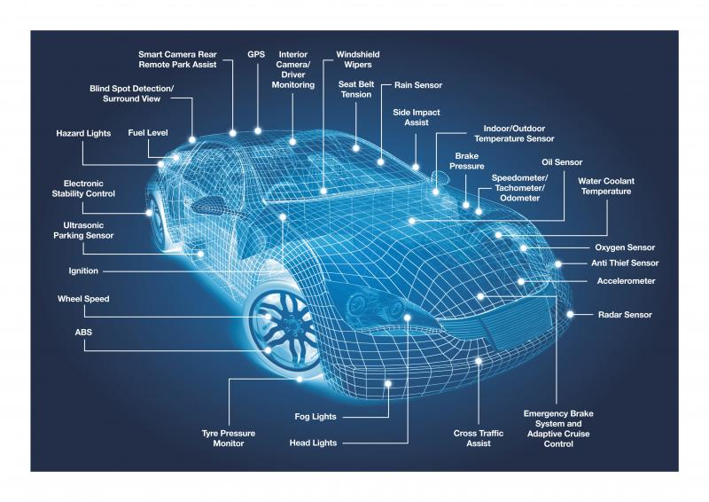

# 监控系统

我们需要感知这个世界, 比如人

## 模型

+ 数据的采集
+ 预处理/数据清洗
+ 数据的存储
+ 数据分析/触发事件
+ 数据的展示

## 数据采集

### Push

优点:
+ 事实性强, 数据能立即到达server
+ 可以穿过防火墙

### Poll

优点:
+ 可以批量拉去，可以批量处理
+ 数据的连络短，易于排查问题, 可以直接通过HTTP 协议访问到Endpoint暴露的数据
+ 独立于监控系统之外, 部署采集器，不需要依赖和知道server

缺点:
+ 历史数据无法补充
+ 客户端必须对外暴露访问, 比如如果想要获取手机APP的运行指标, 是没有办法拉去的
